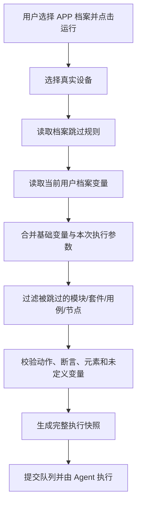

# APP 档案跳过与用户变量配置设计方案

> 文档状态：设计确认稿  
> 适用范围：当前开发环境  
> 核心口径：APP 档案只决定“执行什么”，用户变量只决定“使用什么数据执行”

## 1. 背景

平台中的不同设备使用同一套 APP 和公共测试资产，但设备支持的功能存在差异。例如某些设备支持更多串口、AI 功能或行业模块，另一些设备不支持这些内容。

公共套件和用例不能按设备复制，否则会产生大量重复资产和维护成本。因此继续维护一套公共测试资产，通过 APP 档案保存少量跳过规则，在执行前剔除当前档案不支持的内容。

不同平台用户在各自设备上使用的登录账号、密码、手机号、服务器地址等数据不同。这些差异不属于 APP 或设备能力差异，应作为当前用户在当前 APP 档案下的私有变量保存。

## 2. 最终设计结论

系统保留三层数据：

```text
公共测试资产
  ├─ 模块
  ├─ 测试套件
  ├─ 测试用例
  ├─ 步骤与断言
  ├─ 公共元素
  └─ 基础变量
        ↓
APP 档案
  └─ 只保存跳过规则，未配置的内容默认全部支持
        ↓
当前用户变量
  └─ 只保存当前用户在当前档案下覆盖的变量值
        ↓
执行快照
  └─ 固化最终套件、用例、步骤、元素和变量结果
```

本方案不引入：

- 用户配置方案列表和多配置标签页。
- 查看、编辑或复制其他用户配置。
- 用户变量发布版本。
- 用户变量共享缓存。
- APP 档案元素覆盖。
- APP 档案节点参数覆盖。
- APP 档案公共变量覆盖。
- 单步骤或单断言变量覆盖。

## 3. 概念与职责

### 3.1 公共测试资产

公共测试资产是唯一需要长期维护的测试定义，包含模块、套件、用例、步骤、断言、元素和基础变量。

所有 APP 档案引用同一套公共资产。修改公共用例后，各档案在下一次新执行时自动使用最新资产；已经创建的执行继续使用自己的执行快照。

### 3.2 APP 档案

左侧列表中的每一项仍然使用当前 `AppProfile` 概念。产品界面可以继续显示“APP 档案”，也可以改成更直观的“设备测试档案”。

APP 档案不是 Agent 上报的物理设备，也不与某个 `device_id` 强制绑定。用户运行档案时仍通过现有设备选择流程选择真实执行设备。

APP 档案只维护测试范围差异：

- 默认支持全部模块、套件、用例、步骤和断言。
- 只有明确设置跳过规则的内容才不执行。
- 上级跳过后，下级显示为继承跳过。
- 恢复上级后，下级按照自身直接规则重新计算。

### 3.3 当前用户变量

每个用户在每个 APP 档案下只有一份私有变量集合：

```text
用户 + APP档案 + 变量名 = 用户覆盖值
```

用户只能读取和修改自己的变量。后端从访问令牌确定用户身份，接口不接受由前端指定的 `user_id`。

第一版采用“档案内同名变量统一覆盖”的简单口径。例如张三在档案 A 中设置：

```text
username = zhangsan
```

则档案 A 中所有引用 `${username}` 的套件、用例、步骤和断言都使用 `zhangsan`。如果不同业务位置场景需要不同账号，应定义不同变量名，例如 `${admin_username}`、`${driver_username}`，不重新引入步骤级覆盖。

## 4. 跳过规则

### 4.1 默认启用

系统不保存“启用”记录：

```text
不存在跳过规则 = enabled
存在跳过规则   = skipped
```

这样新建 APP 档案后天然支持全部公共资产，只需配置少量差异。

### 4.2 支持层级

跳过规则可以作用于：

1. 模块。
2. 测试套件。
3. 套件中的用例。
4. 必要时作用于步骤或断言。

推荐优先使用模块、套件和用例级跳过。步骤或断言级跳过只用于极少数无法拆分公共用例的场景，避免形成难以维护的大量细粒度规则。

### 4.3 规则优先级

```text
套件跳过 > 用例跳过 > 步骤/断言跳过
```

上级跳过时，下级规则仍可保留，但执行结果显示为继承跳过。恢复上级后，下级直接规则重新生效。

同一用例可以在多个套件中复用。用例跳过必须包含套件上下文；需要区分同一套件内的重复编排时，应使用 `suite_case_id`，不能只使用 `case_id`。

## 5. 用户变量数据模型

### 5.1 推荐表结构

新增 `user_app_profile_variable_overrides`：

| 字段 | 类型 | 说明 |
|---|---|---|
| `id` | integer | 主键 |
| `user_id` | integer | 当前变量所属用户 |
| `profile_id` | integer | 所属 APP 档案 |
| `variable_name` | varchar(100) | 变量名，不包含 `${}` |
| `value` | text | 用户覆盖值，允许空字符串 |
| `is_sensitive` | boolean | 是否为敏感变量 |
| `created_at` | timestamptz | 创建时间 |
| `updated_at` | timestamptz | 更新时间 |

约束与索引：

```text
UNIQUE(user_id, profile_id, variable_name)
INDEX(profile_id, user_id)
FOREIGN KEY user_id REFERENCES users(id) ON DELETE CASCADE
FOREIGN KEY profile_id REFERENCES app_profiles(id) ON DELETE CASCADE
CHECK(variable_name <> '')
```

恢复继承值时直接删除对应覆盖记录。执行历史由执行快照保证，不需要为用户变量保留软删除和历史版本。

### 5.2 为什么不使用单个 JSONB 字段

按变量逐行保存具备以下优势：

- 单个变量可以独立保存和恢复。
- 并发修改不同变量不会覆盖整份配置。
- 可以按变量名检索、校验和统计。
- 敏感变量可以单独加密和脱敏。
- 审计时能够准确记录发生变化的变量。

### 5.3 敏感变量

账号可按普通字符串保存，密码、Token 等敏感变量应支持 `is_sensitive`：

- 数据库存储密文，不在日志中输出明文。
- 查询接口返回掩码和“已配置”状态，不返回完整明文。
- 用户重新输入后覆盖原值。
- 执行快照和报告不展示敏感变量明文。
- Agent 只接收执行所需的最终值，Agent 日志不得打印完整变量表。

即使系统只在内网运行，也应保留该安全边界。

## 6. 变量发现与展示

后端从当前 APP 档案引用的公共测试资产中收集变量：

- 套件前后置步骤参数。
- 用例步骤参数。
- 断言参数。
- 递归扫描对象和数组中的 `${name}`。
- 排除 `variable_name` 等运行时输出变量名。
- 元素智能定位配置中的运行时占位符不作为用户变量展示。

收集范围默认包含被跳过的测试资产。这样用户提前配置的变量不会因临时跳过而消失，恢复测试范围后无需重新录入。

同名变量只显示一行，并展示引用次数。不存在用户覆盖时展示当前继承值；存在用户覆盖时展示用户值。

## 7. 变量优先级

最终变量优先级固定为：

```text
本次执行手动参数
> 当前用户在当前 APP 档案下的变量
> 套件编排项变量
> 套件变量
> 用例变量
> 项目变量
> 全局变量
```

规则说明：

- 本次执行参数只影响当前执行。
- 用户变量在当前 APP 档案内统一覆盖同名变量。
- 用户未设置的变量继续走现有继承链。
- 空字符串是合法覆盖值，不能被当成“未设置”。
- `null` 只用于 API 表达“删除用户覆盖并恢复继承”，不作为执行值。
- 执行前如果仍存在未定义变量，预检失败并返回具体变量名和引用位置。

## 8. 前端页面设计

### 8.1 APP 档案主页面

左侧保持档案列表：

```text
全部 / 公共套件库
设备档案 A
设备档案 B
设备档案 C
+ 新建
```

右侧保留层级工作台，推荐列：

| 名称 | 类型 | 阶段 | 生效状态 | 当前用户变量 | 原因 | 操作 |
|---|---|---|---|---|---|---|

页面顶部操作：

```text
[运行当前档案全部套件] [我的变量配置] [差异清单]
```

取消原“覆盖配置”中的以下入口：

- 元素覆盖。
- 公共档案变量覆盖。
- 节点参数覆盖。
- 应用到全部节点。
- 单步骤变量覆盖。

### 8.2 当前用户变量列

用例行可以展示该用例引用的当前用户有效变量，但建议默认只读，编辑统一进入“我的变量配置”，避免用户误以为只修改当前用例。

如果保留表格内快捷编辑，必须明确提示：

> 修改后会影响当前用户在该 APP 档案下所有引用同名变量的位置。

保存成功后，所有已展开行中的同名变量应同步刷新。

### 8.3 “我的变量配置”抽屉

不使用多用户 Tabs，只展示当前用户自己的变量：

| 变量 | 继承值 | 我的值 | 继承来源 | 引用数 | 状态 | 操作 |
|---|---|---|---|---:|---|---|

支持：

- 按变量名搜索。
- 只看已覆盖。
- 表内编辑。
- Enter 保存、Esc 取消。
- 单变量恢复继承值。
- 敏感变量掩码和重新输入。
- 分页或虚拟滚动，避免大量变量首次打开卡顿。

推荐提示文案：

> 这里的变量只属于当前账号，并且只在执行当前 APP 档案时生效。其他用户不会看到或使用这些变量。

## 9. API 设计

### 9.1 查询当前用户变量

```http
GET /api/app-profiles/{profile_id}/my-variables
```

查询参数：

```text
keyword
overridden_only
page
page_size
```

响应示例：

```json
{
  "total": 2,
  "page": 1,
  "page_size": 20,
  "items": [
    {
      "name": "username",
      "inherited_value": "admin",
      "inherited_source": "project",
      "user_value": "zhangsan",
      "effective_value": "zhangsan",
      "overridden": true,
      "reference_count": 12,
      "is_sensitive": false
    }
  ]
}
```

后端根据当前登录用户查询，不接受 `user_id`。

### 9.2 保存或恢复变量

```http
PATCH /api/app-profiles/{profile_id}/my-variables
```

请求示例：

```json
{
  "request_id": "uuid",
  "updates": [
    {"name": "username", "value": "zhangsan"},
    {"name": "password", "value": "123456"},
    {"name": "server_ip", "value": null}
  ]
}
```

语义：

- 字符串：新增或更新当前用户覆盖。
- 空字符串：保存为空字符串。
- `null`：删除当前用户覆盖，恢复继承值。
- 批量更新在一个事务中完成。
- `request_id` 用于避免网络重试造成重复审计。

主要错误码：

| HTTP | 错误码 | 含义 |
|---:|---|---|
| 403 | `PROJECT_PERMISSION_DENIED` | 当前用户无项目访问或执行权限 |
| 404 | `APP_PROFILE_NOT_FOUND` | APP 档案不存在 |
| 422 | `VARIABLE_NOT_REFERENCED` | 变量未被当前档案测试资产引用 |
| 422 | `VARIABLE_VALUE_INVALID` | 变量值类型不合法 |
| 409 | `VARIABLE_UPDATE_CONFLICT` | 同一变量发生并发更新冲突 |

用户变量不推进共享 `AppProfile.revision`，不广播项目级档案 revision 变化。

## 10. 执行流程

### 10.1 创建执行



执行创建时，后端必须从认证上下文确定用户，不允许前端选择变量所有者。

### 10.2 执行快照

执行开始前固化：

- 最终套件及顺序。
- 最终用例及顺序。
- 最终步骤和断言参数。
- 最终元素定位信息。
- 最终变量值或渲染后的参数。
- 被排除内容及原因。
- 执行发起用户。

用户变量不需要发布版本，但执行快照不能取消。用户在执行过程中修改变量，只影响以后创建的新执行。

### 10.3 重试

历史执行重试继续使用原执行快照，不重新读取当前用户变量。需要使用最新变量时，用户应重新发起一次新执行。

## 11. 权限设计

| 操作 | Owner/Admin | Member | Viewer |
|---|---:|---:|---:|
| 查看 APP 档案 | 是 | 是 | 是 |
| 新建、编辑、删除 APP 档案 | 是 | 否 | 否 |
| 设置档案跳过规则 | 是 | 否 | 否 |
| 查看自己的档案变量 | 是 | 是 | 按是否允许执行决定 |
| 修改自己的档案变量 | 是 | 是 | 否 |
| 查看或修改其他用户变量 | 否 | 否 | 否 |
| 执行测试 | 是 | 是 | 否 |

平台管理员如需排障，应通过受审计的临时诊断能力处理，不在普通业务接口中提供查询其他用户变量的能力。

## 12. 对现有覆盖功能的调整

本设计取代“APP 档案包含元素、公共变量和节点参数覆盖”的旧口径。

计划停用并删除：

- `AppProfileElementOverride` 及相关 API、抽屉和解析逻辑。
- `AppProfileVariableOverride` 及相关 API、抽屉和解析逻辑。
- `AppProfileSuiteCaseVariableOverride` 及相关 API和解析逻辑。
- `AppProfileNodeOverride` 及节点参数覆盖 API和解析逻辑。

继续保留：

- `AppProfile`。
- `AppProfileSkipRule`。
- APP 档案工作台和差异清单。
- 公共元素库及其正常编辑能力。
- 公共变量、项目变量、套件变量、用例变量和编排项变量。
- 执行快照。

当前项目仍处于开发环境，不需要为旧覆盖数据保留兼容分支。迁移可以直接删除旧覆盖表及相关测试数据，但实施前必须确认没有其他模块继续引用这些模型。

本专题不要求立即移除系统现有的内部 revision 字段。共享档案 revision 可以暂时继续用于跳过规则并发保护；用户变量不参与该 revision，也不需要独立的可见版本管理。

## 13. 性能要求

- 用户变量列表由后端聚合，前端不遍历完整套件树计算变量。
- 变量引用一次批量查询，禁止逐套件、逐用例 N+1 查询。
- 默认每页 20 条，可选择 50、100 条，并支持跳页。
- 工作台只加载当前展开套件的用例和变量摘要。
- 用户变量发生变化后，只刷新受影响的变量和已展开行，不重新加载完整档案树。
- 执行预检直接读取数据库即可，不为用户变量引入共享缓存。

## 14. 审计与安全

建议记录以下用户变量操作：

- 新增覆盖。
- 修改覆盖。
- 恢复继承值。

审计内容包含用户、档案、变量名、操作类型、时间、IP 和 User-Agent。敏感变量只记录“已变化”，不记录变更前后明文。

应用日志、HTTP 日志、执行日志和报告均不得打印密码、Token 等敏感值。

## 15. 验收场景

### 15.1 档案默认支持全部

新建 APP 档案后不创建任何启用记录，预检包含全部公共套件和用例。

### 15.2 档案跳过

设备档案 A 跳过“网约车模块”后，该模块下套件和用例均不进入执行快照，报告以 N/A 或 skipped 展示对应排除原因。

### 15.3 用户隔离

张三和李四在同一档案中分别设置不同的 `${username}`。两人分别执行时使用自己的值，互不影响。

### 15.4 同名变量统一生效

同一档案中 10 个步骤引用 `${server_ip}`。当前用户修改一次后，10 个步骤的新执行快照全部使用新值。

### 15.5 恢复继承

用户将变量恢复后，数据库删除对应用户覆盖记录，新执行重新使用套件、用例、项目或全局继承值。

### 15.6 执行稳定性

用户启动执行后修改变量，正在运行的执行不受影响；下一次新执行使用新值。

### 15.7 重试稳定性

用户修改变量后重试历史执行，重试仍使用历史执行快照；重新发起执行才使用最新变量。

### 15.8 权限与安全

普通用户无法通过修改请求参数读取或覆盖其他用户变量；敏感变量不会出现在接口明文、日志或报告中。

## 16. 推荐实施顺序

1. 新增用户档案变量表、Repository、Schema 和 API。
2. 增加变量发现、继承值计算和敏感变量处理。
3. 将用户变量合并接入预检和执行快照。
4. 改造 APP 档案页面和“我的变量配置”抽屉。
5. 将当前用例行变量快捷编辑切换为用户级语义，或改成只读摘要。
6. 移除元素、公共档案变量和节点参数覆盖入口。
7. 删除旧覆盖 API、模型、解析分支和数据库表。
8. 更新差异清单、用户手册、架构文档和自动化测试。

## 17. 最终口径

1. 所有 APP 档案共用一套测试资产。
2. 新档案默认执行全部测试内容，只保存需要跳过的差异。
3. APP 档案不允许覆盖公共元素、节点参数和公共变量。
4. 每个用户在每个 APP 档案下只有一份私有变量集合。
5. 用户变量按变量名在当前档案内统一生效，不支持步骤级变量值。
6. 执行参数优先级最高，用户变量优先于公共变量继承链。
7. 用户变量不推进共享档案 revision，不需要发布版本和共享缓存。
8. 每次执行必须生成完整快照，保证运行中修改和历史重试不改变既有结果。
