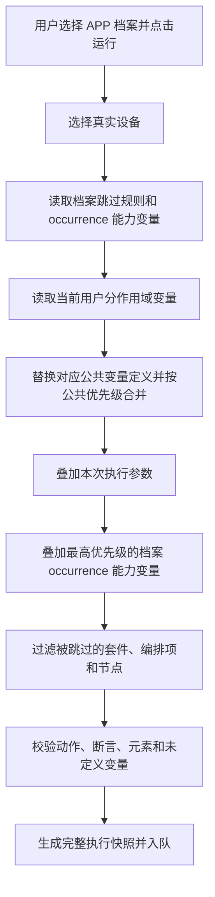

# APP 档案跳过与用户变量配置设计方案

> 文档状态：设计确认稿  
> 适用范围：当前开发环境  
> 核心口径：APP 档案保存设备能力约束；用户变量保存当前用户在项目、套件和用例作用域下的私有测试数据

> 实施状态（Step 74）：后端、前端和 Agent 已按本稿最终契约落地。现行实现以本文及权威架构文档 §10.20 为准；本文不是按提交记录展开的实施流水账。

## 1. 背景

平台中的不同设备使用同一套 APP 和公共测试资产，但设备支持的功能存在差异。例如某些设备支持更多串口、AI 功能或行业模块，另一些设备不支持这些内容。

公共套件和用例不能按设备复制，否则会产生大量重复资产和维护成本。因此继续维护一套公共测试资产，通过 APP 档案保存少量跳过规则，在执行前剔除当前档案不支持的内容。

少量变量同时属于设备能力约束，例如某个套件编排项在指定设备档案下必须使用固定端口或能力参数。这类值继续使用现有 APP 档案用例变量覆盖，并且不能被用户变量或本次执行参数突破。

不同平台用户在各自设备上使用的登录账号、密码、手机号、服务器地址等数据属于用户测试数据。用户配置必须指向明确的项目、套件或用例变量定义；不同作用域、不同套件中的同名变量不是同一项配置。

## 2. 最终设计结论

系统保留四层数据：

```text
公共测试资产
  ├─ 套件、用例、步骤与断言
  ├─ 公共元素
  └─ 全局、项目、套件、用例和编排项变量
        ↓
APP 档案（设备能力约束）
  ├─ 跳过规则：未配置的内容默认支持
  └─ 用例 occurrence 变量覆盖：按 suite_case_id 隔离，优先级最高
        ↓
当前用户变量
  └─ 分别覆盖当前档案下指定的项目、套件或用例变量
        ↓
执行快照
  └─ 固化最终套件、用例、节点、元素和变量结果
```

本方案不引入：

- 用户配置方案列表和多配置标签页。
- 查看、编辑或复制其他用户配置。
- 用户变量发布版本。
- 用户变量共享缓存。
- APP 档案元素覆盖。
- APP 档案节点参数覆盖。
- APP 档案全局变量覆盖。
- 用户步骤级变量编辑或单节点变量覆盖。
- 持久化的模块跳过规则。

现有 `AppProfileSuiteCaseVariableOverride` 继续保留；它是所有用户共享的设备能力约束，不属于用户私有变量。

## 3. 概念与职责

### 3.1 公共测试资产

公共测试资产是唯一需要长期维护的测试定义，包含套件、用例、步骤、断言、元素和基础变量。

所有 APP 档案引用同一套公共资产。修改公共用例后，各档案在下一次新执行时自动使用最新资产；已经创建的执行继续使用自己的执行快照。

模块只负责组织套件和用例，不参与 APP 档案规则解析，也不进入执行快照。

### 3.2 APP 档案

左侧列表中的每一项继续使用当前 `AppProfile` 概念。产品界面可以继续显示“APP 档案”，也可以改成更直观的“设备能力档案”。

APP 档案不是 Agent 上报的物理设备，也不与某个 `device_id` 强制绑定。用户运行档案时仍通过现有设备选择流程选择真实执行设备。

APP 档案维护两类共享能力约束：

- 跳过规则：默认支持全部套件、编排项、步骤和断言，只有明确设置跳过的内容才不执行。
- 用例 occurrence 变量覆盖：按 `suite_case_id + variable_name` 保存，适合固定端口、能力参数等不能由用户突破的设备差异。

上级跳过后，下级显示为继承跳过；恢复上级后，下级按照自身直接规则重新计算。APP 档案写操作仍由 Owner/Admin 管理，并推进共享 `AppProfile.revision`。

### 3.3 当前用户变量

当前用户变量不是按变量名在整个档案内统一覆盖，而是通过稳定的 `variables.id` 覆盖一个明确的项目、套件或用例变量定义：

```text
用户 + APP档案 + variable_id = 用户覆盖值
```

例如套件 A 和套件 B 都定义了 `username`，变量配置中应显示为两项：

```text
套件 A / username
套件 B / username
```

两个变量拥有不同的 `variable_id`，修改其中一项只影响对应套件。用户只能读取和修改自己的变量；后端从访问令牌确定用户身份，接口不接受由前端指定的 `user_id`。

用户变量替换其对应公共变量定义的值，然后继续参与既有作用域优先级计算。用户未配置的定义继续使用公共值。

所有可供用户配置的项目、套件和用例变量都必须具有稳定的 `variables.id`。现有用例内联变量若尚未规范化到 `variables` 表，应在接入本功能前完成迁移；用户变量接口不使用“作用域 + 名称”猜测变量身份。

### 3.4 APP 档案用例变量覆盖

现有 APP 档案工作台中的用例变量快捷编辑继续保留，数据仍写入 `AppProfileSuiteCaseVariableOverride`：

```text
APP档案 + suite_case_id + 变量名 = 设备能力覆盖值
```

同一用例在不同套件中复用，或者在同一套件中重复编排时，各 occurrence 互不影响。该覆盖对所有用户生效，优先级高于本次执行参数，不能被用户私有配置覆盖。

### 3.5 步骤变量引用

步骤和断言只提供变量引用位置，不提供用户变量编辑入口。用户只能编辑项目、套件和用例作用域中的变量；步骤参数中的 `${name}` 用于发现引用并展示影响范围。

如果某个步骤需要独立数据，应定义语义明确的变量名，或者通过用例、套件及编排项结构表达，不能重新引入步骤级用户覆盖。

## 4. 跳过规则

### 4.1 默认启用

系统不保存“启用”记录：

```text
不存在跳过规则 = enabled
存在跳过规则   = skipped
```

新建 APP 档案后天然支持全部公共资产，只需配置少量差异。

### 4.2 支持层级与身份

持久化跳过规则支持：

1. 测试套件：使用 `suite_id`。
2. 套件用例编排项：使用 `suite_case_id`。
3. 套件前后置节点：使用 `suite_id + node_key`。
4. 用例步骤或断言：使用 `suite_case_id + node_key`。

用例、步骤和断言必须使用 `suite_case_id` 精确区分 occurrence，禁止退回 `(suite_id, case_id)`，否则同一用例在同一套件中重复编排时无法只跳过其中一次。

推荐优先使用套件和编排项级跳过。步骤或断言级跳过只用于极少数无法拆分公共用例的场景。

### 4.3 模块不是跳过目标

模块是纯组织维度，不新增 `target_type=module`。如果页面提供“跳过当前分组”快捷操作，只能由前端把当前套件模块子树展开为具体套件规则后批量提交。

批量操作只影响提交时已存在的套件；以后新加入该模块的套件仍默认启用，符合“未配置即支持”的原则。

### 4.4 规则优先级

```text
套件跳过 > 编排项跳过 > 步骤/断言跳过
```

上级跳过时，下级规则仍可保留，但执行结果显示为继承跳过。恢复上级后，下级直接规则重新生效。

## 5. 用户变量数据模型

### 5.1 推荐表结构

新增 `user_app_profile_variable_overrides`：

| 字段 | 类型 | 说明 |
|---|---|---|
| `id` | integer | 主键 |
| `user_id` | integer | 当前变量所属用户 |
| `profile_id` | integer | 所属 APP 档案 |
| `variable_id` | integer | 被覆盖的公共 `variables.id` |
| `value_ciphertext` | text | 用户覆盖值的密文；空字符串也加密保存 |
| `created_at` | timestamptz | 创建时间 |
| `updated_at` | timestamptz | 更新时间 |

约束与索引：

```text
UNIQUE(user_id, profile_id, variable_id)
INDEX(profile_id, user_id)
FOREIGN KEY user_id REFERENCES users(id) ON DELETE CASCADE
FOREIGN KEY profile_id REFERENCES app_profiles(id) ON DELETE CASCADE
FOREIGN KEY variable_id REFERENCES variables(id) ON DELETE CASCADE
```

服务层必须校验 `variable_id` 指向项目、套件或用例变量，且该变量所属项目与档案一致；全局变量和编排项变量不允许通过本接口编辑。

恢复公共值时直接删除对应覆盖记录。执行历史由执行快照保证，不需要为用户变量保留软删除或发布版本。

### 5.2 为什么不使用单个 JSONB 字段

按变量逐行保存具备以下优势：

- 不同作用域和不同套件中的同名变量通过 `variable_id` 独立保存。
- 单个变量可以独立保存和恢复。
- 并发修改不同变量不会覆盖整份配置。
- 可以按变量身份检索、校验和统计。
- 敏感变量可以单独加密和脱敏。
- 审计时能够通过稳定变量 ID 准确记录发生变化的变量。

### 5.3 幂等与并发

第一版不引入用户可见 revision，也不做乐观并发冲突检测：

- `request_id` 用于同一请求的幂等重放，避免网络重试产生重复审计。
- 同一用户在多个页面修改同一项时采用最后写入生效。
- 不返回缺少版本依据的 `VARIABLE_UPDATE_CONFLICT`。

以后出现明确的多端并发编辑需求时，再为单行增加版本字段，不提前引入额外并发协议。

### 5.4 敏感变量

密码、Token 等敏感属性属于公共变量定义元数据：`variables.is_sensitive boolean NOT NULL DEFAULT false`，不由普通用户在保存覆盖时自行决定。相同 `variable_id` 的用户覆盖继承该敏感属性。

- 所有用户覆盖值统一存储为密文，不在日志中输出明文；`is_sensitive` 只决定接口展示与日志脱敏策略。
- 查询接口返回掩码和“已配置”状态，不返回完整明文。
- 用户重新输入后覆盖原值。
- 执行快照、执行详情和报告不展示敏感变量明文。
- Agent 只接收执行所需的最终值，Agent 日志不得打印完整变量表。
- 用户变量使用独立加密密钥，不与 Agent 用户密钥共用。

## 6. 变量发现与展示

后端从当前 APP 档案引用的公共测试资产中收集可配置变量及引用位置：

- 项目变量。
- 套件变量。
- 用例变量。
- 套件前后置节点、用例步骤和断言参数中的 `${name}` 引用。
- 递归扫描参数对象和数组。
- 排除 `variable_name` 等运行时输出变量名。
- 元素智能定位配置中的运行时占位符不纳入用户变量配置。

收集范围默认包含被跳过的测试资产。这样用户提前配置的变量不会因临时跳过而消失，恢复测试范围后无需重新录入。

变量列表以 `variable_id` 为身份，并显示其作用域、所属对象和变量名，不能只按变量名去重。同一变量定义的多个步骤引用合并为一项并展示引用次数；步骤和断言引用只读，不形成可编辑的步骤级变量。

APP 档案 occurrence 变量覆盖在工作台中单独展示为设备能力值，不混入“我的变量配置”。当它与用户变量或执行参数同名时，预检需要明确提示最终由档案能力覆盖值生效。

## 7. 变量解析与优先级

最终优先级固定为：

```text
APP 档案用例 occurrence 覆盖
> 本次执行参数
> 套件编排项变量
> 套件变量（用户值替换该套件变量的公共值）
> 用例变量（用户值替换该用例变量的公共值）
> 项目变量（用户值替换该项目变量的公共值）
> 全局变量
```

解析过程：

1. 对项目、套件和用例变量定义，若当前用户在当前档案下存在对应身份的覆盖，则以用户值替换该定义的公共值。
2. 按现有公共作用域优先级合并：全局 → 项目 → 用例 → 套件 → 编排项。
3. 叠加本次执行参数。
4. 最后叠加 APP 档案 `suite_case_id` 变量覆盖，形成不可被用户突破的最终设备能力值。

规则说明：

- 本次执行参数只影响当前执行，但不能覆盖 APP 档案 occurrence 能力值。
- 用户修改项目变量不会覆盖同名套件变量；用户必须编辑具体套件的变量定义。
- 用户修改套件 A 的变量不会影响套件 B 中的同名变量。
- 空字符串是合法覆盖值，不能被当成“未设置”。
- `null` 只用于 API 表达删除用户覆盖并恢复公共值，不作为执行值。
- 执行前如果仍存在未定义变量，预检失败并返回具体变量名和引用位置。

## 8. 前端页面设计

### 8.1 APP 档案主页面

左侧保持档案列表：

```text
全部 / 公共套件库
设备档案 A
设备档案 B
设备档案 C
+ 新建
```

右侧保留层级工作台，推荐列：

| 名称 | 类型 | 阶段 | 生效状态 | 档案能力变量 | 原因 | 操作 |
|---|---|---|---|---|---|---|

页面顶部操作：

```text
[运行当前档案全部套件] [我的变量配置] [差异清单]
```

现有用例行变量编辑继续保留，语义明确为“APP 档案能力变量”，按 `suite_case_id` 保存并对所有用户生效。只有 Owner/Admin 可以编辑。

取消以下入口：

- 元素覆盖。
- APP 档案全局变量覆盖。
- 节点参数覆盖。
- 应用到全部节点。
- 单步骤变量覆盖。

### 8.2 “我的变量配置”抽屉

不使用多用户 Tabs，只展示当前用户自己的变量。按项目、套件、用例分组，步骤引用仅作为只读明细：

Owner、Admin、Member 可查看并修改自己的变量；Viewer 不可进入或读取“我的变量配置”入口，也不可修改自己的变量，相关 GET/PATCH 请求均返回 403。

| 变量 | 作用域 | 所属对象 | 公共值 | 我的值 | 引用数 | 状态 | 操作 |
|---|---|---|---|---|---:|---|---|

支持：

- 按变量名搜索。
- 按项目、套件、用例作用域筛选。
- 只看已覆盖。
- 表内编辑。
- Enter 保存、Esc 取消。
- 单变量恢复公共值。
- 展开查看步骤和断言引用位置，但不能在引用位置编辑。
- 敏感变量掩码和重新输入。
- 分页或虚拟滚动，避免大量变量首次打开卡顿。

不同套件中的同名变量必须分别显示所属套件，不能合并成一行。

推荐提示文案：

> 这里的变量只属于当前账号，并且只在执行当前 APP 档案时生效。请先确认变量所属的项目、套件或用例；其他用户不会看到或使用这些值。APP 档案能力变量的优先级更高。

## 9. API 设计

### 9.1 查询当前用户变量

```http
GET /api/app-profiles/{profile_id}/my-variables
```

查询参数：

```text
keyword
scope=project|suite|case
overridden_only
page
page_size
```

响应示例：

```json
{
  "total": 2,
  "page": 1,
  "page_size": 20,
  "items": [
    {
      "variable_id": 108,
      "name": "username",
      "scope": "suite",
      "suite_id": 12,
      "suite_name": "登录回归套件",
      "case_id": null,
      "case_name": null,
      "public_value": "admin",
      "user_value": "zhangsan",
      "display_value": "zhangsan",
      "overridden": true,
      "reference_count": 6,
      "is_sensitive": false,
      "references": []
    }
  ]
}
```

`display_value` 表示当前变量定义层的用户值或公共值，不代表叠加编排项、执行参数和 APP 档案 occurrence 覆盖后的最终执行值。

后端根据当前登录用户查询，不接受 `user_id`。

### 9.2 保存或恢复用户变量

```http
PATCH /api/app-profiles/{profile_id}/my-variables
```

请求示例：

```json
{
  "request_id": "uuid",
  "updates": [
    {"variable_id": 21, "value": "10.0.0.8"},
    {"variable_id": 108, "value": "zhangsan"},
    {"variable_id": 235, "value": null}
  ]
}
```

语义：

- 字符串：新增或更新当前用户对指定变量身份的覆盖。
- 空字符串：保存为空字符串。
- `null`：删除当前用户覆盖，恢复该变量定义的公共值。
- 批量更新在一个事务中完成。
- 同一 `request_id` 幂等重放，不重复写入和审计。
- 未提供行版本，合法的新请求采用最后写入生效。

主要错误码：

| HTTP | 错误码 | 含义 |
|---:|---|---|
| 403 | `PROJECT_FORBIDDEN` | 当前用户无项目访问或执行权限 |
| 404 | `APP_PROFILE_NOT_FOUND` | APP 档案不存在 |
| 404 | `VARIABLE_NOT_FOUND` | `variable_id` 不存在或不属于当前档案项目 |
| 422 | `VARIABLE_NOT_REFERENCED` | 变量未被当前档案测试资产引用 |
| 422 | `VARIABLE_VALUE_INVALID` | 变量值或作用域身份不合法 |

用户变量不推进共享 `AppProfile.revision`，不广播项目级档案 revision 变化。

`references` 是只读引用明细，按真实动作/断言 `params|parameters` 中的 `${name}` 计算，包含套件、`suite_case_id`、用例、阶段、顺序和节点名称；元素智能定位配置不计入引用。展开引用明细不得成为编辑入口。

### 9.3 APP 档案用例变量接口

现有接口继续保留：

```http
GET   /api/app-profiles/{profile_id}/suite-cases/{suite_case_id}/variables
PATCH /api/app-profiles/{profile_id}/suite-cases/{suite_case_id}/variable-overrides
```

写入仍携带 `expected_revision` 和 `request_id`，成功后推进共享 `profile_revision`。它与用户变量 API 不共用权限、版本和数据表。

## 10. 执行流程

### 10.1 创建执行



执行创建时，后端必须从认证上下文确定用户，不允许前端选择变量所有者。

### 10.2 执行快照

执行开始前固化：

- 最终套件及顺序。
- 最终编排项及顺序。
- 最终节点和断言参数。
- 最终元素定位信息。
- 最终变量值或渲染后的参数。
- 被排除内容及原因。
- 执行发起用户。

用户变量不需要发布版本，但执行快照不能取消。用户在执行过程中修改变量，只影响以后创建的新执行。

### 10.3 重试

历史执行重试继续使用原执行快照，不重新读取当前用户变量、APP 档案能力变量或公共资产。需要使用最新配置时，用户应重新发起一次新执行。

## 11. 权限设计

| 操作 | Owner/Admin | Member | Viewer |
|---|---:|---:|---:|
| 查看 APP 档案 | 是 | 是 | 是 |
| 新建、编辑、删除 APP 档案 | 是 | 否 | 否 |
| 设置档案跳过规则 | 是 | 否 | 否 |
| 编辑 APP 档案用例能力变量 | 是 | 否 | 否 |
| 查看自己的用户变量 | 是 | 是 | 否 |
| 修改自己的用户变量 | 是 | 是 | 否 |
| 查看或修改其他用户变量 | 否 | 否 | 否 |
| 执行测试 | 是 | 是 | 否 |

Viewer 不能进入或读取“我的变量配置”入口，也不能修改自己的用户变量；后端 GET/PATCH 接口均直接返回 403。

平台管理员如需排障，应通过受审计的临时诊断能力处理，不在普通业务接口中提供查询其他用户变量的能力。

## 12. 对现有覆盖功能的调整

本设计把 APP 档案收窄为“跳过规则 + 用例 occurrence 能力变量”。

计划停用并删除：

- `AppProfileElementOverride` 及相关 API、抽屉和解析逻辑。
- `AppProfileVariableOverride` 及相关 API、抽屉和解析逻辑。
- `AppProfileNodeOverride` 及节点参数覆盖 API、抽屉和解析逻辑。

继续保留：

- `AppProfile` 与发布版本。
- `AppProfileSkipRule`。
- `AppProfileSuiteCaseVariableOverride` 及现有用例行快捷编辑。
- APP 档案工作台和差异清单。
- 公共元素库及智能定位能力。
- 全局、项目、套件、用例和编排项变量。
- 新增的当前用户项目／套件／用例变量覆盖。
- 执行快照。

公共智能定位规则必须覆盖所有支持的 APP/设备形态；不再允许通过 APP 档案替换元素 locator。无法由同一公共元素可靠定位的场景，应拆分公共元素并在公共测试资产中明确引用，不能恢复档案元素覆盖。

当前项目仍处于开发环境，不需要为旧覆盖数据保留兼容分支。迁移可以直接删除旧覆盖表及相关测试数据，但实施前必须确认没有其他模块继续引用这些模型。

现行 API 已删除档案元素定位覆盖、档案全局变量覆盖和节点参数覆盖；旧路由不作为兼容入口保留。执行涉及敏感变量时，Agent 协议和最低版本为 `3.4.0`，旧 Agent 必须升级。

共享档案 revision 继续用于跳过规则和 APP 档案 occurrence 变量覆盖的并发保护。用户变量不参与该 revision，也不需要独立的可见版本管理。

## 13. 性能要求

- 用户变量列表由后端聚合，前端不遍历完整套件树计算变量。
- 变量定义与引用一次批量查询，禁止逐套件、逐用例 N+1 查询。
- 默认每页 20 条，可选择 50、100 条，并支持跳页。
- 工作台只加载当前展开套件的编排项和变量摘要。
- 用户变量发生变化后，只刷新受影响的变量，不重新加载完整档案树。
- 执行预检直接读取数据库，不为用户变量引入共享缓存。

## 14. 审计与安全

记录以下用户变量操作：

- 新增覆盖。
- 修改覆盖。
- 恢复公共值。

审计内容包含用户、档案、`variable_id`、变量作用域与目标快照、变量名、操作类型、时间、IP、User-Agent 和 `request_id`。敏感变量只记录“已变化”，不记录变更前后明文。

应用日志、HTTP 日志、执行日志和报告均不得打印密码、Token 等敏感值。

## 15. 验收场景

### 15.1 档案默认支持全部

新建 APP 档案后不创建任何启用记录，预检包含全部公共套件和编排项。

### 15.2 套件跳过

设备档案 A 跳过“网约车套件”后，该套件不进入可执行快照，报告以 N/A 展示对应排除原因。

### 15.3 occurrence 精确跳过

同一用例在同一套件中重复编排两次，只对其中一个 `suite_case_id` 设置跳过后，另一个 occurrence 仍正常执行。

### 15.4 用户隔离

张三和李四分别设置“登录回归套件 / username”。两人创建的新执行使用各自的值，互不影响。

### 15.5 同名套件变量独立

套件 A 与套件 B 都定义 `username`。当前用户只修改套件 A 的变量后，套件 A 使用用户值，套件 B 继续使用自己的公共值。

### 15.6 作用域继承

项目和套件同时定义 `server_ip`。用户只修改项目变量后，定义了同名变量的套件仍使用套件值；未定义同名套件变量的位置使用用户的项目值。

### 15.7 APP 档案能力值最高

某 `suite_case_id` 在 APP 档案中覆盖 `port_name=COM8`。即使当前用户设置了其他值，或者本次执行参数提交 `port_name=COM9`，最终执行快照仍使用 `COM8`。

### 15.8 恢复公共值

用户恢复变量后，数据库删除对应用户覆盖记录，新执行重新使用该变量定义的公共值，并继续参与正常作用域优先级计算。

### 15.9 执行与重试稳定性

用户启动执行后修改变量，正在运行的执行不受影响；下一次新执行使用最新值。历史执行重试仍使用历史执行快照。

### 15.10 幂等、权限与安全

同一 `request_id` 重试不会重复写入或审计；普通用户无法通过修改参数读取或覆盖其他用户变量；敏感变量不会出现在接口明文、日志或报告中。

## 16. 推荐实施顺序

1. 先更新权威架构文档及相关契约测试，固定新口径。
2. 将用例、步骤和断言跳过身份改为 `suite_case_id`，保留现有档案用例变量覆盖。
3. 将可配置用例变量规范化为稳定的 `variables.id`，消除用户配置对内联名称映射的依赖。
4. 新增按 `variable_id` 关联的用户档案变量表、Repository、Schema、审计和 API。
5. 增加变量定义发现、引用聚合、敏感变量处理和用户值替换。
6. 按最终优先级接入预检和执行快照。
7. 增加“我的变量配置”抽屉；现有用例行编辑改名为“档案能力变量”并保留。
8. 移除元素、APP 档案全局变量和节点参数覆盖入口。
9. 删除旧覆盖 API、模型、解析分支和数据库表。
10. 更新差异清单、用户手册和自动化测试。

## 17. 最终口径

1. 所有 APP 档案共用一套测试资产，APP 档案表示设备能力约束。
2. 新档案默认执行全部测试内容，只保存需要跳过的差异。
3. 持久化跳过规则不使用模块；套件按 `suite_id`，编排项及其节点按 `suite_case_id` 精确寻址。
4. APP 档案不允许覆盖公共元素、节点参数和档案全局变量。
5. 现有 APP 档案用例 occurrence 变量覆盖继续保留，所有用户共享，并拥有最高优先级。
6. 每个用户可以在每个 APP 档案下按稳定 `variable_id` 分别覆盖项目、套件和用例变量；同名但不同作用域或目标的变量互相独立。
7. 步骤和断言只展示变量引用位置，不提供用户编辑和节点级变量覆盖。
8. APP 档案 occurrence 覆盖高于本次执行参数；本次执行参数高于其余公共变量解析结果。
9. 用户值替换对应身份的公共变量值，再按编排项、套件、用例、项目、全局的既有优先级解析。
10. 用户变量不推进共享档案 revision；第一版使用 `request_id` 幂等并采用最后写入生效。
11. 每次执行必须生成完整快照，保证运行中修改和历史重试不改变既有结果。
