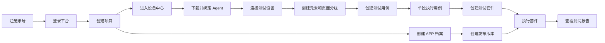
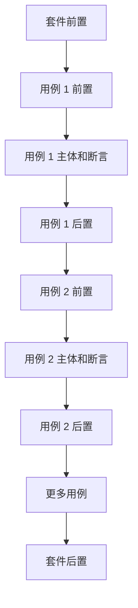

# APP 自动化测试平台平台使用人员操作手册

本文面向测试人员、测试负责人和日常使用平台的项目成员，按照前端页面的实际操作顺序，完整说明如何从注册账号开始，完成项目创建、Agent 接入、元素维护、用例编写、套件执行、测试报告查看以及 APP 档案管理。

文档中的按钮和菜单名称以当前页面显示为准。不同账号看到的按钮可能不同，这是因为项目角色不同；如果看不到某个“新建”“编辑”“删除”或“运行”按钮，请联系项目管理员确认权限。

## 一、完整使用流程

一个新项目建议按照下面的顺序使用：



推荐的实际工作顺序是：

1. 先注册并登录平台。
2. 创建一个项目，并邀请项目成员。
3. 接入 Agent 和测试设备，确认设备状态正常。
4. 创建页面分组和元素。
5. 创建一个最小可执行用例，单独执行验证。
6. 创建更多用例并整理到模块中。
7. 创建套件，添加用例并调整顺序。
8. 如果不同 APP 或版本存在差异，再创建 APP 档案并发布版本。
9. 执行套件并在“报告中心”查看结果。

## 二、认识平台页面

登录后，平台主要分为“平台公共区域”和“项目工作区”。

```text
平台公共区域
├── 工作台
├── 项目管理
├── 全局元素库
├── 执行中心
├── 设备中心
└── 报告中心

进入某个项目后
├── 项目概览
├── 测试用例
├── 测试套件
├── APP 档案
├── 元素库
├── 变量
├── 项目执行
├── 项目报告
└── 项目设置
```

常用页面之间的关系如下：

| 页面 | 主要用途 |
| --- | --- |
| 项目管理 | 新建、进入、编辑和删除项目 |
| 设备中心 | 下载 Agent、生成个人 Key、查看 Agent 和测试设备状态 |
| 元素库 | 保存按钮、输入框、列表等页面控件的定位信息 |
| 测试用例 | 编写一次完整的测试流程和检查条件 |
| 测试套件 | 将多个用例编排成一组，批量执行 |
| APP 档案 | 为不同 APP、版本或环境保存差异配置 |
| 执行中心 | 查看正在执行、排队和已完成的任务 |
| 报告中心 | 查看测试结果、日志、截图和统计信息 |
| 项目设置 | 管理项目基本信息、成员和权限 |

## 三、注册和登录

### 3.1 注册账号

1. 打开平台登录页。
2. 在登录框下方点击“立即注册”。
3. 在“创建账号”页面填写：

   | 页面字段 | 填写说明 |
   | --- | --- |
   | 用户名 | 用于登录平台，建议使用容易识别的姓名或工号。 |
   | 密码 | 设置登录密码，不要使用过于简单的密码。 |

4. 点击“注 册”。
5. 注册成功后，使用刚才填写的用户名和密码登录。

页面示意：

```text
┌──────────────────────────────┐
│          创建账号             │
│ 用户名  [请输入用户名        ] │
│ 密码    [请输入密码       👁 ] │
│                              │
│          [      注 册      ]   │
│ 已有账号？[去登录]            │
└──────────────────────────────┘
```

如果页面提示用户名已存在，请更换用户名；如果提示密码不符合要求，按照页面提示修改后重新提交。

### 3.2 登录平台

1. 在“欢迎回来”页面填写用户名和密码。
2. 需要在下次打开浏览器时保持登录，可以勾选“记住我”。
3. 点击“登 录”。

登录成功后，平台会进入“工作台”。如果访问项目页面时被带回登录页，通常是登录状态已经过期，重新登录即可。

## 四、创建项目和管理项目成员

### 4.1 创建项目

1. 点击左侧“项目管理”。
2. 点击右上角“新建项目”。
3. 在弹窗中填写：

   | 页面字段 | 是否必填 | 填写建议 |
   | --- | --- | --- |
   | 名称 | 是 | 使用产品名、项目名或业务线名称，例如“运维宝移动 APP 测试”。 |
   | 描述 | 否 | 填写测试范围、负责人、版本范围等信息。 |
   | 可见性 | 是 | “私有”只对项目成员开放；“公开”适合需要被更多人员查看的项目。 |

4. 点击“保存”。

页面示意：

```text
项目管理                         [新建项目]
┌──────────────────────────────────────────┐
│ [按项目名称搜索]  [全部][我创建的][公开]   │
│                                          │
│ 项目卡片                                  │
│ 名称：运维宝移动 APP 测试                  │
│ 描述：移动端功能回归                       │
│ 用例 0   元素 0   套件 0                   │
│                         [进入] [编辑]      │
└──────────────────────────────────────────┘
```

### 4.2 查找并进入项目

在“项目管理”页面可以：

- 使用“按项目名称搜索”查找项目。
- 使用“全部”“我创建的”“公开”筛选项目。
- 使用“角色”筛选自己是拥有者、管理员、成员还是访客的项目。
- 点击项目卡片上的“进入”打开项目工作区。

进入后，左侧菜单会显示该项目的“测试用例”“测试套件”“APP 档案”“元素库”等页面。

### 4.3 管理项目成员

1. 进入项目后，点击左侧“项目设置”。
2. 打开“成员与权限”区域。
3. 搜索用户并添加为项目成员，或调整已有成员角色。

角色使用建议：

| 角色 | 适合的人员 | 主要能力 |
| --- | --- | --- |
| 拥有者 | 项目负责人 | 管理项目、成员、资产和项目删除等全部操作。 |
| 管理员 | 测试负责人 | 管理项目基本信息、成员和测试资产。 |
| 成员 | 测试编写和执行人员 | 创建、编辑用例、元素、套件并执行测试。 |
| 访客 | 只查看结果的人员 | 查看项目资产、执行记录和报告，不能修改内容。 |

### 4.4 项目权限注意事项

- 项目管理员及以上可以自由编辑和删除项目内元素、用例、套件等资产。
- 普通成员和访客的操作范围以页面实际显示的按钮为准。
- 访客通常只能查看，页面中不会显示新建、编辑、删除或运行入口。
- 删除项目会影响项目下的用例、元素、套件和其他资产，删除前必须确认范围。

## 五、下载、配置和连接 Agent

Agent 是安装在测试电脑上的客户端。平台页面负责管理测试任务，Agent 负责连接测试手机并实际执行操作。

### 5.1 准备测试电脑和手机

在安装 Agent 前，准备：

- 一台 Windows 测试电脑。
- 一部 Android 测试手机或平板。
- USB 数据线，或已经配置好的无线调试环境。
- 测试 APP 已安装到设备。
- 测试电脑可以访问平台地址。

Android 设备首次连接时，需在手机上确认“允许 USB 调试”。如果设备显示“未授权”，请解锁手机并确认授权提示。

### 5.2 在设备中心下载 Agent

1. 点击左侧“设备中心”。
2. 在页面顶部找到“Agent 下载与个人 Key”。
3. 在“Windows Agent”一栏点击“下载 v……”。
4. 下载完成后运行安装程序。
5. 根据安装向导选择安装位置；如果需要电脑开机后自动运行，可以在安装时开启自动启动选项。

页面示意：

```text
设备中心
┌─────────────────────────────────────────────┐
│ Agent 下载与个人 Key                         │
│ Windows Agent   [下载 v3.x.x]                │
│ 我的 Key        尚未生成       [生成 Key]     │
│ 安装 Agent 后，把上面的 Key 粘贴到 Agent 的   │
│ “绑定 Key”输入框完成绑定。                    │
└─────────────────────────────────────────────┘
```

如果显示“暂无发布版本（管理员发布后显示）”，说明当前平台还没有可下载的 Agent 安装包，请联系平台管理员发布安装包。

### 5.3 生成个人 Key

1. 在“设备中心”的“我的 Key”一栏点击“生成 Key”。
2. 生成后点击“复制”。
3. 暂时不要把 Key 发到群聊、截图或代码仓库中。

个人 Key 只在绑定 Agent 时使用。若 Key 泄露，可以点击“重置”；重置后旧 Key 不能再用于新增绑定，已经完成绑定的 Agent 按页面提示处理即可。

### 5.4 在 Agent 中绑定平台

安装完成后打开 Agent 客户端：

1. 在“平台地址”或“服务器地址”中填写管理员提供的平台地址。
2. 在“绑定 Key”输入框粘贴设备中心生成的个人 Key。
3. 点击“绑定”或“连接”。
4. 等待客户端提示绑定成功，并保持 Agent 运行。

如果客户端还要求填写 Agent 名称或主机名，建议填写容易识别的名称，例如：

```text
测试电脑-客厅
测试电脑-Android-01
办公室回归机
```

首次连接后，客户端会记住本机绑定信息。以后只要 Agent 正常启动并能访问平台，通常不需要每次重新输入 Key。

### 5.5 检查 Agent 是否在线

回到平台“设备中心”，在“已绑定 Agent”区域查看：

| 页面列 | 正常表现 |
| --- | --- |
| Agent ID | 显示本机 Agent 的唯一标识。 |
| 主机名 | 显示安装 Agent 的电脑名称。 |
| 状态 | 显示在线或类似的正常状态。 |
| 版本 | 显示 Agent 版本。 |
| 设备数 | 显示该 Agent 当前发现的设备数量。 |
| 最后心跳 | 时间持续更新。 |

页面每 5 秒自动刷新，也可以点击“刷新”。

### 5.6 连接测试设备

将手机通过 USB 或无线方式连接到运行 Agent 的电脑，确认：

1. 手机已解锁。
2. 已开启开发者选项和 USB 调试。
3. 手机弹出授权提示时点击允许。
4. 在“设备中心”的“我的设备”区域出现设备。
5. 设备状态为在线、已授权或空闲等正常状态。

“我的设备”页面常见信息：

| 页面列 | 说明 |
| --- | --- |
| 设备 | 设备名称。 |
| 序列号/地址 | USB 序列号或设备地址。 |
| 无线地址 | 使用 Wi-Fi 连接时显示无线地址。 |
| 连接 | 显示 USB 或 Wi-Fi。 |
| 状态 | 显示设备当前是否可用。 |
| 所属 Agent | 显示设备由哪个 Agent 接入。 |

可以点击“设为默认”，让后续运行时优先选择这台设备；也可以点击“清除默认设备”取消默认设置。

### 5.7 Agent 和设备异常处理

| 现象 | 处理方式 |
| --- | --- |
| Agent 显示离线 | 检查客户端是否运行、平台地址是否正确、网络是否可达，然后点击“刷新”。 |
| 没有设备 | 检查 USB 线、手机授权、无线连接和 Agent 日志。 |
| 设备显示未授权 | 解锁手机，重新插拔 USB，并在手机上点击允许 USB 调试。 |
| 设备显示忙 | 该设备正在执行其他任务，等待任务结束后再运行。 |
| 设备突然离线 | 检查数据线、电量、手机锁屏和电脑网络。 |
| Agent 有多个但不知道选哪个 | 根据“主机名”和“设备数”判断，选择连接目标手机的 Agent。 |

## 六、创建和维护元素

元素是 APP 页面上可被自动化操作的控件，例如按钮、输入框、标题、复选框、列表和列表项。

### 6.1 进入项目元素库

1. 打开目标项目。
2. 点击左侧“元素库”。
3. 左侧是“页面分组”，右侧是元素列表。

页面分组用于按页面或功能组织元素，例如：

```text
页面分组
├── 登录页
│   ├── 用户名输入框
│   ├── 密码输入框
│   └── 登录按钮
├── 首页
│   ├── 首页标题
│   └── 设置按钮
└── 设置页
    ├── 通知开关
    └── 保存按钮
```

### 6.2 创建页面分组

1. 在“页面分组”区域点击“新增页面分组”。
2. 填写页面名称，例如“登录页”。
3. 点击“创建”。

也可以在某个页面分组上右键，选择“新建页面”，创建该分组下的子页面。页面分组支持展开、折叠、编辑和删除。

注意：

- “全部”和“未分组”是系统保留分类，不能编辑或删除。
- 删除页面分组后，该分组下的元素会自动变为“未分组”，不会删除元素本身。
- 项目元素库只显示当前项目相关的分组，不属于当前项目的分组不会混入列表。

### 6.3 新建元素

1. 选择目标页面分组，或选择“未分组”。
2. 点击右侧“新建元素”。
3. 填写弹窗中的信息：

   | 页面字段 | 填写说明 |
   | --- | --- |
   | 项目 | 当前项目模式下通常已经选定。 |
   | 名称 | 给元素起一个易懂的名称，例如“登录按钮”“用户名输入框”。 |
   | 页面 | 选择页面分组；不选择时归入“未分组”。 |
   | 平台 | 选择 Android、iOS 或通用。 |
   | 适用范围 | 不填写时表示所有范围；有特殊范围时按团队约定填写。 |
   | 定位方式 | 选择如何找到该元素。 |
   | 定位值 | 填写对应定位方式的值。 |
   | 描述 | 可填写控件用途、页面位置或维护说明。 |

4. 点击“保存”。

### 6.4 选择定位方式

元素的“定位方式”决定平台如何在手机页面中找到控件。常见选择如下：

| 定位方式 | 适用情况 | 填写示例 |
| --- | --- | --- |
| ID / resource_id | APP 为控件提供稳定资源 ID 时优先使用。 | `com.example:id/login` |
| XPath | 需要按控件层级、属性或文本定位时使用。 | `//android.widget.Button[@text='登录']` |
| accessibility_id | APP 提供了无障碍标识时使用。 | `login_button` |
| class_name | 页面中控件类型唯一时使用。 | `android.widget.EditText` |
| 智能定位 | 普通定位不稳定，需要按文本、控件特征等组合查找时使用。 | 按页面提示配置 |
| 坐标 | 控件无法稳定识别时使用。 | 按屏幕坐标填写 |

建议优先使用稳定的 resource-id 或 accessibility_id。XPath 需要注意页面层级变化；坐标定位会受到分辨率、状态栏和页面布局影响。

### 6.5 编辑、复制、引用和删除元素

在右侧元素列表的“操作”列可以使用：

- “引用”：查看哪些用例正在使用该元素。
- “复制”：复制当前元素，适合创建定位方式相似的新元素。
- “编辑”：修改元素名称、页面、定位方式、定位值或描述。
- “删除”：删除元素。删除前先通过“引用”确认是否会影响已有用例。

元素修改后，引用该元素的用例会使用最新元素配置；如果只是某个 APP 的定位方式不同，建议使用 APP 档案中的元素覆盖，而不是复制大量相似元素。

### 6.6 导入和导出元素

项目元素库可以使用“导入 Excel”和“导出 Excel”。

推荐流程：

1. 点击“导入 Excel”。
2. 点击“下载 Excel 模板”。
3. 按模板填写元素名称、页面、平台、定位方式和定位值。
4. 点击“选择 .xlsx 文件”。
5. 确认预览内容无误后点击“开始导入”。

如果某行填写错误，页面会显示行号、字段和错误原因。导入前应修正错误；不要把包含密码、Token 等敏感数据的内容写入元素描述。

## 七、创建和编写测试用例

### 7.1 创建用例模块

1. 进入项目工作区的“测试用例”。
2. 在左侧“用例模块”区域点击“新增模块”。
3. 填写“模块名称”，例如“登录功能”。
4. 点击“创建”。

也可以右键某个模块，选择“新建子模块”，建立多级结构：

```text
用例模块
├── 登录功能
│   ├── 正常登录
│   └── 异常登录
└── 设备设置
    ├── 网络设置
    └── 显示设置
```

模块支持自由展开、折叠、编辑和删除。删除模块时，子模块会提升到当前层级，模块内用例会变为“未分组”，不会删除用例本身。

**拖拽调整模块结构**：按住任意模块往上/下拖可以调整同级顺序，拖到另一个模块的中间位置则会成为它的子模块。拖到列表底部的“拖到此处成为顶级模块”区域可以把它提升回顶级。落点有提示线或虚线框表示可放置；拖到自己的子模块里不会生效（提示也不会出现），因为那会形成循环。

触摸屏或使用键盘时可以用右键菜单的“移动到…”：选择目标模块后点“确定”，模块会成为目标模块的子模块；选择“根层级（顶级模块）”则提升为顶级模块。

**按模块筛选**：点击左侧“全部用例”“未分组”或任意模块，右侧列表只显示对应范围的用例。选中父模块时会**同时包含其子模块**下的用例。

### 7.2 新建用例

1. 点击右侧“新建用例”。
2. 填写基本信息：

   | 页面字段 | 填写说明 |
   | --- | --- |
   | 名称 | 写清楚测试对象和预期结果，例如“登录成功后进入首页”。 |
   | 模块 | 选择所属模块；暂时不确定时可以放入未分组。 |
   | 状态 | 草稿表示仍在编辑，启用表示可执行，禁用表示暂不执行。 |
   | 描述 | 填写测试目的、前置条件、数据要求或特殊说明。 |

3. 在“前置操作”“执行步骤”“后置操作”中编排步骤。
4. 在“用例变量”中填写本用例专用的变量。
5. 点击底部“保存”。

### 7.3 三类步骤区域

用例编辑页包含三个操作区域：

```text
前置操作   →   执行步骤   →   后置操作
准备环境       执行业务       清理环境
```

| 区域 | 作用 | 示例 |
| --- | --- | --- |
| 前置操作 | 为本用例准备环境。执行时可按开关决定是否运行。 | 启动 APP、登录、进入指定页面。 |
| 执行步骤 | 用例的主体流程，始终是主要执行内容。 | 点击、输入、滑动、读取文本。 |
| 后置操作 | 执行结束后清理和恢复环境。主体失败时也会尝试执行。 | 退出登录、关闭 APP、恢复设置。 |

### 7.4 添加动作步骤

1. 在对应区域点击“添加操作”。
2. 选择动作。
3. 如果页面出现“元素”选择框，选择元素库中的目标元素。
4. 填写动作参数。
5. 根据需要填写“说明”，并设置“失败后继续”。
6. 点击“展开”检查完整内容，或点击“收起”查看步骤摘要。

典型的登录步骤：

```text
前置操作
└── 启动 APP

执行步骤
├── 点击元素：用户名输入框
├── 输入文本：${username}
├── 点击元素：密码输入框
├── 输入文本：${password}
└── 点击元素：登录按钮

后置操作
└── 关闭 APP
```

### 7.5 添加断言

1. 在某个动作下点击“添加断言”。
2. 选择要检查的元素。
3. 填写断言参数。
4. 一个动作可以添加多个断言，按列表顺序检查。

例如：

```text
点击元素：登录按钮
├── 元素存在/不存在：成功提示，期望“存在”
└── 文本包含：首页标题，期望值“欢迎”
```

动作失败时，该动作下的断言不会执行。关键步骤建议保持“失败后继续”关闭，避免后续步骤在错误页面上继续；清理类步骤可以根据需要开启。

### 7.6 用例变量

在“用例变量”区域点击“添加变量”，填写“变量名”和“变量值”。例如：

| 变量名 | 变量值 | 使用场景 |
| --- | --- | --- |
| username | test_user | 登录账号 |
| password | 测试密码 | 登录密码 |
| search_word | 自动化 | 搜索内容 |

在动作文本中引用变量时写成 `${变量名}`，例如输入文本填写 `${username}`。

变量的使用优先级是：

```text
本次执行填写的参数 > 套件变量 > 用例变量 > 项目变量 > 全局变量
```

同名变量会使用优先级更高的值。为了方便排查，建议同一项目尽量不要在多个层级重复使用同一个变量名。

### 7.7 保存和检查用例

点击“保存”时，页面会检查：

- 用例名称是否填写。
- 需要元素的动作是否已经选择元素。
- 必填参数是否填写。
- 参数数值是否在允许范围内。
- 断言是否选择了检查元素。

如果保存失败，优先查看页面顶部或字段旁的错误提示，修正后再次保存。保存成功后建议回到“测试用例”列表，确认用例名称、所属模块、状态和步骤数量正确。

### 7.8 编辑、克隆和删除用例

在用例列表“操作”列可以使用：

- “编辑”：修改用例基本信息、步骤、断言和变量。
- “克隆”：复制一个相似用例，再修改差异内容。
- “删除”：删除用例。
- “批量删除”：先勾选多个用例，再批量删除。

删除前应先确认该用例是否已经被套件引用。若只是暂时不想执行，建议把状态改为“禁用”，不要直接删除。

## 八、创建和编排测试套件

### 8.1 创建套件模块

套件模块和用例模块的用法完全一致，但**两棵树互相独立**：套件模块只用于给套件分组，不会出现在用例页；用例模块也不能挂套件。

1. 进入项目工作区的“测试套件”。
2. 在左侧“套件模块”区域点击“新增模块”，填写名称后创建。
3. 右键模块可以“新建子模块 / 编辑模块 / 移动到… / 删除模块”。
4. 拖动模块可调整同级顺序，拖到另一个模块中间即成为它的子模块。

```text
套件模块
├── 版本冒烟
│   ├── Android
│   └── iOS
└── 每日回归
```

点击“全部套件”“未分组”或任意模块，右侧套件列表会按该范围过滤；选中父模块时同样包含其子模块下的套件。

删除套件模块时，子模块会提升到当前层级，模块内套件会变为“未分组”，不会删除套件本身。

### 8.2 创建套件

1. 进入项目工作区的“测试套件”。
2. 点击“新建套件”。
3. 填写：

   | 页面字段 | 填写说明 |
   | --- | --- |
   | 名称 | 例如“登录回归”“版本冒烟测试”“设置功能回归”。 |
   | 模块 | 套件归属的套件模块，选择“未分组”表示不归类。默认取左侧当前选中的模块。 |
   | 描述 | 填写执行范围、适用版本和负责人。 |

4. 点击“保存”。

需要把已有套件换到别的模块时，点击套件的“编辑信息”，在“模块”下拉里改选后保存即可。

### 8.3 添加用例和调整顺序

在套件详情的“用例编排”区域：

1. 点击“添加用例”。
2. 在用例列表中勾选需要执行的用例。
3. 确认后，用例会出现在套件列表中。
4. 拖动用例左侧的排序手柄，调整执行顺序。
5. 需要移除用例时，点击该用例右侧的删除按钮。

“用例编排”区域会显示“自动保存”。添加、移除和拖动排序后，建议等待保存提示完成，再刷新页面检查顺序。

页面示意：

```text
测试套件                         [新建套件]
┌──────────────────┬────────────────────────────┐
│ 套件列表          │ 登录回归                    │
│ 登录回归          │ 用例编排        [添加用例]  │
│ 支付回归          │ 1  登录成功                 │
│ 冒烟测试          │ 2  登录失败                 │
│                   │ 3  退出登录                 │
│                   │ 套件变量        [新增变量] │
│                   │ 暂无套件变量                │
└──────────────────┴────────────────────────────┘
```

### 8.3 配置套件前置和后置操作

套件详情中可以配置套件级的前置和后置操作：

| 操作区域 | 执行时机 | 适合放置的内容 |
| --- | --- | --- |
| 套件前置 | 整个套件开始前执行一次。 | 统一启动 APP、准备公共数据、登录公共账号。 |
| 套件后置 | 整个套件结束后执行一次。 | 关闭 APP、退出账号、清理公共数据。 |

配置后点击“保存套件配置”。前置和后置操作会保持上下排列，按照页面显示的顺序执行。

### 8.4 配置套件变量

套件详情中的“套件变量”区域用于配置整个套件共享的变量。

1. 点击“新增变量”。
2. 在“新增套件变量”窗口填写：

   | 页面字段 | 填写说明 |
   | --- | --- |
   | 变量名 | 必填，例如 `username`、`environment`。 |
   | 值 | 填写该套件使用的值。 |
   | 说明 | 可选，填写变量用途。 |

3. 点击“创建”。

已有变量可以点击“编辑”修改值，点击“删除”移除变量。套件变量会覆盖同名的用例变量，但会被本次执行时填写的执行参数覆盖。

### 8.5 编辑和删除套件

在套件列表或套件详情右上角的“套件操作”中可以编辑和删除套件。

- 编辑套件：修改名称和描述。
- 删除套件：删除套件及其中的用例编排关系，不会删除被引用的用例。
- 如果套件正在执行，不建议修改或删除，等待执行完成后再操作。

## 九、执行用例

### 9.1 单独执行用例

1. 在“测试用例”列表找到目标用例。
2. 点击“运行”。
3. 在设备选择窗口中选择设备。
4. 根据页面提示选择 APP 或档案、设置超时时间和执行参数。
5. 确认预检查信息无误后点击开始执行。

单独执行适合第一次验证新用例、调试元素定位和检查动作参数。

### 9.2 执行前检查

开始前确认：

- Agent 显示在线。
- 目标设备在线、已授权且空闲。
- 测试 APP 已安装，且版本符合测试要求。
- 用例状态为“启用”。
- 用例引用的元素没有被删除。
- 用例变量、项目变量或套件变量已经准备好。

如果页面提示没有可用设备，先回到“设备中心”处理 Agent 或设备状态，不要连续重复点击运行。

### 9.3 执行状态

执行后可以在“项目执行”或“执行中心”查看状态：

| 状态 | 页面含义 |
| --- | --- |
| queued | 已提交，正在等待设备。 |
| running | 正在执行。 |
| stopping | 已请求停止，正在完成收尾。 |
| passed | 执行通过。 |
| failed | 动作或断言未通过。 |
| error | 设备、网络或系统出现异常。 |
| stopped | 用户主动停止。 |
| cancelled | 任务未正常完成，被取消。 |

### 9.4 查看执行详情和停止执行

点击执行记录进入“执行详情”，可以查看：

- 执行名称、设备和当前状态。
- 套件、用例、步骤和断言的执行结果。
- 实时日志。
- 失败原因。
- 截图等执行证据。

执行过程中需要停止时，点击“停止”，并等待状态从 `stopping` 收敛到最终状态。不要在设备仍被占用时强制关闭 Agent 或拔掉手机。

## 十、执行测试套件

### 10.1 执行套件

1. 进入项目的“测试套件”。
2. 选择要运行的套件。
3. 点击“运行套件”。
4. 选择目标设备。
5. 确认套件内用例顺序、套件前置、套件后置和套件变量。
6. 如果使用 APP 档案，选择档案和发布版本。
7. 确认后点击开始执行。

### 10.2 套件执行顺序

套件一般按下面的顺序执行：



套件前置失败时，套件中的用例可能会被跳过，但套件后置仍会尝试执行，用于清理环境。

### 10.3 批量执行和 APP 档案执行

- 单个用例执行：适合调试。
- 单个套件执行：适合一次回归一组相关功能。
- 当前 APP 全部套件：适合某个 APP 版本的整体回归。
- 批量执行：适合一次选择多个套件或用例。

如果使用 APP 档案执行，务必确认“档案”“发布版本”和测试设备属于同一个项目，并在开始前查看执行预览。

## 十一、查看测试报告

### 11.1 打开报告中心

1. 点击全局“报告中心”，或进入项目后点击“项目报告”。
2. 可以按执行 ID、状态、类型、APP 档案或发布版本筛选。
3. 点击列表中的报告记录，进入“报告详情”。

报告列表常见字段：

| 字段 | 说明 |
| --- | --- |
| 报告 ID | 报告的唯一编号。 |
| 执行 ID | 对应执行任务的编号。 |
| 类型 | 用例、套件或批量执行。 |
| 名称 | 执行的用例或套件名称。 |
| APP 档案 / 版本 | 本次执行使用的档案和发布版本。 |
| 状态 | 通过、失败、异常或停止等结果。 |
| 通过/总数 | 已通过的用例或套件数量与总数量。 |
| 成功率 | 可执行内容中的通过比例。 |
| 不适用 | 被档案规则标记为不适用的数量。 |
| HTML | 是否已经生成 HTML 报告。 |

### 11.2 阅读报告详情

报告详情通常按照下面的层级展示：

```text
套件
└── 用例
    └── 步骤
        └── 断言
```

排查失败时建议按照顺序查看：

1. 先看整体状态和失败数量。
2. 展开失败的套件和用例。
3. 找到第一个失败步骤。
4. 查看该步骤的动作、元素、参数和错误信息。
5. 查看步骤后的断言是否失败。
6. 打开实时日志或截图，确认当时页面状态。

常见判断方式：

- `failed`：通常是元素找不到、动作未完成或断言不满足。
- `error`：通常是 Agent、设备、网络、Appium 或系统通信异常。
- `stopped`：通常是用户主动停止，不等同于测试失败。
- `不适用`：表示该内容按 APP 档案规则被跳过，不计入成功率分母。

### 11.3 下载 HTML 报告

在报告列表或报告详情中点击 HTML 下载入口，可以生成离线报告。适合发送给没有平台账号的人员或归档到版本测试资料中。

下载前检查报告中是否包含账号、密码、Token、测试数据或设备信息；涉及敏感内容时，应按照团队安全要求处理。

## 十二、APP 档案管理

APP 档案用于在不复制整套用例和元素的情况下，管理不同 APP、版本或环境之间的差异。

### 12.1 什么时候创建 APP 档案

遇到以下情况时建议创建档案：

- 不同 APP 只是在包名、元素定位或页面结构上不同。
- 同一 APP 的测试环境地址、账号或业务参数不同。
- 某个版本不支持部分套件、用例、步骤或断言。
- 需要为某个 APP 版本保留可追溯的发布配置。

如果所有 APP 和环境都完全一致，可以先直接使用项目公共资产。

### 12.2 创建 APP 档案

1. 进入项目工作区的“APP 档案”。
2. 在档案列表区域点击“新建档案”。
3. 填写档案名称和描述。
4. 点击保存并进入档案工作区。

建议命名方式：

```text
运维宝 Android 测试环境
运维宝 Android 生产镜像
运维宝 iOS 回归环境
```

### 12.3 创建发布版本

1. 在档案工作区点击“发布版本”。
2. 在“发布版本管理”窗口中创建版本。
3. 填写：

   | 页面字段 | 填写说明 |
   | --- | --- |
   | 版本号 | 填写 APP 或测试配置版本，例如 `2026.09.1`。 |
   | 构建号 | 填写 APP 的构建号或流水线编号。 |
   | 发布说明 | 记录包名、版本、适配设备和主要变化。 |

4. 保存发布版本。

执行时要选择有效的发布版本。修改档案后，如果页面提示修订版本发生变化，应重新查看执行预览。

### 12.4 了解 APP 档案工作区

进入档案后，页面左侧显示套件和用例层级，右侧显示具体内容及生效状态：

```text
APP 档案工作区
├── 套件 A
│   ├── 套件前置
│   ├── 用例 1
│   │   ├── 步骤
│   │   └── 断言
│   └── 套件后置
└── 套件 B
```

页面顶部常用操作：

- “刷新”：重新读取最新配置。
- “运行当前 APP 全部套件”：执行当前档案下可执行的全部套件。
- “发布版本”：创建和管理档案版本。
- “差异清单”：查看档案相对于公共配置的差异。
- “覆盖配置”：配置元素、变量或节点覆盖。
- “搜索套件”：快速定位套件。
- “全部状态”：按正常、已跳过、已覆盖筛选。

### 12.5 设置跳过规则

当某个 APP 或版本不支持一部分测试内容时，可以设置跳过规则：

1. 在档案工作区勾选套件、用例、步骤或断言。
2. 点击“批量跳过”或对应行的“跳过”。
3. 在“设置跳过规则”窗口选择“原因”：

   - 不支持
   - 未适配
   - 已废弃
   - 环境限制
   - 其他

4. 必要时填写“备注”。选择“其他”时，建议把原因写清楚。
5. 点击“确认跳过”。

恢复时点击“恢复”或“批量恢复直接规则”。跳过内容显示为 N/A，不会被误判为失败。

### 12.6 覆盖元素定位

当公共元素在当前 APP 中定位方式不同：

1. 点击“覆盖配置”。
2. 找到需要修改的元素。
3. 修改定位方式或定位值。
4. 保存覆盖。

常见情况：

```text
公共元素：登录按钮，resource-id = old_login
当前 APP：登录按钮，resource-id = new_login
处理方式：在 APP 档案中覆盖为 new_login
```

这样不会影响其他 APP 使用的公共元素。

### 12.7 覆盖变量和步骤参数

档案还可以覆盖：

- 项目或全局变量的值。
- 某个步骤的动作参数。
- 某个断言的检查参数。

例如：

- 测试环境地址改为测试服务器地址。
- 某 APP 的等待时间需要从 10 秒改为 20 秒。
- 某版本不需要执行一个特殊步骤。

修改后点击“差异清单”确认只产生预期差异。需要恢复公共配置时使用“恢复”或“恢复公共配置”。

### 12.8 执行 APP 档案

执行前按以下顺序确认：

1. 选择正确的 APP 档案。
2. 选择正确的发布版本。
3. 检查“全部状态”中是否存在大量已跳过内容。
4. 点击“差异清单”查看元素、变量和步骤覆盖。
5. 点击“运行当前 APP 全部套件”，或对单个套件/用例点击“运行”。
6. 在设备选择窗口选择在线空闲设备。
7. 确认后开始执行。

如果档案修订号、公共用例或套件在预览后发生变化，重新刷新并预览后再执行。

## 十三、从零开始的完整示例

以下示例以“测试登录功能”为例，展示一条完整的使用路径。

### 第一步：注册和登录

注册账号 `tester01`，登录平台。

### 第二步：创建项目

在“项目管理”创建：

```text
名称：移动 APP 登录测试
描述：验证 Android APP 的登录、退出和错误提示
可见性：私有
```

### 第三步：接入设备

1. 进入“设备中心”。
2. 点击“生成 Key”，再点击“复制”。
3. 下载并安装 Windows Agent。
4. 在 Agent 中粘贴 Key 并连接。
5. 连接 Android 手机并确认 USB 调试授权。
6. 回到设备中心确认 Agent 在线、设备空闲。

### 第四步：创建元素

在项目“元素库”中创建“登录页”分组，并创建：

| 元素名称 | 平台 | 定位方式 | 定位值示例 |
| --- | --- | --- | --- |
| 用户名输入框 | Android | resource_id | `com.demo:id/username` |
| 密码输入框 | Android | resource_id | `com.demo:id/password` |
| 登录按钮 | Android | accessibility_id | `login_button` |
| 首页标题 | Android | resource_id | `com.demo:id/home_title` |
| 错误提示 | Android | XPath | `//*[contains(@text,'密码错误')]` |

### 第五步：创建用例

在“测试用例”创建模块“登录功能”，再创建用例“登录成功后进入首页”：

```text
前置操作：启动 APP

执行步骤：
1. 点击元素：用户名输入框
2. 输入文本：${username}
3. 点击元素：密码输入框
4. 输入文本：${password}
5. 点击元素：登录按钮
   断言：元素存在：首页标题

后置操作：关闭 APP
```

在“用例变量”中添加：

```text
username = test_user
password = test_password
```

保存后点击“运行”，选择设备，先单独验证用例。

### 第六步：创建套件

在“测试套件”创建“登录回归”，点击“添加用例”，加入：

1. 登录成功后进入首页。
2. 登录失败显示错误提示。
3. 退出登录。

拖动用例调整顺序，在“套件变量”中添加公共账号，配置套件前置和后置，点击“保存套件配置”。

### 第七步：执行和查看报告

1. 点击“运行套件”。
2. 选择在线空闲设备。
3. 检查套件用例顺序和执行参数。
4. 点击开始执行。
5. 在“项目执行”查看实时状态。
6. 执行结束后进入“项目报告”。
7. 打开报告详情，查看失败步骤、断言、日志和截图。

### 第八步：创建 APP 档案

如果另一个 APP 版本只有登录按钮定位值不同：

1. 在“APP 档案”创建“移动 APP 新版本”。
2. 创建对应发布版本。
3. 在“覆盖配置”中只覆盖登录按钮定位值。
4. 在“差异清单”确认只有一个元素发生变化。
5. 使用该档案执行同一个“登录回归”套件。

## 十四、日常使用检查清单

### 每次执行前

- [ ] Agent 在线。
- [ ] 设备在线、已授权、空闲。
- [ ] APP 已安装并处于正确版本。
- [ ] 用例或套件状态为启用。
- [ ] 元素定位和变量配置已确认。
- [ ] 套件顺序正确。
- [ ] APP 档案和发布版本选择正确。

### 每次执行后

- [ ] 查看执行是否进入最终状态。
- [ ] 检查第一个失败步骤，而不是只看总失败数。
- [ ] 查看日志和截图。
- [ ] 区分失败、异常、停止和不适用。
- [ ] 对修复后的内容重新执行并保留新报告。

### 版本回归前

- [ ] 确认 APP 档案发布版本。
- [ ] 查看差异清单。
- [ ] 查看执行预览。
- [ ] 确认没有误跳过关键用例。
- [ ] 确认设备型号、系统版本和 APP 构建号。

## 十五、常见问题

### 15.1 看不到“新建”或“编辑”按钮

检查当前账号是否只是访客，或者项目权限是否尚未加载完成。联系项目管理员将账号加入项目或调整角色。

### 15.2 元素库中找不到刚创建的页面分组

确认当前打开的是正确项目，点击元素库“刷新”，并确认页面分组没有被搜索条件隐藏。项目元素库只展示当前项目的分组。

### 15.3 用例保存失败

检查用例名称、元素选择、必填参数、动作类型和断言配置。展开每个步骤查看是否有字段提示。

### 15.4 套件中用例顺序不正确

在“用例编排”区域拖动用例左侧排序手柄，等待“自动保存”完成后刷新页面确认。排序时应确保套件中的每个用例只出现一次。

### 15.5 套件变量区域显示“暂无套件变量”

点击“新增变量”，在“新增套件变量”窗口填写变量名、值和说明，然后点击“创建”。

### 15.6 Agent 在线但不能执行

查看“我的设备”是否有在线、已授权且空闲的设备。Agent 在线不代表设备一定可用；设备可能未授权、已掉线或正在被其他执行占用。

### 15.7 列表滑动后找不到文字

在“列表内滑动查找文字并点击”动作中，确认：

- “列表控件”选择的是真正负责滑动的 ListView。
- 动作会自动把 ListView 的第一层直接父元素作为滑动和点击安全视口，无需选择额外元素。
- “目标文字”与手机页面文字一致。
- “匹配方式”需要模糊匹配时选择“包含匹配”。
- 首选方向正确，滑动比例和每方向最大滑动次数足够。

### 15.8 报告显示大量“不适用”

打开对应 APP 档案的“差异清单”和跳过规则，确认是否误把套件、用例或步骤设置成了跳过。N/A 不代表失败，但会减少实际执行内容。

### 15.9 报告显示 error

先确认 Agent、设备和网络状态，再查看执行详情日志。`error` 一般属于设备或系统异常，不要只修改断言内容；先排查设备掉线、Agent 断连、APP 未安装和版本不匹配等问题。

## 十六、安全和维护建议

- 不要把个人 Key、密码、Token 写入公开描述、截图、群聊或代码仓库。
- 测试账号尽量使用专用账号，避免在报告中暴露真实业务数据。
- 元素名称使用统一规则，例如“页面-区域-控件”。
- 公共元素优先集中维护，APP 差异优先使用 APP 档案覆盖。
- 关键动作必须配置断言，不能只依赖“点击成功”。
- 套件前置负责准备公共环境，套件后置负责清理公共环境。
- 设备执行前检查电量、网络、系统时间和 APP 版本。
- 删除元素、用例、套件前先检查引用关系和执行影响。
- 修改公共用例、套件或档案后，重新查看执行预览再开始回归。
