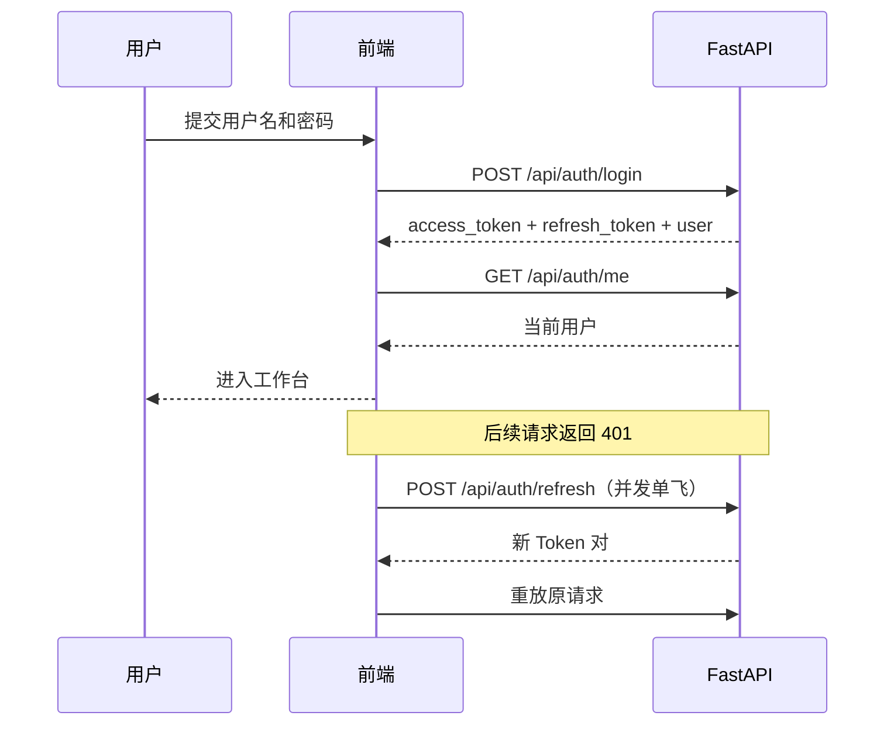
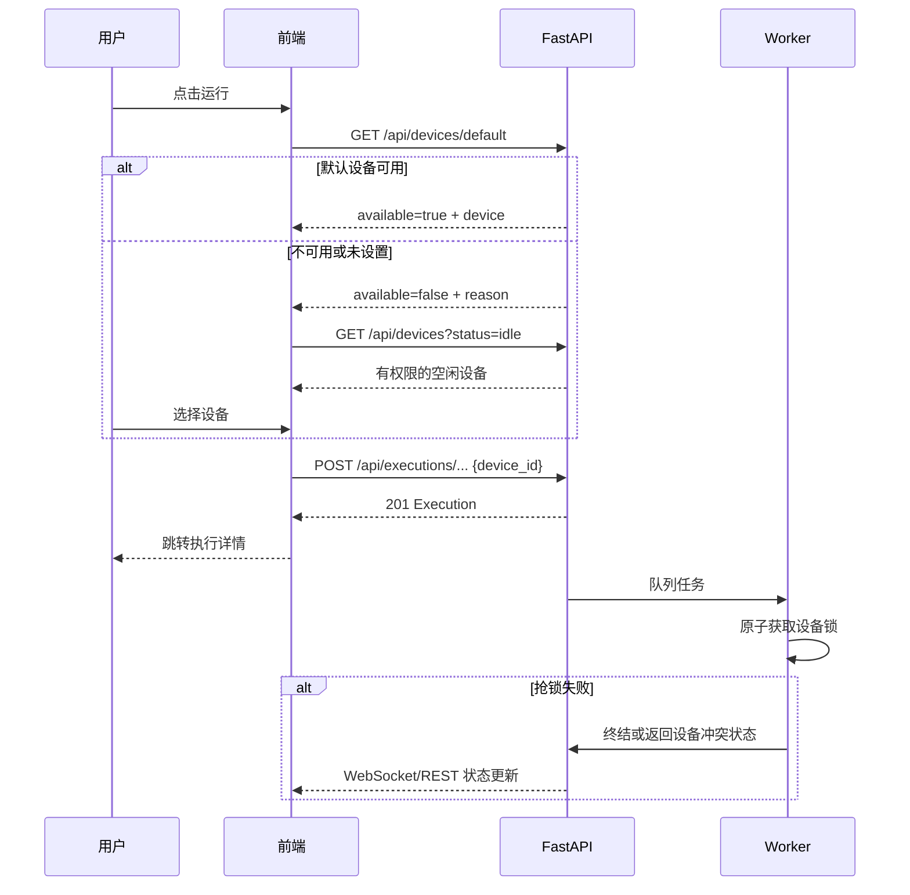
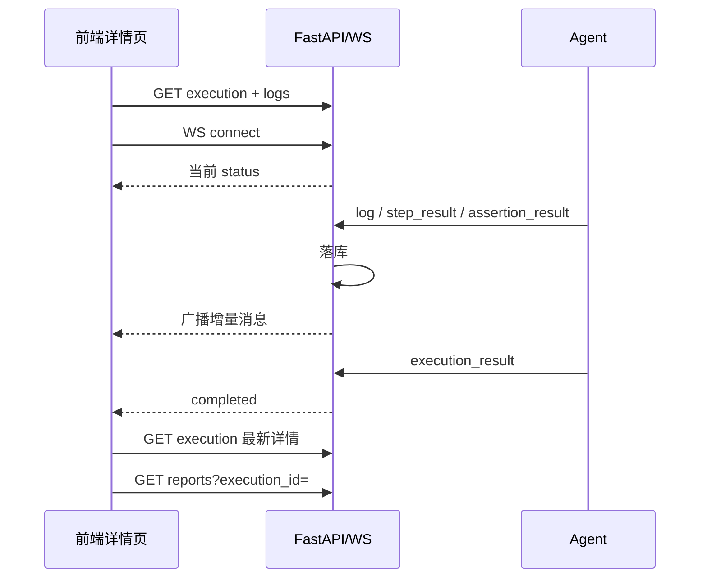
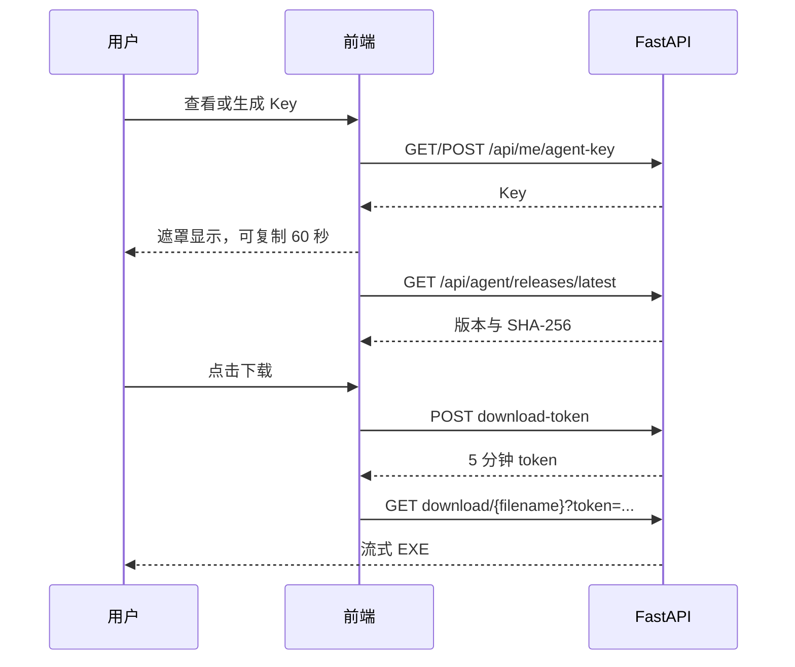
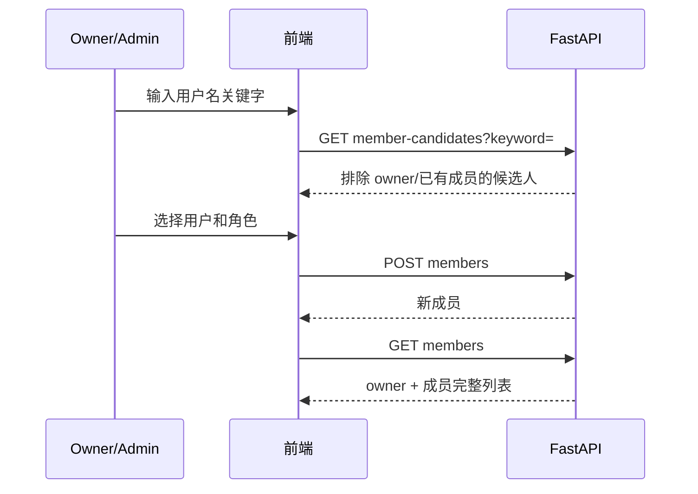

# APP 自动化测试平台前端 V2 详细设计说明书

> 版本：V2.0  
> 日期：2026-08-21  
> 状态：设计定稿，待实施  
> 上位方案：`前端页面布局与交互V2重设计方案.md`  
> 权威约束：`APP自动化测试平台_详细架构实施方案.md` 第 10 章  
> Agent 约束：`Windows_Agent安装与设备管理实施方案.md`

---

## 1. 文档目标与边界

本文是前端 V2 的可实施详细设计，供产品、前端、后端、Agent 和测试人员共同使用。实现人员不应再自行决定导航、页面区域、主要交互、数据口径、权限和接口形态。

本文覆盖：

- 全部前端页面的路由、布局、样式、组件、交互和状态。
- 前端状态管理、请求缓存、错误反馈、权限控制和响应式规则。
- 页面与后端 REST/WebSocket 的数据流。
- V2 需要新增或调整的接口、字段、错误码和权限规则。
- Windows Agent 下载、Key、绑定、设备同步和自动选机的前端接线。
- 自动化测试和人工验收口径。

本文不覆盖：

- Agent 桌面窗口内部的 Tkinter 视觉细节。
- iOS/macOS Agent、移动端 Web、深色主题和自动升级。
- 通知中心、收藏、保存筛选、可配置仪表盘和独立 BI 系统。

如本文与权威架构执行状态机、进程职责、报告生成方式冲突，以权威架构第 10 章为准；如本文与旧 UI V1 文档冲突，以本文为准。

---

## 2. 全局信息架构

### 2.1 路由表

| 路由 | 页面 | 权限 | 备注 |
| --- | --- | --- | --- |
| `/login` | 登录 | 公开 | 已登录访问时跳转工作台 |
| `/dashboard` | 全局工作台 | 登录用户 | 默认首页 |
| `/projects` | 项目列表 | 登录用户 | 私有/协作/公开项目发现 |
| `/projects/:projectId/overview` | 项目概览 | viewer+ | 项目默认页 |
| `/projects/:projectId/cases` | 测试用例 | viewer+ | 写操作 member+ |
| `/projects/:projectId/cases/new` | 新建用例 | member+ | viewer 返回 403 |
| `/projects/:projectId/cases/:caseId/edit` | 编辑用例 | member+ | 保留 `new` 优先匹配 |
| `/projects/:projectId/suites` | 测试套件 | viewer+ | 写/运行 member+ |
| `/projects/:projectId/elements` | 元素库 | viewer+ | 写操作 member+ |
| `/projects/:projectId/variables` | 变量 | viewer+ | 写操作 member+ |
| `/projects/:projectId/settings` | 项目设置 | viewer+ | 分区按角色控制 |
| `/devices` | 设备中心 | 登录用户 | 普通用户只见绑定资源 |
| `/executions` | 执行中心 | 登录用户 | 默认仅个人工作空间项目 |
| `/executions/:executionId` | 执行详情 | 项目 viewer+ | 运行态连接 WebSocket |
| `/reports` | 报告中心 | 登录用户 | 默认仅个人工作空间项目 |
| `/reports/:reportId` | 报告详情 | 项目 viewer+ | HTML 按需生成 |
| `/403` | 无权限 | 公开 | 保留返回来源入口 |
| `/:pathMatch(.*)*` | 404 | 公开 | 不再静默跳转 `/projects` |

### 2.2 导航层级

全局导航固定为：工作台、项目、执行中心、设备中心、报告。进入项目后，在全局导航与用户区之间插入项目上下文区，包含项目切换器及项目概览、用例、套件、元素、变量、设置。

```text
┌─────────────────────────────────────────────────────────────────────────────┐
│ 侧边栏 232/72 │ 顶栏：面包屑 / 项目上下文                  用户菜单         │
├───────────────┼─────────────────────────────────────────────────────────────┤
│ Logo          │ 页面标题 + 说明                           页面主操作         │
│ 工作台        │ ┌─────────────────────────────────────────────────────────┐ │
│ 项目          │ │ 筛选、统计、表格、编辑器或详情内容                      │ │
│ 执行中心      │ │                                                         │ │
│ 设备中心      │ │                                                         │ │
│ 报告          │ └─────────────────────────────────────────────────────────┘ │
│ ───────────   │                                                             │
│ 当前项目      │                                                             │
│  · 概览       │                                                             │
│  · 用例       │                                                             │
│  · 套件       │                                                             │
│  · 元素       │                                                             │
│  · 变量       │                                                             │
│  · 设置       │                                                             │
│ 用户          │                                                             │
└───────────────┴─────────────────────────────────────────────────────────────┘
```

### 2.3 导航行为

- 路由是筛选和当前项目上下文的唯一可分享来源；列表筛选写入 URL Query。
- 项目切换器显示最近访问项目和可搜索项目列表，选择后进入目标项目概览。
- 从列表进入详情再返回时，恢复筛选、分页和滚动位置。
- viewer 访问写页面时路由守卫跳转 `/403`；后端 403 仍作为最终权限防线。
- 页面标题由路由 Meta 和异步加载到的对象名称共同生成，例如“登录流程 · 编辑用例”。
- 浏览器标题格式为“页面名 - 项目名 - APP 自动化测试平台”。

---

## 3. 设计系统

### 3.1 布局令牌

| 令牌 | 值 | 用途 |
| --- | --- | --- |
| `--sidebar-width` | `232px` | 展开侧栏 |
| `--sidebar-collapsed-width` | `72px` | 1024～1279px 侧栏 |
| `--header-height` | `56px` | 顶栏 |
| `--content-padding` | `24px` | 1280px+ 页面留白 |
| `--content-padding-compact` | `16px` | 1024～1279px 页面留白 |
| `--content-max-width` | `none` | 数据页全宽；表单页单独限宽 |
| `--form-max-width` | `880px` | 普通表单 |
| `--detail-max-width` | `1440px` | 详情页内容上限 |

断点：

- `>= 1440px`：完整宽屏布局。
- `1280～1439px`：完整侧栏，图表列宽收缩。
- `1024～1279px`：折叠侧栏，双栏页面缩窄，表格内部横向滚动。
- `< 1024px`：显示“建议使用 1024px 以上屏幕”的非阻塞提示，不承诺完整适配。

### 3.2 间距、圆角和阴影

- 间距使用 4px 基数：`4/8/12/16/20/24/32/40`。
- 页面区块间距 16px，页面标题与主体间距 20px。
- 输入框和普通按钮高度 32px，主要页面按钮高度 36px。
- 小标签高度 22px，表格默认行高约 44px。
- 输入框圆角 6px，按钮 6px，卡片 10px，对话框 12px。
- 默认卡片只使用 `1px` 边框；仅浮层和 Hover 卡片使用轻阴影。

### 3.3 字体层级

| 层级 | 字号/行高 | 字重 |
| --- | --- | --- |
| 页面标题 | `24/32px` | 600 |
| 区块标题 | `16/24px` | 600 |
| 卡片标题 | `14/22px` | 600 |
| 正文/表格 | `14/22px` | 400 |
| 辅助文字 | `12/20px` | 400 |
| KPI 数值 | `28/36px` | 700 |

中文使用系统字体栈：`Inter, "PingFang SC", "Microsoft YaHei", sans-serif`。数值列启用等宽数字特性。

### 3.4 状态色

| 业务状态 | 标签 | 颜色 |
| --- | --- | --- |
| `queued` | 排队中 | 灰蓝 |
| `running` | 运行中 | 蓝，带轻量动态圆点 |
| `stopping` | 停止中 | 橙 |
| `passed` | 通过 | 绿 |
| `failed` | 失败 | 红 |
| `error` | 异常 | 深红 |
| `stopped` | 已停止 | 灰 |
| `cancelled` | 已取消 | 灰 |
| Agent `online` | 在线 | 绿 |
| Agent `offline` | 离线 | 灰 |
| Device `idle` | 空闲 | 绿 |
| Device `busy` | 忙碌 | 橙 |
| Device `unauthorized` | 未授权 | 红 |
| Device `offline` | 离线 | 灰 |

状态组件必须输出文本和图标，不能只改变颜色。

### 3.5 公共组件

| 组件 | 职责 |
| --- | --- |
| `AppShell` | 侧栏、顶栏、内容区和响应式折叠 |
| `PageHeader` | 面包屑、标题、说明、主操作 |
| `FilterBar` | URL 同步筛选、清空、结果数 |
| `StatCard` | KPI、趋势、帮助提示 |
| `StatusBadge` | 统一业务状态映射 |
| `DataTable` | 加载、空状态、分页、固定操作列 |
| `EmptyState` | 首次使用引导和可执行主操作 |
| `ErrorState` | 错误摘要、重试、帮助入口 |
| `ConfirmAction` | 删除、停止、重置 Key 等确认 |
| `PermissionGate` | 按平台/项目角色渲染操作 |
| `DevicePicker` | 全平台统一设备选择器 |
| `RunButton` | 默认设备运行与选择设备运行 |
| `AuthenticatedImage` | 携带 Bearer Token 拉取截图 Blob |
| `ExecutionTimeline` | 用例、步骤和断言实时状态 |
| `LiveLogViewer` | 增量日志、过滤、自动滚动、连接状态 |

---

## 4. 全局交互规范

### 4.1 列表与筛选

- 筛选值写入 URL Query；刷新、复制链接和前进/后退均能恢复。
- 输入搜索等待 300ms 防抖；按 Enter 立即执行。
- 切换筛选后页码重置为 1；切换分页只更新页码。
- 默认分页为 20 条，可选 20/50/100；项目卡片默认 12 条。
- 后端排序规则必须稳定，默认按 `updated_at DESC, id DESC` 或 `created_at DESC, id DESC`。
- 请求切换时取消上一请求，较早响应不能覆盖新筛选结果。
- 空结果区分“暂无数据”和“筛选后无结果”。后者提供“清除筛选”。

### 4.2 表单

- 必填项在标签后显示 `*`，提交时在字段下方显示后端或前端校验错误。
- 创建成功返回列表并显示成功消息；编辑成功留在当前页或按页面约定返回。
- 后端返回 409 时保留用户输入，不关闭对话框。
- 清空可选字段时必须发送显式 `null` 或空字符串，不能因 `undefined` 被忽略。
- 编辑页面维护 `dirty` 状态，路由离开、浏览器刷新和关闭页面均提示未保存修改。

### 4.3 反馈与危险操作

- 普通成功使用顶部轻提示，持续约 2 秒。
- 可恢复失败使用行内错误或对话框内错误，不只显示全局 Toast。
- 删除项目、删除用例、注销 Agent、重置 Key必须二次确认，并在确认文案中显示对象名称与影响。
- “停止执行”只在 `queued/running/stopping` 对应允许状态出现；重复停止返回当前状态，不伪造成功。
- 所有提交按钮防重复点击；进行中显示 Loading。

### 4.4 时间、数字与文本

- 后端时间统一为 UTC ISO 8601；前端按浏览器本地时区显示。
- 列表时间显示 `YYYY-MM-DD HH:mm:ss`，可 Tooltip 显示完整 ISO 时间。
- 耗时：小于 1 秒显示 ms；小于 60 秒显示秒；更长显示 `Xm Ys`。
- 成功率保留 1 位小数；没有有效样本显示 `—`，不显示 `0%`。
- UDID、地址、Key、SHA-256、日志和定位值使用等宽字体并提供复制。

### 4.5 请求与错误

- Axios 基础地址为 `/api`，30 秒超时；下载接口按文件大小单独处理。
- 401 继续使用单飞 Refresh：并发请求只刷新一次，成功后重放，失败后清理令牌并跳转登录。
- 403 跳转无权限页或在当前区块显示只读状态。
- 404 详情页显示对象不存在，不自动跳转。
- 409 作为业务冲突在原操作上下文中展示。
- 422 将字段错误映射到表单；无法映射的错误显示在表单顶部。
- 5xx 显示可重试错误状态，不泄露堆栈或内部路径。

---

## 5. 页面详细设计

### 5.1 登录页

**路由**：`/login`；公开。

**布局**：1280px 以上左侧 55% 品牌区、右侧 45% 登录区；1024～1279px 调整为 45%/55%。登录卡片宽 400px，垂直居中。

**样式**：品牌区使用深蓝灰到靛蓝的低对比渐变，展示产品名、Android/Windows Agent、设备管理、实时执行和报告分析三项真实能力。登录区使用白色背景，不使用多余阴影。

**交互**：

1. 用户名失焦校验非空，密码失焦校验非空。
2. Enter 提交；请求中禁用按钮和输入框。
3. 失败保留用户名，清空密码，显示“用户名或密码错误”。
4. “记住我”控制 Refresh Token 是否持久存储；未勾选时放在 `sessionStorage`。
5. 登录成功调用 `GET /auth/me` 校验身份，再跳转 `redirect` 或 `/dashboard`。

**接口**：`POST /api/auth/login`、`GET /api/auth/me`。

**边界状态**：后端不可用时显示“服务暂时不可用”和重试按钮；已登录进入该路由时直接跳转工作台。

### 5.2 全局工作台

**路由**：`/dashboard`；登录用户。

```text
┌ 页面标题：工作台 ───────────────────────── [7天|30天|90天] [刷新] ┐
│ KPI：活跃执行 │ 成功率 │ 空闲设备/全部 │ 我的项目                   │
├──────────────────────────────┬───────────────────────────────────┤
│ 执行趋势折线图               │ 状态分布环图                      │
├──────────────────────────────┴───────────────────────────────────┤
│ 活跃与最近执行（最多 10 条）                       [查看全部]     │
├──────────────────────────────────┬───────────────────────────────┤
│ 需要关注：失败/异常/离线 Agent   │ 快捷开始                        │
└──────────────────────────────────┴───────────────────────────────┘
```

**数据口径**：只统计用户拥有或作为成员加入的项目；公开但未加入的项目不进入个人工作台。成功率分母为 `passed + failed + error`。

**交互**：

- 时间范围写入 `?range=7d|30d|90d`，默认 7d。
- 页面首次进入请求一次；页面可见时每 60 秒刷新，隐藏标签页暂停。
- KPI 点击进入带对应筛选的执行、设备或项目页面。
- 最近执行点击进入执行详情；失败项点击进入执行详情并定位失败用例。
- 没有项目时隐藏趋势图，展示创建或加入项目的引导。

**接口**：`GET /api/dashboard/overview`、快捷入口所需的项目与设备接口。

### 5.3 项目列表

**路由**：`/projects`；登录用户。

**布局**：标题与“新建项目”在第一行；第二行为名称搜索、范围筛选（我的/协作/公开/全部）和角色筛选；主体为最小 300px 的自适应卡片网格。

**卡片内容**：项目名、两行描述、可见性、角色、用例/套件/元素数量、更新时间。卡片主区域单击进入概览；更多菜单包含编辑和删除。

**交互**：

- 搜索和筛选同步 URL。
- 新建/编辑使用 520px 对话框，字段为名称、描述、可见性。
- 私有改公开时提示其内容将对全部登录用户可见。
- 删除只允许 owner；确认需输入项目名，成功后从列表移除。
- viewer 不显示编辑和删除入口。

**接口**：`GET/POST /api/projects`、`PUT/DELETE /api/projects/{id}`。

### 5.4 项目概览

**路由**：`/projects/:projectId/overview`；viewer+。

**布局**：项目标题卡展示描述、角色和可见性；下方为资产 KPI、项目趋势、最近执行和快捷操作。

**交互**：

- 资产 KPI 跳转到用例、套件、元素页面。
- viewer 的快捷操作只保留查看，不显示创建或运行。
- 项目数据不存在显示 404；失权显示 403。
- 工作台聚合接口携带 `project_id`，统计当前项目所有可见执行。

**接口**：`GET /api/projects/{id}`、`GET /api/dashboard/overview?project_id={id}`。

### 5.5 测试用例列表

**路由**：`/projects/:projectId/cases`；viewer+。

**布局**：左侧 220px 用例模块树，右侧为筛选栏和表格。1024px 下模块树折叠为可展开抽屉。

**模块树**：显示“全部用例”“未分组”和层级模块；member+ 可通过节点菜单新增子模块、重命名、调整父级和删除空模块。

**表格列**：多选框、名称、模块、状态、步骤/断言数、最近结果、更新时间、操作。

**交互**：

- 选择模块、状态或名称后刷新表格并更新 URL。
- 单击名称进入编辑；运行使用统一 `RunButton`。
- member+ 可新建、编辑、克隆和删除；viewer 只读。
- 删除模块前请求检查或由删除接口返回 409；有用例时不允许删除，并提示先移动用例。
- Disabled 用例不允许直接运行，按钮禁用并说明原因。

**接口**：模块 CRUD、用例列表/创建/克隆/删除、默认设备接口和执行创建接口。

### 5.6 用例编辑器

**路由**：新建与编辑路由；member+。

```text
┌ 面包屑 / 用例名                 [草稿/启用/禁用] [保存] [运行▼] ┐
├────────────────────────────────────────────────────────────────┤
│ 基本信息：名称、模块、描述                                     │
├────────────────────┬───────────────────────────────────────────┤
│ 大纲               │ 步骤编辑区                                │
│ 1 启动 APP          │ 卡片头：序号、动作、拖拽、复制、删除       │
│ 2 点击元素          │ 卡片体：元素、参数、描述、失败后继续       │
│ 3 输入文本          │                                           │
│ 断言                │                                           │
│ 变量                │                                           │
├────────────────────┴───────────────────────────────────────────┤
│ 校验摘要                                  [取消] [保存草稿/保存] │
└────────────────────────────────────────────────────────────────┘
```

**字段规则**：

- 名称 1～255 字；模块可空；状态为 draft/active/disabled。
- 步骤 `order` 从 1 连续递增；动作必须来自 Action Registry。
- `needsElement=true` 时 `element_id` 必填，并且元素必须属于当前项目。
- Registry 标记 `required` 的参数不能为空；数值字段按后端范围校验。
- `continue_on_failure` 在每个步骤的高级选项中编辑。
- 断言类型和参数来自 Assertion Registry。
- 用例变量键不能为空、不能重复；保存为 JSON 对象。

**交互**：

- 新增步骤默认 click；新增断言默认 element_exists。
- 切换动作/断言前，如已有非默认参数，确认后重建参数。
- 复制步骤时复制参数与元素，插入原步骤之后并重排。
- 拖拽结束只改本地顺序，保存时整体提交。
- 保存失败保留全部编辑状态，并定位字段错误。
- 编辑成功后更新基线并清除 dirty；新建成功跳转编辑路由。
- “运行”前若有未保存修改，先提示保存；保存成功后进入统一运行流程。

**接口**：`GET/POST/PUT /api/cases...`、`GET /api/projects/{id}/modules`、`GET /api/projects/{id}/elements`、执行相关接口。

### 5.7 测试套件

**路由**：`/projects/:projectId/suites`；viewer+。

**布局**：左侧 320px 套件列表，右侧为详情、套件变量和有序用例列表。顶部提供新建套件和“运行已选择套件”。

**交互**：

- 左侧支持名称、状态搜索和多选；单击套件加载右侧内容。
- 新建/编辑字段为名称、描述、状态。
- “添加用例”对话框支持模块和名称筛选，允许一次选择多个用例。
- 拖拽排序采用乐观更新；接口失败时恢复旧顺序。
- 套件变量在右侧独立折叠区维护，调用 scope=suite 的变量接口。
- 批量运行只允许选择同一项目的启用套件；空套件或 Disabled 套件禁用运行。

**接口**：套件 CRUD、套件用例增删排序、套件变量、单套件/批量执行接口。

### 5.8 元素库

**路由**：`/projects/:projectId/elements`；viewer+。

**数据模型约束**：`test_modules` 用于用例分类，元素没有 `module_id`。元素库左侧必须按 `page_name` 分组，不能错误复用用例模块。

**布局**：左侧 220px 页面分组（全部、未分组、各 `page_name`），右侧为筛选栏和元素表格。

**表格列**：名称、页面、平台、定位方式、定位值、引用数、更新时间、操作。

**交互**：

- 页面分组由专用统计接口返回，不从当前分页结果推断。
- 支持关键字、平台、定位方式和页面筛选。
- 创建/编辑使用 600px 抽屉，字段为名称、页面、平台、定位方式、定位值、描述。
- 定位值使用等宽字体；提供复制和展开查看。
- 删除前获取引用；有引用时显示引用用例并禁止直接删除。
- 引用列表点击进入用例编辑并定位对应步骤。

**接口**：元素 CRUD、引用接口、`GET /api/projects/{id}/element-pages`。

### 5.9 变量

**路由**：`/projects/:projectId/variables`；viewer+。

**布局**：项目变量与全局变量页签；页签内为名称搜索、表格和创建按钮。全局变量显示明显的作用域提示。

**交互**：

- 项目变量自动携带 `project_id`；全局变量不得携带项目外键。
- 变量名创建后不可修改，值和描述可修改。
- 项目变量与全局变量同名时，运行解析以 case > suite > project > global 为优先级。
- 用例变量在用例编辑器维护；套件变量在套件详情维护。
- viewer 只读；member+ 可管理项目变量。全局变量仅平台管理员可写。

**接口**：`GET/POST /api/variables`、`PUT/DELETE /api/variables/{id}`。

### 5.10 项目设置与成员

**路由**：`/projects/:projectId/settings`；viewer+。

**布局**：左侧设置子导航，右侧内容。子导航为“基本信息”“成员与权限”“危险操作”。

**基本信息**：名称、描述、可见性；owner/admin 可编辑，其余只读。

**成员与权限**：owner 固定在首行；其余成员显示用户名、角色和操作。添加成员时输入至少两个字符进行远程搜索。

**角色规则**：

- owner 可添加或管理 admin/member/viewer。
- admin 只能添加、修改和移除 member/viewer。
- admin 不得修改自己为其他角色；如需退出由 owner 移除。
- owner 不在 `project_members` 表中，接口返回虚拟 owner 行。
- member/viewer 只能查看。

**危险操作**：仅 owner 可见；删除需输入项目名，成功后返回项目列表。

**接口**：项目详情/更新/删除、成员列表、候选人搜索、添加、改角色和移除。

### 5.11 设备中心

**路由**：`/devices`；登录用户。

**布局**：页面顶部显示设备总数、空闲数、在线 Agent 数和默认设备。主体使用“我的设备”“Agent 与绑定”“下载安装”三个页签，页签写入 `?tab=`。

**我的设备**：

- 筛选：关键字、状态、连接类型、Agent。
- 列：默认标记、名称、UDID/地址、Android 版本、USB/Wi-Fi、Agent、状态、占用执行、最后心跳、操作。
- 每 5 秒刷新；标签页隐藏时暂停；保留当前分页和选择。
- `unauthorized` 显示“请在设备上允许 USB 调试”；`offline` 显示连接异常。
- 设置默认设备后更新顶部摘要和所有 DevicePicker 缓存。

**Agent 与绑定**：

- 列：主机名、Agent ID、版本、平台、状态、最后心跳、设备数、操作。
- 普通用户只显示撤销自己的绑定；管理员额外显示注销 Agent。
- 撤销后如该 Agent 下设备是默认设备，前端重新查询默认设备并提示已失效。

**下载安装**：

- 第一块显示版本、发布时间、大小、SHA-256 和下载按钮。
- 第二块显示用户 Key；默认用密码样式遮罩，点击查看后显示 60 秒，可复制。
- 首次无 Key 时显示“生成 Key”；重置必须说明旧 Key 不能新增绑定、已有绑定不受影响。
- 第三块展示安装、绑定和连接设备三步引导。

**接口**：Agent/设备/默认设备、用户 Key、绑定撤销和安装包发布接口。

### 5.12 设备选择器

**形式**：680px 对话框；所有运行入口复用。

**布局**：顶部显示执行对象和刷新按钮；主体为可用设备卡片列表；底部为高级设置、设为默认复选框、取消和运行。

**设备卡片**：名称、Android 版本、USB/Wi-Fi、Agent 主机名、最后心跳。仅 `Agent=online && device=idle && locked_by_execution=null` 可选。

**交互**：

- 默认设备可用时主运行按钮直接创建执行，不打开选择器。
- 用户点击“选择设备运行”时始终打开选择器。
- 对话框每 5 秒刷新；选中设备变为不可用时取消选择并提示。
- 运行中按钮显示“正在创建执行”；成功跳转 `/executions/{id}`。
- 409 `DEVICE_BUSY` 保持对话框并刷新；`AGENT_OFFLINE` 更新卡片状态；403 移除失权设备。

### 5.13 执行中心

**路由**：`/executions`；登录用户。

**布局**：顶部状态摘要；第二行是项目、状态、类型、设备、时间、关键字筛选；主体为执行表格。

**表格列**：ID、对象名称、项目、类型、设备、状态、耗时、创建人、开始/创建时间、操作。

**交互**：

- 默认显示个人工作空间项目的执行，不把未加入的公开项目混入全局列表。
- 活跃执行可按 5 秒轮询更新当前页；页面隐藏时暂停。
- 点击行进入独立详情。
- `queued/running/stopping` 显示停止；终态显示重试和报告。
- 重试走统一设备流程，不静默沿用已不可用设备。
- 由旧链接 `/executions?focus=123` 进入时重定向 `/executions/123`。

**接口**：执行列表、停止、重试、默认设备和报告查找接口。

### 5.14 执行详情

**路由**：`/executions/:executionId`；项目 viewer+。

```text
┌ 返回执行中心  执行 #1001 / 登录套件  [运行中]   [停止] [重试] ┐
│ 项目 / 设备 / 创建人 / 开始时间 / 耗时 / 超时                 │
├─────────────────────────────────────┬──────────────────────────┤
│ 用例、步骤、断言时间线              │ 实时日志                 │
│  ▾ 登录用例 [running]               │ 连接状态 级别筛选        │
│    ✓ 启动 APP                       │ 10:00:01 ...             │
│    ● 点击登录按钮                   │ 10:00:02 ...             │
│    ○ 文本断言                       │                          │
├─────────────────────────────────────┴──────────────────────────┤
│ 终态后：结果摘要 / 查看报告 / 下载报告                         │
└────────────────────────────────────────────────────────────────┘
```

**数据加载**：先并行请求执行详情和最近 200 条日志；运行态再连接 WebSocket。REST 是事实源，WebSocket 只做增量更新。

**重连**：记录最后一条日志时间；连接恢复后调用 `GET logs?after_timestamp=`，再重新请求执行详情。最多重连 10 次，退避为 1/2/3/5/8 秒后固定 10 秒；超过次数显示“实时连接中断”，同时保持 5 秒 REST 轮询。

**交互**：

- 新日志只在用户位于底部时自动滚动；用户向上阅读后显示“有 N 条新日志”。
- 步骤结果按 `case_id + step_order` 幂等更新，不追加重复行。
- 截图通过 `AuthenticatedImage` 用 Axios 拉取 Blob，避免 `` 无法携带 Bearer Token。
- 停止请求后立即将按钮置为 Loading，服务端确认后显示 stopping。
- 终态关闭 WebSocket，刷新详情并查找报告；报告未完成时显示“报告生成中”。

**接口**：执行详情、日志、停止、重试、执行附件、报告查找和执行 WebSocket。

### 5.15 报告中心

**路由**：`/reports`；登录用户。

**布局**：顶部成功率、报告数、失败和异常摘要；筛选栏；报告表格。

**表格列**：执行 ID、对象、项目、设备、类型、状态、通过/总数、成功率、耗时、完成时间、操作。

**交互**：

- 支持项目、状态、类型、时间范围和名称/执行 ID 搜索。
- 点击行进入报告详情。
- 下载按钮调用 Blob 下载；生成期间显示 Loading，重复点击不重复生成。
- 全局列表仅显示个人工作空间项目；公开项目报告从项目上下文访问。

**接口**：报告列表和下载接口。

### 5.16 报告详情

**路由**：`/reports/:reportId`；项目 viewer+。

**布局**：顶部执行摘要；第二行统计卡和状态分布；主体为用例结果；底部为完整日志。

**交互**：

- 默认展开 failed/error 用例，通过用例默认折叠。
- 支持“只看失败”“全部展开”“全部折叠”。
- 用例内步骤和断言按执行顺序展示。
- 错误信息等宽显示并支持复制。
- 截图通过鉴权 Blob 加载，支持缩略图、预览和前后切换。
- “查看执行”返回关联执行详情；“重试”使用统一设备流程。
- 下载 HTML 报告保持按需生成和幂等缓存。

**接口**：报告详情、文件、下载、执行详情和重试接口。

### 5.17 403 与 404

- 403 显示“你没有权限访问此内容”、返回上一页和返回项目列表。
- 404 显示“页面或数据不存在”、返回工作台。
- 路由 404 与资源 404 文案区分；不得把所有异常静默跳转项目页。

---

## 6. 前端状态与数据层

### 6.1 Store 与 Composable

| 模块 | 状态/职责 |
| --- | --- |
| `authStore` | 用户、Access Token、Refresh Token、登录和登出 |
| `layoutStore` | 侧栏折叠、最近项目、用户选择的表格密度 |
| `projectContextStore` | 当前项目详情、角色、权限计算和项目切换 |
| `deviceStore` | 默认设备、设备摘要、最后刷新时间和缓存失效 |
| `useListQuery` | URL Query、分页、排序、防抖和取消旧请求 |
| `usePermission` | owner/admin/member/viewer 能力判断 |
| `useRunFlow` | 默认设备判断、DevicePicker、创建执行和冲突恢复 |
| `useExecutionSocket` | 连接、心跳、增量消息、重连和 REST 补拉 |
| `useUnsavedChanges` | 编辑页 dirty 与离开确认 |
| `useAuthenticatedImage` | 鉴权图片 Blob 生命周期 |

业务列表数据默认保留在页面级状态，不将所有服务端数据写入 Pinia。筛选状态以 URL 为主，默认设备和项目上下文可跨页面缓存。

### 6.2 缓存与刷新

| 数据 | 策略 |
| --- | --- |
| 当前用户 | 启动时获取，401 后清理 |
| 当前项目 | 路由项目变化时获取，5 分钟软缓存 |
| 项目列表 | 页面进入获取，写操作后失效 |
| 工作台 | 60 秒可见轮询，支持手动刷新 |
| Agent/设备 | 5 秒可见轮询 |
| 默认设备 | 运行前强制获取，设置/解绑后失效 |
| 执行列表 | 活跃页 5 秒轮询 |
| 执行详情 | REST 初始 + WS 增量 + 重连补拉 |
| 报告 | 手动进入获取，终态数据不轮询 |

### 6.3 权限能力

前端不直接散落角色字符串判断，统一计算：

- `canReadProject`：owner/admin/member/viewer。
- `canWriteAssets`：owner/admin/member。
- `canExecute`：owner/admin/member。
- `canEditProject`：owner/admin。
- `canDeleteProject`：owner。
- `canManageAdmins`：owner。
- `canManageMembers`：owner/admin，admin 仅限 member/viewer。
- `isPlatformAdmin`：用户 `is_admin=true`。

---

## 7. REST 接口规范

### 7.1 通用约定

- 所有业务接口前缀为 `/api`。
- JSON 字段使用 `snake_case`，状态值全部小写。
- 时间为 UTC ISO 8601。
- 创建成功返回 201，查询/修改成功 200，删除成功 204。
- 列表统一返回：

```json
{
  "total": 100,
  "page": 1,
  "page_size": 20,
  "items": []
}
```

- 当前项目列表 `PageResult` 需要补齐 `page/page_size`，消除前后端类型不一致。
- 列表查询的 `page >= 1`，`page_size` 只允许 20/50/100；项目卡片允许 12。

### 7.2 错误结构

领域错误统一为：

```json
{
  "detail": {
    "code": "DEVICE_BUSY",
    "message": "设备刚被其他执行占用",
    "field_errors": null
  }
}
```

Pydantic 422 仍可返回标准错误数组，前端请求层同时兼容字符串 `detail`、对象 `detail` 和 422 数组。

核心错误码：

| HTTP | code | 前端处理 |
| --- | --- | --- |
| 400 | `DEVICE_REQUIRED` | 打开设备选择器 |
| 400 | `INVALID_SCOPE` | 定位变量作用域字段 |
| 401 | `AUTH_INVALID` | 登录页错误或刷新失败退出 |
| 403 | `PROJECT_FORBIDDEN` | 403 页 |
| 403 | `DEVICE_FORBIDDEN` | 从设备列表移除并提示 |
| 404 | `RESOURCE_NOT_FOUND` | 资源 404 状态 |
| 409 | `DEVICE_BUSY` | 保留选择器并刷新 |
| 409 | `AGENT_OFFLINE` | 标记 Agent 离线并刷新 |
| 409 | `MEMBER_ALREADY_EXISTS` | 成员对话框内提示 |
| 409 | `PROJECT_OWNER_IMMUTABLE` | 成员行提示不可操作 |
| 409 | `EXECUTION_STATE_CONFLICT` | 刷新执行详情 |
| 409 | `AGENT_KEY_EXISTS` | 改为显示已有 Key |
| 429 | `RATE_LIMITED` | 显示等待时间并禁用重试 |

### 7.3 认证接口

| 方法与路径 | 请求 | 响应 | 页面 |
| --- | --- | --- | --- |
| `POST /auth/login` | `{username,password}` | Token + User | 登录 |
| `GET /auth/me` | 无 | User | 应用启动 |
| `POST /auth/refresh` | `{refresh_token}` | 新 Token 对 | 请求层 |
| `POST /auth/logout` | `{refresh_token}` | 204 | 用户菜单 |

`User`：`id, username, email, status, is_admin`。

### 7.4 工作台接口

`GET /dashboard/overview?range=7d|30d|90d&project_id?`

```json
{
  "range": "7d",
  "generated_at": "2026-08-21T08:00:00Z",
  "stats": {
    "project_count": 3,
    "period_execution_count": 42,
    "active_execution_count": 2,
    "success_rate": 92.5,
    "available_device_count": 2,
    "device_count": 4
  },
  "status_counts": {
    "queued": 0,
    "running": 2,
    "stopping": 0,
    "passed": 35,
    "failed": 3,
    "error": 2,
    "stopped": 0,
    "cancelled": 0
  },
  "trend": [
    {"date":"2026-08-21","total":10,"passed":8,"failed":1,"error":1}
  ],
  "recent_executions": []
}
```

`project_id` 为空时只包含 owned/member 项目；指定时校验该项目 viewer+ 权限。

### 7.5 项目与成员

| 方法与路径 | 关键参数/请求 | 响应 |
| --- | --- | --- |
| `GET /projects` | `keyword,scope,role,page,page_size` | `Page<Project>` |
| `POST /projects` | `name,description,visibility` | Project |
| `GET /projects/{id}` | 无 | Project |
| `PUT /projects/{id}` | 可选字段，支持显式清空 | Project |
| `DELETE /projects/{id}` | 无 | 204 |
| `GET /projects/{id}/members` | 无 | `ProjectMember[]`，含 owner |
| `GET /projects/{id}/member-candidates` | `keyword,limit<=20` | UserCandidate[] |
| `POST /projects/{id}/members` | `user_id,role` | ProjectMember |
| `PATCH /projects/{id}/members/{user_id}` | `role` | ProjectMember |
| `DELETE /projects/{id}/members/{user_id}` | 无 | 204 |

`Project` 在现有字段基础上保留 `case_count/element_count/suite_count/role`。成员结构为 `membership_id|null,user_id,username,role`。

### 7.6 模块、用例和元素

| 方法与路径 | 说明 |
| --- | --- |
| `GET/POST /projects/{id}/modules` | 获取模块树或创建模块 |
| `PUT/DELETE /modules/{id}` | 更新或删除空模块 |
| `GET/POST /projects/{id}/cases` | 用例分页列表/创建 |
| `GET/PUT/DELETE /cases/{id}` | 用例详情/更新/删除 |
| `POST /cases/{id}/clone` | 克隆用例 |
| `GET /projects/{id}/element-pages` | `page_name,count` 分组统计 |
| `GET/POST /projects/{id}/elements` | 元素分页列表/创建 |
| `GET/PUT/DELETE /elements/{id}` | 元素详情/更新/删除 |
| `GET /elements/{id}/usage` | 引用用例及步骤位置 |

用例列表参数：`module_id,status,keyword,page,page_size`。列表项在现有字段上增加：

- `step_count`
- `assertion_count`
- `last_execution_status`
- `last_execution_at`

元素列表参数：`page_name,platform,locator_type,keyword,page,page_size`。引用响应增加可选 `step_orders`，用于进入编辑器后定位引用步骤。

### 7.7 套件与变量

| 方法与路径 | 说明 |
| --- | --- |
| `GET/POST /projects/{id}/suites` | 套件分页列表/创建 |
| `GET/PUT/DELETE /suites/{id}` | 套件详情/更新/删除 |
| `GET /suites/{id}/cases` | 有序用例列表 |
| `POST /suites/{id}/cases` | 支持 `case_ids: number[]` 批量添加 |
| `PUT /suites/{id}/cases/order` | 完整 `case_id` 顺序 |
| `DELETE /suites/{id}/cases/{case_id}` | 移除用例 |
| `GET/POST /variables` | 按 scope 和归属查询/创建 |
| `PUT/DELETE /variables/{id}` | 修改值/描述或删除 |

套件列表增加 `keyword,status,page,page_size`，统一返回分页结构。变量解析优先级固定为 `case > suite > project > global`。

### 7.8 Agent、设备和发布

| 方法与路径 | 说明 |
| --- | --- |
| `GET /agents` | 普通用户返回绑定 Agent，管理员返回全部 |
| `DELETE /agents/{id}/bindings/me` | 用户撤销自己的绑定 |
| `DELETE /agents/{id}` | 管理员注销 Agent |
| `GET /agents/{id}/devices` | Agent 下设备 |
| `GET /devices` | 设备分页与筛选 |
| `GET /devices/{id}` | 设备详情 |
| `GET /devices/default` | 默认设备与实时可用性 |
| `PUT /devices/default` | `{device_id:number|null}` |
| `POST /devices/{id}/release` | 管理员强制释放 |
| `GET /me/agent-key` | 查看当前用户 Key |
| `POST /me/agent-key` | 首次生成 |
| `POST /me/agent-key/regenerate` | 重置 |
| `GET /agent/releases/latest` | 最新安装包元数据 |
| `POST /agent/releases/latest/download-token` | 5 分钟下载令牌 |
| `GET /agent/releases/download/{filename}?token=` | 流式下载 |

设备查询增加 `keyword,agent_id,connection_type,platform,status,page,page_size`。`Device` 必须包含 `connection_type,address,locked_by_execution,agent_name,last_heartbeat`。

安装包元数据：`version,filename,sha256,size,published_at`。下载令牌绑定用户、文件名和 5 分钟过期时间。

### 7.9 执行

| 方法与路径 | 说明 |
| --- | --- |
| `POST /executions/cases/{case_id}` | 创建用例执行 |
| `POST /executions/suites/{suite_id}` | 创建套件执行 |
| `POST /executions/suites/batch` | 批量套件执行 |
| `GET /executions` | 执行分页与组合筛选 |
| `GET /executions/{id}` | 包含用例、步骤和断言的详情 |
| `GET /executions/{id}/logs` | 支持时间戳增量日志 |
| `POST /executions/{id}/stop` | 原子停止请求 |
| `POST /executions/{id}/retry` | 指定设备重试 |
| `GET /executions/{id}/artifacts/{artifact_id}` | 鉴权读取运行附件 |

创建请求：

```json
{
  "device_id": 12,
  "parameters": {"variables":{"username":"u1"}},
  "timeout_seconds": 1800
}
```

`device_id` 必填。批量执行额外携带非空 `suite_ids`，所有套件必须属于同一项目。

执行列表参数增加：`project_id,device_id,status,type,keyword,created_from,created_to,page,page_size`。列表项增加 `project_name,device_name,created_by_name`。

执行详情结构：

```text
ExecutionDetail
├─ execution 基础字段、project_name、device_name、created_by_name
└─ cases[]
   ├─ case_id、case_name、module_name、status、duration、error_message
   ├─ steps[]: order、action、status、duration、actual_value、error_message、artifact_id
   └─ assertions[]: type、expected_value、actual_value、status、error_message
```

重试请求为 `{device_id, timeout_seconds?}`，不能用 Query 参数隐式传递设备。

### 7.10 报告

| 方法与路径 | 说明 |
| --- | --- |
| `GET /reports` | 报告分页和组合筛选 |
| `GET /reports/{id}/detail` | 聚合详情 |
| `GET /reports/{id}/download` | 按需生成并下载 HTML |
| `GET /reports/{id}/files/{filename}` | 鉴权文件读取 |

报告列表参数增加：`project_id,status,type,keyword,created_from,created_to,page,page_size`。列表项增加 `project_name,device_name,finished_at`。

前端通过 Axios Blob 获取报告截图，再创建 Object URL；组件卸载时必须 `URL.revokeObjectURL`。禁止把 Access Token 拼入普通截图 URL。

---

## 8. WebSocket 详细契约

### 8.1 连接

```text
ws(s)://<host>/ws/executions/{execution_id}?token=<access_token>
```

服务端在握手后立即发送当前 `status`。客户端每 30 秒发送 `{"type":"ping"}`，5 秒内应收到 `pong`。

### 8.2 服务端消息

```json
{"type":"status","execution_id":1001,"status":"running","timestamp":"..."}
```

```json
{
  "type":"log",
  "execution_id":1001,
  "level":"INFO",
  "message":"点击登录按钮",
  "step_order":2,
  "timestamp":"..."
}
```

```json
{
  "type":"step_result",
  "execution_id":1001,
  "case_id":500,
  "step_order":2,
  "status":"passed",
  "duration":1500,
  "artifact_id":88,
  "timestamp":"..."
}
```

```json
{
  "type":"assertion_result",
  "execution_id":1001,
  "case_id":500,
  "step_order":2,
  "assertion_type":"text_equals",
  "status":"pass",
  "expected_value":"登录成功",
  "actual_value":"登录成功",
  "error_message":null,
  "timestamp":"..."
}
```

```json
{
  "type":"completed",
  "execution_id":1001,
  "status":"passed",
  "report_id":2001,
  "timestamp":"..."
}
```

所有状态值使用小写。消息通过 `execution_id + case_id + step_order + type` 幂等合并。当前后端需补充 assertion 广播、可选 `artifact_id` 和最终 `report_id`。

### 8.3 重连与补偿

1. 断线后按 1/2/3/5/8/10 秒退避，最多 10 次。
2. 重连成功记录新的连接状态。
3. 使用最后日志时间请求 `GET /logs?after_timestamp=`。
4. 重新请求 `GET /executions/{id}` 修正步骤和断言状态。
5. 若已进入终态，关闭 WebSocket 并查询报告。
6. 重连失败时保持 5 秒 REST 轮询，并允许用户手动重连。

---

## 9. 核心数据交互时序

### 9.1 登录与令牌刷新



### 9.2 默认设备与运行



### 9.3 实时执行



### 9.4 Agent Key 与安装包下载



### 9.5 项目成员管理



---

## 10. 权限与数据可见性

| 能力 | owner | admin | member | viewer | 平台管理员 |
| --- | --- | --- | --- | --- | --- |
| 查看项目资产 | 是 | 是 | 是 | 是 | 按项目访问规则 |
| 编辑资产 | 是 | 是 | 是 | 否 | 按项目角色 |
| 发起/停止/重试 | 是 | 是 | 是 | 否 | 按项目角色 |
| 查看执行/报告 | 是 | 是 | 是 | 是 | 按项目访问规则 |
| 修改项目 | 是 | 是 | 否 | 否 | 按项目角色 |
| 删除项目 | 是 | 否 | 否 | 否 | 否，除非是 owner |
| 管理 admin | 是 | 否 | 否 | 否 | 否，除非是 owner |
| 管理 member/viewer | 是 | 是 | 否 | 否 | 按项目角色 |
| 查看绑定 Agent/设备 | 自己绑定 | 自己绑定 | 自己绑定 | 自己绑定 | 全部 |
| 强制释放/注销 Agent | 否 | 否 | 否 | 否 | 是 |
| 编辑全局变量 | 否 | 否 | 否 | 否 | 是 |

公开项目规则：公开项目可在项目列表中发现，登录用户以 viewer 身份访问；未加入项目的公开活动不进入个人工作台、全局执行中心和全局报告中心，避免个人工作面板被无关项目污染。

---

## 11. 可访问性与键盘交互

- 所有按钮、菜单、筛选和对话框可通过键盘访问。
- 焦点态使用 2px 主色外框，不能只依赖浏览器默认不明显焦点。
- 对话框打开后焦点进入第一个字段，关闭后回到触发按钮。
- Escape 关闭普通对话框；有未保存修改时先确认。
- 表单错误区使用 `aria-live`；实时执行状态用礼貌级别播报，不连续播报每条日志。
- 图标按钮必须有可见 Tooltip 和 `aria-label`。
- 文本和背景对比度至少满足 WCAG AA。
- 动画遵循 `prefers-reduced-motion`，关闭状态闪烁和非必要过渡。

---

## 12. 测试与验收

### 12.1 前端自动化

- 路由、认证守卫和 403/404。
- 列表 Query 同步、分页、取消旧请求和错误恢复。
- owner/admin/member/viewer 操作显示矩阵。
- 用例编辑器 Registry 参数、拖拽、复制、校验和 dirty 提示。
- 默认设备直跑、主动选机、设置默认、设备忙/离线/失权。
- 执行 WebSocket 消息幂等、重连补拉和终态关闭。
- 鉴权截图 Blob 加载与 URL 回收。
- 成员搜索和角色管理边界。
- 安装包元数据、下载令牌、Key 查看和重置。

### 12.2 后端自动化

- Dashboard 全局/项目统计和用户隔离。
- 所有新增筛选参数与分页总数一致。
- 用例列表扩展字段和元素页面统计。
- 成员候选人、owner 虚拟行和角色越权。
- 执行详情步骤/断言聚合与附件权限。
- 运行、重试、停止和设备原子锁冲突。
- WebSocket 权限、断线、消息格式和 assertion 广播。
- 下载令牌过期、文件名绑定、路径穿越和 Range。

### 12.3 分辨率与视觉验收

- 1024、1280、1440、1920px 分别检查全部页面。
- 页面级不出现横向滚动；宽表格只在表格容器内部滚动。
- Loading、空数据、筛选无结果、403、404、409 和 5xx 均有明确页面状态。
- 状态色、字号、间距、按钮优先级和固定操作列保持一致。
- 不存在无行为按钮、假链接或按用户名推断角色的逻辑。

### 12.4 完整业务验收

1. 登录进入工作台并看到正确的个人统计。
2. 创建项目、管理成员并验证四种项目角色。
3. 创建模块、元素、用例、套件和多级变量。
4. 默认设备可用时直接运行；不可用时正确选机。
5. 两个用户争抢同一设备时只有一个成功。
6. 执行详情实时展示步骤、断言、日志和截图。
7. 断网重连后 REST 补拉，无日志和状态丢失。
8. 停止、重试和报告生成完整可用。
9. 普通用户、未绑定用户和平台管理员的设备数据严格隔离。
10. Agent Key、绑定撤销和 Windows 安装包下载完整通过。

---

## 13. 实施约束

- 先完成并验收当前 Windows Agent 后端改动，UI 接入时不得覆盖无关未提交文件。
- 先更新权威架构文档的 API、路由和权限口径，再实现代码。
- 每个实施 Step 必须独立通过 Backend/Agent Ruff、pytest、前端测试和构建。
- 不为图表引入完整 UI 框架；只增加 ECharts 5 和 Element Plus 图标依赖。
- 不把服务端实体直接作为任意表单 Payload；前端为 Create/Update/Query 分别定义明确 TypeScript 类型。
- REST 为事实源，WebSocket 为实时增量通道；页面必须能在 WebSocket 不可用时降级工作。
