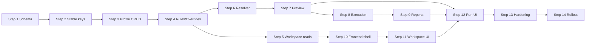

# 多 APP 形态共用测试资产与差异化执行——分步实施计划

> 文档版本：V1.0
>
> 编制日期：2026-08-25
>
> 上游方案：`docs/多APP形态共用测试资产与差异化执行_详细实施方案.md`
>
> 执行原则：每个 Step 的全部子任务完成后，统一执行该 Step 的完整门禁；通过后只提交一次。

> **历史/已废弃：本计划中的旧档案覆盖步骤不得照做，也不作为现行实现依据。** 当前实现以 [`APP档案跳过与用户变量配置设计方案.md`](APP档案跳过与用户变量配置设计方案.md) 和权威架构文档 §10.20 为准；档案只保留跳过规则与 occurrence 能力变量，当前用户变量使用稳定 `variable_id`。

## 0. 计划目标与执行规则

本计划把详细实施方案拆为 14 个可实现、可测试、可回滚、可独立提交的 Step。拆分遵循以下原则：

1. 先扩展数据结构，后切换业务行为。
2. 新能力默认关闭，任何中间 Step 都不能阻断现有执行流程。
3. APP 档案、规则、解析器、预检、执行快照和前端按依赖顺序接入。
4. 所有执行入口最终共用同一个解析器，不允许临时复制解析逻辑。
5. 每个 Step 只有一个提交点；Step 内不提交半成品。
6. Step 中途只允许轻量语法检查，不把局部测试当作验收结果。
7. 发现既有缺陷且会阻断本 Step 时，在本 Step 内修复并增加回归测试；无关问题单独记录，不扩大范围。

### 0.1 开始实施前检查

开始 Step 1 前完成以下一次性检查，不产生功能提交：

- 确认当前分支和工作区已有修改归属，禁止覆盖用户未提交内容。
- 记录 `alembic current`、`alembic heads`、后端/前端/Agent 基线测试结果。
- 确认 `test_platform_test` 可创建、迁移和清理，测试不得连接开发库。
- 导出开发库 schema-only 备份，用于审阅 DDL 差异。
- 确认权威架构文档第 10 章仍为当前最终口径。
- 确认 Node 18.16、Vite 5、Python 3.11 和 uv 路径符合项目约束。

基线命令：

```powershell
$env:Path = "$env:USERPROFILE\.local\bin;" + $env:Path

Set-Location backend
uv run ruff check app/ tests/ worker.py scripts/
uv run pytest tests/ -q
uv run alembic check

Set-Location ..\agent
uv run ruff check .
uv run pytest tests/ -q

Set-Location ..\frontend
npm run test
npm run build
```

基线失败时先判断是否与本方案相关。无关失败不得混入 Step 1 功能提交，应先单独修复或获得明确豁免。

### 0.2 通用 Step 门禁

每个 Step 根据触及子系统执行完整门禁：

```text
后端 Step：
  uv run ruff check app/ tests/ worker.py scripts/
  uv run pytest tests/ -q
  uv run alembic check

前端 Step：
  npm run test
  npm run build

Agent/协议相关 Step：
  uv run ruff check .
  uv run pytest tests/ -q
```

若一个 Step 同时修改后端和前端，两个子系统门禁都必须通过后才能提交。

### 0.3 功能开关

从 Step 1 开始增加并始终维护：

```text
APP_PROFILE_FEATURE_MODE=off|compat|required
APP_PROFILE_ENABLED_PROJECT_IDS=
```

- `off`：新表可写入迁移数据，但现有 UI 和执行流程不使用档案规则。
- `compat`：仅灰度项目显示并要求新流程；旧请求自动注入默认通用档案。
- `required`：所有新执行必须显式指定 APP 档案和发布版本。

Step 1～12 默认 `off`；Step 13 在测试环境切换 `compat`；Step 14 才允许生产灰度。

## Step 1：数据库 Expand、ORM 模型与兼容字段

### 1.1 目标

一次性建立新能力所需数据库结构和 ORM 模型，但不改变任何现有 API、Worker 或前端行为。

### 1.2 实现内容

- 新建模型：
  - `AppProfile`
  - `AppProfileRelease`
  - `AppProfileSkipRule`
  - `AppProfileElementOverride`
  - `AppProfileVariableOverride`
  - `AppProfileNodeOverride`
  - `AppProfileAuditLog`
  - `ExecutionExclusion`
- 扩展：
  - `projects.test_asset_revision`
  - `executions` 的档案、版本、双 revision 和解析摘要字段
  - `reports.not_applicable/exclusion_summary`
- 在 `app/models/__init__.py` 注册全部模型，确保 Alembic metadata 完整。
- 增加配置项 `app_profile_feature_mode`、`app_profile_enabled_project_ids`、快照大小限制和预检限流配置。
- 编写 Alembic Migration A，只做建表、加 nullable/兼容列、约束和普通索引。
- 大表索引使用 PostgreSQL concurrent 策略时拆为可审阅的 autocommit block。
- 更新测试清理夹具，按 FK 顺序清理新表，保证测试会话可重复执行。

### 1.3 明确不做

- 不回填步骤 UUID。
- 不创建默认档案。
- 不注册公开 API。
- 不修改执行创建和 Worker。
- 不开启功能开关。

### 1.4 测试与验收

- Alembic 从当前 head 升级成功。
- 对空测试库执行 `upgrade head` 成功。
- 对已有数据副本升级后，原用例、执行和报告数量不变。
- downgrade 在无新业务数据的测试库可执行；生产回滚坚持前滚修复。
- SQLAlchemy 能导入全部模型，没有循环导入。
- 原有后端测试全部通过。

门禁：Backend Ruff + Pytest + Alembic check。

提交：`feat(backend): Step 1 expand APP profile schema`

回滚点：应用可直接回滚到旧版本；新增表和 nullable 字段保留，不影响旧代码。

## Step 2：步骤稳定标识与公共资产修订号

### 2.1 目标

确保步骤、断言在排序和普通编辑后仍能被档案规则稳定引用，并让公共资产变化能够可靠失效解析缓存。

### 2.2 实现内容

- 用例步骤、断言 Schema 增加 `key: UUID`。
- 新建步骤/断言：前端优先生成 UUID，后端缺失时兜底生成。
- 编辑、折叠、展开、拖拽排序：保持原 key 不变。
- 克隆用例：为所有步骤和断言重新生成 key。
- 后端拒绝同一用例内重复 key，并返回 `NODE_KEY_DUPLICATED`。
- 编写 `scripts/backfill_case_node_keys.py`：
  - `--dry-run`
  - `--project-id`
  - `--batch-size`
  - 主键游标分批
  - JSONL 备份和校验和
  - 可从中断位置继续
- 对会改变执行快照的公共资产写操作统一调用 `bump_test_asset_revision`：
  - 套件/用例创建、删除、启停
  - 套件成员增删与排序
  - 步骤、断言和用例变量修改
  - 元素定位修改
  - 全局/项目/套件变量修改
- revision 变更与资产写入处于同一事务，项目行短暂加锁。
- 前端类型和编辑器补充 key，但不展示给普通用户。

### 2.3 数据迁移顺序

1. 测试库 dry-run，记录缺失、非法和重复 key 数量。
2. 测试库正式回填，重复运行确认 changed=0。
3. 开发库导出 JSONL 后分批回填。
4. 运行一致性检查，确认所有活动用例节点 key 合法且用例内唯一。
5. 暂不增加数据库级 JSON CHECK，校验由 Pydantic 和迁移脚本保证。

### 2.4 测试与验收

- 保存旧格式用例时后端生成 key。
- 排序、折叠、编辑参数后 key 不变。
- 克隆后新旧用例的节点 key 不相同。
- 回填脚本 dry-run 不写库，正式运行幂等。
- 资产修改只递增一次 revision；纯描述修改不递增。
- 两个并发资产编辑串行更新，不丢 revision。
- 前端用例编辑相关测试与构建通过。

门禁：Backend Ruff + Pytest + Alembic check；Frontend Vitest + Build。

提交：`feat(backend): Step 2 add stable case node keys`

回滚点：新增 key 对旧 Agent 是额外 JSON 字段；即使回滚应用也不会影响现有执行。

## Step 3：APP 档案、发布版本、默认档案与基础审计

### 3.1 目标

提供项目级 APP 档案和发布版本的完整生命周期，以及所有后续配置命令复用的 revision、幂等和审计基础设施。

### 3.2 实现内容

- 新增 Pydantic Schema 和路由：
  - 项目档案列表/创建
  - 档案详情/修改/停用
  - 发布版本列表/创建/修改/停用
- 建立 `ProfileRevisionService`：
  - 锁定档案行
  - 校验 expected revision
  - 有效配置变化递增一次
  - 发布版本变化不递增解析 revision
- 建立 `ProfileAuditService`：
  - `request_id` 幂等查询
  - 记录 actor、role、IP、User-Agent、revision 前后值
  - 返回已存储的幂等响应
- 创建默认档案脚本：
  - 每个活动项目创建“通用配置（待调整）”
  - `inherit_all=true`
  - 创建“未标注历史版本”
  - 重复执行不重复创建
- 权限：Owner/Admin 写，Member/Viewer 读。
- feature mode 仍为 `off`，档案 API 可供开发验证，但不接执行。

### 3.3 错误与边界

- 同项目 code/name 冲突返回 409。
- 停用档案前检查非终态执行；当前尚无新执行时保持该逻辑测试。
- 软删除档案和版本，历史引用保留。
- 公开项目访客按 Viewer 处理，不允许写。
- 平台管理员不自动绕过项目权限。

### 3.4 测试与验收

- CRUD、分页、筛选和软删除。
- Owner/Admin/Member/Viewer 权限矩阵。
- 相同 request_id 重放不重复写审计。
- 两个相同 expected revision 的并发更新只有一个成功。
- 默认档案脚本幂等且不会修改现有业务档案。
- 生产弱配置校验不受影响。

门禁：Backend Ruff + Pytest + Alembic check。

提交：`feat(backend): Step 3 add APP profile lifecycle`

回滚点：关闭档案 API 路由即可；新数据保留，旧执行不读取。

## Step 4：跳过规则、局部覆盖与原子批量命令

### 4.1 目标

完成套件、用例、步骤、断言四级跳过，以及元素、变量、节点参数覆盖的安全写入能力。

### 4.2 实现内容

- 实现批量跳过/恢复命令：
  - request_id 幂等
  - expected revision
  - 最多 500 个 targets
  - 单事务全成全败
  - 原因枚举和备注校验
- 实现元素覆盖 upsert/restore。
- 实现 APP 档案变量覆盖 upsert/restore。
- 实现步骤/断言节点 patch upsert/restore。
- 建立目标归属校验：档案、套件、用例、节点、元素必须属于同一项目。
- 建立 Registry patch 白名单：禁止修改 key、order、phase、action、assertion_type。
- patch 保存前合并到公共节点副本并完整校验。
- 父级恢复只恢复父级直接规则，绝不清理子级直接规则。
- 资产软删除时在同一服务事务中软删除当前有效规则/覆盖；审计和历史执行不删除。
- 每个配置命令只递增一次 profile revision，并写一条包含逐项 changes 的审计记录。

### 4.3 测试与验收

- 四级跳过创建、幂等、恢复。
- “其他”原因无备注被拒绝。
- 一个非法 target 导致全部回滚且 revision 不变。
- 父级恢复保留子级规则。
- 跨项目 ID 猜测全部被拒绝。
- 非白名单 patch 和 Registry 非法参数被拒绝。
- 跳过节点的覆盖可以保存，但后续解析不得生效。
- 批量审计逐项保存 before/after，敏感变量值脱敏。

门禁：Backend Ruff + Pytest + Alembic check。

提交：`feat(backend): Step 4 add profile rules and overrides`

回滚点：规则尚未接入执行，关闭写接口即可停止影响；已有配置可保留。

## Step 5：配置工作台读模型与差异查询

### 5.1 目标

提供前端层级树表格所需的高效读接口，准确计算直接跳过、继承跳过和覆盖状态。

### 5.2 实现内容

- 实现档案工作台套件根节点分页。
- 实现套件下用例、用例下步骤/断言的懒加载接口。
- 实现差异扁平列表：`all/skipped/overridden`。
- 为每个节点返回：
  - `effective_status`
  - `status_source`
  - `direct_rule_id`
  - 原因
  - 覆盖数量
  - 更新人/更新时间
- 状态计算规则：套件直接规则优先于用例，之后才是节点直接规则。
- 父级被跳过时不在数据库展开子规则；读模型按请求动态计算继承状态。
- 聚合 SQL 批量读取规则和覆盖，禁止节点级 N+1。
- 支持 keyword、状态、原因、更新人和白名单排序。
- 加入查询计数测试，防止未来退化成 N+1。

### 5.3 性能基线

- 500 套件下根节点单页 P95 < 500ms。
- 100 用例套件的子节点 P95 < 300ms。
- 单页 SQL 查询次数保持固定数量，不随节点数线性增长。
- 响应不返回完整步骤参数和元素详情，详情在覆盖抽屉按需读取。

### 5.4 测试与验收

- 直接/继承/覆盖组合状态准确。
- 恢复父级后子级直接规则重新显现。
- 新公共套件自动出现在所有 inherit_all 档案。
- 分页、筛选、排序和懒加载稳定。
- Viewer 可读、无项目权限用户不可读。
- SQL 查询次数和基准响应时间达标。

门禁：Backend Ruff + Pytest + Alembic check。

提交：`feat(backend): Step 5 add profile workspace queries`

回滚点：纯读接口，可直接取消路由注册，不影响配置和执行。

## Step 6：配置解析器核心与双修订缓存

### 6.1 目标

实现公共资产与 APP 档案规则到最终执行快照的唯一解析核心，但暂不替换现有执行创建流程。

### 6.2 实现内容

- 新建 `ProfileResolver`、请求/结果 dataclass 和错误类型。
- 实现目标加载：case/suite/batch、套件顺序、批量用例去重。
- 实现套件 > 用例 > 步骤/断言跳过优先级。
- 实现节点、元素和变量覆盖。
- 变量优先级：执行 > APP > 套件 > 用例 > 项目 > 全局。
- 应用 setup/main/teardown 运行选项并生成最终连续 order。
- 保留 `source_key/source_order/source_phase` 供历史映射。
- 使用 Registry 对最终动作和断言二次校验。
- 生成 `ResolvedCase`、`ExclusionItem`、summary 和 warnings。
- 所有节点过滤后把用例标记为 `empty_after_filter`，不能作为 passed。
- 实现有界 LRU/TTL 结构缓存，键包含：
  - project_id
  - test_asset_revision
  - profile_id
  - profile_revision
- 缓存只保存公共结构和配置索引，不缓存执行变量渲染后的完整快照。

### 6.3 单元测试矩阵

- 无规则输出与当前快照语义等价。
- 四级跳过优先级和排除来源。
- 元素/变量/节点覆盖顺序。
- 同一用例多套件去重。
- 未定义变量和跨项目元素错误。
- Registry 升级后旧覆盖失效能够被发现。
- 公共资产 revision 变化后缓存 miss。
- 档案 revision 变化后缓存 miss。
- 冷/热缓存结果完全一致。
- 输入对象不被原地修改。

### 6.4 验收

解析器可通过纯 service 测试生成完整快照；现有执行仍走旧流程，功能开关保持 off。

门禁：Backend Ruff + Pytest + Alembic check。

提交：`feat(backend): Step 6 add APP profile resolver`

回滚点：解析器尚未接生产入口，删除服务引用即可。

## Step 7：执行预检、冲突校验与资源保护

### 7.1 目标

把解析器通过只读预检接口开放给前端和测试人员，在改变执行链路前先验证解析结果。

### 7.2 实现内容

- 实现 `POST /api/executions/preview`。
- 校验档案、发布版本、目标和可选设备权限/状态。
- 返回档案 revision、资产 revision、执行/N/A/覆盖数量和前 200 条排除预览。
- 不创建 Execution、不入队、不锁设备。
- 实现错误码：
  - `APP_PROFILE_REQUIRED`
  - `APP_RELEASE_REQUIRED`
  - `PROFILE_EMPTY`
  - `PROFILE_TARGET_NOT_APPLICABLE`
  - `PROFILE_OVERRIDE_INVALID`
  - `PROFILE_VARIABLE_UNRESOLVED`
  - `SNAPSHOT_TOO_LARGE`
- 实现用户+项目维度限流、15 秒超时、目标数量和快照估算限制。
- 对相同用户、目标、双 revisions、运行参数哈希缓存预检 30 秒。
- 响应和日志不得输出变量敏感值或完整快照。

### 7.3 测试与验收

- 单用例、套件、批量预检。
- 整体不适用与部分 N/A。
- 预检不会生成任何执行、队列或设备锁记录。
- 无权限设备和跨项目目标被拒绝。
- 限流、超时、缓存、大小限制。
- 两类 revision 均返回并与数据库一致。
- 100 用例热缓存 P95 目标 < 800ms。

门禁：Backend Ruff + Pytest + Alembic check。

提交：`feat(backend): Step 7 add execution profile preview`

回滚点：撤销预检路由即可，执行流程尚未改变。

## Step 8：执行快照前移、N/A 固化与 Worker 兼容

### 8.1 目标

正式把 APP 档案解析接入执行创建，同时确保 Execution、快照、pending 步骤、排除项和 Queue 原子生成，Agent 协议保持不变。

### 8.2 实现内容

- 扩展 case/suite/batch 创建 Schema：
  - `app_profile_id`
  - `app_release_id`
  - `expected_profile_revision`
  - `expected_test_asset_revision`
- 创建事务开始时锁定项目和档案 revision 行并二次校验。
- 调用同一 `ProfileResolver` 获取候选结果。
- 在一个事务中创建：
  - Execution 及档案/版本名称快照
  - ExecutionCase 完整快照
  - pending ExecutionStep
  - ExecutionExclusion
  - ExecutionQueue
- 任何写入失败整体回滚，不能留下无队列执行。
- Worker 改为读取已经固化的快照，不再为新执行读取实时用例和规则。
- `off/compat` 模式下，为旧请求注入项目通用档案和历史版本；记录兼容告警。
- Worker 对没有快照的历史兼容执行保留一次兜底解析；required 模式下缺快照直接 error。
- 套件/用例整体 N/A 不创建空 ExecutionCase；所有目标为空时创建前返回错误。
- 步骤/断言 N/A 从 Agent 快照移除，同时写排除项。
- 设备锁逻辑保持现有原子更新，档案并发不增加长事务锁。
- `start_test` 协议字段保持兼容；`source_key` 只用于服务端追踪。

### 8.3 重试改造

- 重试默认带入原档案、版本、目标和运行选项。
- 打开重试时重新预检当前 revisions。
- revision 变化时返回差异摘要，由前端确认后创建新执行。
- `retry_of` 保持指向原执行。
- 历史执行快照和排除项不被修改。
- 预留管理员“按原快照重放”service 接口，但 V1 不开放 UI。

### 8.4 并发与终态

- 预检后配置变化：409，不创建执行。
- 预检后公共资产变化：409，不创建执行。
- 同设备并发：只有一个执行成功锁定，其他返回现有设备占用错误。
- queued 取消、Worker 认领、停止宽限期和唯一终态汇总沿用现有已验收逻辑。
- N/A 不新增顶层执行状态，也不能改变 passed/failed/error 判断。

### 8.5 测试与验收

- 创建事务原子性和故障注入回滚。
- 快照在排队期间修改档案/用例后保持不变。
- Agent 收到的是最终过滤和覆盖后的快照。
- N/A 不下发 Agent、不占 pending 步骤。
- 单目标整体 N/A 不入队、不锁设备。
- 兼容旧请求、required 新请求和历史无档案执行。
- 重试 revision 变化提示和新快照。
- 设备锁竞争、queued 取消、停止、截图、断言失败和后置操作回归。

门禁：Backend Ruff + Pytest + Alembic check；Agent Ruff + Pytest。

提交：`feat(backend): Step 8 materialize profile execution snapshots`

回滚点：生产开关仍为 off；应用回滚后旧流程忽略新快照字段。已创建的新快照数据必须保留。

## Step 9：报告模型、N/A 统计与历史快照 API

### 9.1 目标

让报告准确展示 APP 档案、发布版本、双 revisions、不适用内容和覆盖摘要，并保持历史报告不受配置变化影响。

### 9.2 实现内容

- Worker 终态汇总写入：
  - `reports.not_applicable`
  - `reports.exclusion_summary`
- 保持 `reports.total` 为实际执行用例数。
- 成功率只使用 passed + failed + error_count，排除 N/A 和执行中 skipped。
- 分母为 0 时成功率为 0。
- 报告详情从 ExecutionCase 和 ExecutionExclusion 快照读取，不查询当前规则。
- 报告列表和详情增加：
  - APP 档案名称快照
  - 发布版本快照
  - profile revision
  - test asset revision
  - N/A 数量和原因分布
- 新增排除项分页接口或在报告详情接口中提供分页 section。
- 报告列表支持按档案、发布版本和版本关键词筛选。
- HTML 报告同步增加 N/A 章节，父级排除默认折叠。
- 历史 `app_profile_id IS NULL` 显示“历史执行（未指定 APP 档案）”。

### 9.3 测试与验收

- N/A 不计入成功率。
- failed/error 正确进入分母。
- stopped/skipped 与 N/A 分开。
- 配置、用例、元素删除后历史报告仍可读取。
- 同一档案不同发布版本筛选准确。
- HTML 下载内容与页面详情统计一致。
- 报告生成仍保持一执行一报告的幂等约束。

门禁：Backend Ruff + Pytest + Alembic check。

提交：`feat(backend): Step 9 report APP profile exclusions`

回滚点：旧报告 API 可忽略新增字段；已写入排除项和统计不删除。

## Step 10：前端档案树、发布版本与公共库新布局

### 10.1 目标

建立新的测试套件页面框架和 APP 档案管理基础，先完成导航和只读数据流，不在此 Step 实现全部差异编辑。

### 10.2 实现内容

- 新增 APP 档案 API TypeScript 类型与请求模块。
- 新增 `useAppProfileStore`，管理：
  - 档案列表
  - 当前档案/all
  - 双 revisions
  - 过滤条件
  - 展开/选择状态
  - 节点缓存和 stale 状态
- 新增左侧 `AppProfileTree`：
  - 公共套件库（全部）
  - DVR/部标机/网约车等档案
  - 新建、编辑、停用入口
- 新增发布版本管理弹窗。
- 重构套件页右侧公共库：
  - 套件搜索、分页、统计
  - 现有套件/成员 CRUD 和运行入口保留
  - 显示被多少档案跳过/覆盖的汇总
- 过滤条件同步 URL query。
- 切换项目/档案时取消旧请求并隔离缓存。
- feature mode off 时仍显示旧套件页；灰度项目才加载新布局。

### 10.3 UI 验收

- 左侧树宽度、折叠、空状态和禁用档案状态符合详细方案。
- 新建档案默认持续继承公共库，不展示误导性的“复制套件”行为。
- 发布版本 CRUD 权限正确。
- Member/Viewer 不显示配置写入口。
- 公共套件原有编辑、排序、运行功能不回归。
- 切换档案和项目没有慢请求串页。

门禁：Frontend Vitest + Build；Backend Ruff + Pytest + Alembic check（若为列表汇总补充后端字段）。

提交：`feat(frontend): Step 10 add APP profile navigation`

回滚点：关闭前端 feature flag，恢复旧套件页路由；后端档案数据不受影响。

## Step 11：层级配置工作台、跳过和差异视图

### 11.1 目标

完成右侧层级树表格，以及套件、用例、步骤、断言的跳过、恢复、批量操作和“一键查看差异”。

### 11.2 实现内容

- 新增 `ProfileHierarchyTable`：
  - 套件根分页
  - 套件/用例懒加载
  - 展开状态保持
  - 勾选和批量上限
- 新增统一状态标签：正常、直接跳过、继承跳过、已覆盖、跳过且存在覆盖。
- 新增 `SkipReasonDialog`：
  - 预设原因
  - “其他”备注必填
  - 批量目标摘要
- 恢复父级确认明确提示“子级直接规则保留”。
- 保存携带 request_id 和 expected revision。
- 409 后冻结当前编辑、标记 stale、刷新节点并提示用户重新操作。
- 新增 `ProfileDifferenceView`：
  - 只看跳过项
  - 只看覆盖项
  - 两者互斥
  - 目标类型、原因、关键词、更新人筛选
- 差异视图大于 500 行使用 `el-table-v2`；层级工作台继续分页和懒加载。
- 保存成功后局部更新节点，失效父级汇总，不全页闪烁。

### 11.3 测试与验收

- 四级节点展开和懒加载。
- 直接/继承状态组合。
- 批量跳过成功和整体失败。
- 原因校验和错误定位。
- 父级恢复后子级规则重新显现。
- revision 冲突后不覆盖他人修改。
- 只看跳过/覆盖与 URL 状态。
- Viewer 只读、Member 无配置写入口。
- 大列表滚动和搜索无明显卡顿。

门禁：Frontend Vitest + Build；Backend Ruff + Pytest + Alembic check（若接口联调修正后端）。

提交：`feat(frontend): Step 11 add profile hierarchy workspace`

回滚点：关闭新工作台入口；已保存规则仍保留，旧执行在 off 模式不使用。

## Step 12：覆盖抽屉、统一运行预检与报告前端

### 12.1 目标

完成档案局部覆盖编辑、所有运行入口的档案/版本/预检接入，以及报告 N/A 前端展示。

### 12.2 覆盖抽屉

- 公共值与档案值左右对比。
- 元素定位覆盖：locator type/value。
- 变量覆盖：name/value/description，敏感值按规则掩码。
- 步骤/断言 patch：只渲染 Registry 允许字段。
- 保存前本地校验，后端错误定位具体字段。
- “恢复公共值”携带 expected revision。
- 被跳过节点的覆盖显示“当前未生效”。

### 12.3 运行入口

- 扩展 `RunButton`、`DevicePicker`、`useDeviceSelect` 和重试 composable。
- 档案视图运行自动带入且锁定当前档案。
- 公共库运行必须选择档案。
- 发布版本必选，默认当前用户在该档案最近使用值。
- 档案/版本/运行选项变化后自动重新预检。
- 显示源内容、实际执行、N/A 和覆盖摘要。
- 整体不适用、空解析或阻断警告时禁用运行。
- 确认运行携带双 revisions；冲突后打开刷新确认弹窗。
- 重试显示原 revision 与当前 revision 差异。

### 12.4 报告前端

- 报告列表新增档案和版本筛选。
- 报告详情头部显示档案、版本和双 revisions。
- 新增“不适用内容”页签。
- N/A 与 skipped 使用不同标签、说明和统计。
- 历史无档案执行显示兼容文案。

### 12.5 测试与验收

- 三类覆盖保存、恢复和冲突。
- 公共库运行缺档案/版本不能提交。
- 档案视图自动带入档案。
- 预检 loading、错误、空结果、revision 变化。
- 后端设备并发占用错误继续刷新设备选择。
- 重试不复用旧 revision 静默执行。
- 报告成功率、N/A 和 skipped 展示一致。
- 用例、套件、批量、执行详情、报告详情所有运行入口回归。

门禁：Frontend Vitest + Build；Backend Ruff + Pytest + Alembic check。

提交：`feat(frontend): Step 12 complete profile run and reports UI`

回滚点：关闭新前端入口和 compat 灰度；后端快照能力保留。

## Step 13：配置实时通知、监控、性能与安全加固

### 13.1 目标

在进入灰度前补齐多人编辑通知、可观测性、性能保护和安全审计，使故障能够被发现和定位。

### 13.2 实现内容

- 新增项目配置 WebSocket：
  - 只广播 profile/asset revision 和变更人
  - 不广播规则正文或变量值
  - 前端断线后 30 秒轮询兜底
- 复用现有 FastAPI WS 单进程部署约束；不引入 Redis Pub/Sub。
- 增加 Prometheus 指标或项目统一指标出口：
  - 解析耗时/结果
  - 缓存 hit/miss
  - revision 冲突
  - 快照字节数和固化耗时
  - N/A 比率
  - 审计失败
- 结构化日志增加 request/project/profile/revision/execution 上下文。
- 执行数据库查询数和缓存容量基准测试。
- 加入快照 1MB/用例、20MB/执行限制。
- 预检和配置批量接口限流。
- 审计变量值脱敏；日志禁止记录完整执行参数和快照。
- 安全复核：跨项目 ID、权限、任意 patch、XSS 展示、可信代理 IP。
- 测试环境 feature mode 切换为 `compat`，完成真实 Android 冒烟。

### 13.3 性能验收

- 工作台首屏 P95 < 500ms。
- 子节点 P95 < 300ms。
- 100 用例预检 P95 < 800ms。
- 1,000 用例预检 P95 < 3s。
- 热缓存命中率 > 80%。
- 快照大小和进程 RSS 在方案阈值内。
- SQL 次数无 N+1 增长。

### 13.4 故障演练

- 配置 WS 断开后轮询恢复。
- 缓存清空或异常后数据库解析正确。
- 审计写失败导致配置事务回滚。
- Registry 不可用时启动自检失败。
- 数据库短暂异常不产生孤儿 Queue。
- 监控能观察到 revision 冲突和解析错误。

门禁：Backend Ruff + Pytest + Alembic check；Frontend Vitest + Build；Agent Ruff + Pytest。

提交：`feat(backend): Step 13 add profile observability and safeguards`

回滚点：关闭配置 WS 和指标采集不影响核心执行；compat 可退回 off。

## Step 14：迁移演练、灰度上线、全链路验收与文档收口

### 14.1 目标

在真实数据规模和真实 Android 设备上完成迁移、灰度、回滚演练和业务验收，形成可上线版本。

### 14.2 迁移演练

- 从生产脱敏备份恢复到预发布库。
- 执行 Migration A、稳定 key 回填、默认档案脚本。
- 核对迁移前后项目、套件、用例、步骤、执行、报告数量。
- 重跑回填脚本确认幂等。
- 测量锁等待、WAL、脚本耗时和数据库体积。
- 执行应用回滚演练，确认旧版本能忽略新增结构。
- 执行 JSONL 节点恢复演练，但不在生产实际回滚已生效数据。

### 14.3 灰度步骤

1. 生产部署兼容后端，feature mode=`off`。
2. 完成结构迁移和节点回填。
3. 部署新前端，默认仍展示旧入口。
4. 选择一个非关键项目加入 enabled project IDs，mode=`compat`。
5. 管理员创建真实 DVR/部标机/网约车档案和发布版本。
6. 对照当前人工测试范围配置跳过与覆盖。
7. 使用真实 Android 执行单用例、套件和批量套件。
8. 连续观察至少 3 个工作日。
9. 按 10% → 30% → 60% → 100% 项目扩展。
10. 所有活跃项目完成档案配置后切换 required。

### 14.4 全链路验收

- 新档案持续继承所有公共套件。
- 新增公共套件无需重新导入。
- 四级跳过、父级恢复、三类覆盖全部正确。
- 步骤排序后规则仍指向原节点。
- 公共库运行强制选档案/版本。
- 预检、双 revision 冲突、设备并发锁正确。
- Agent 收到最终快照，断言、后置操作、停止、截图链路正确。
- 报告区分 N/A/skipped，历史快照不变。
- 两个档案同时执行同一公共用例互不影响。
- 关闭灰度后可退回通用配置模式。

### 14.5 文档与培训

- 将最终口径合并到权威架构文档第 10 章。
- 更新 OpenAPI、数据库字典、用户手册和运维手册。
- 管理员培训：档案、版本、跳过、覆盖、审计。
- 测试人员培训：选择档案/版本、预检、N/A 报告。
- 输出一套 DVR 示例配置与练习用例。
- 记录灰度指标基线和 required 切换审批。

### 14.6 上线准入

以下全部满足才可全量：

- 全部 Step 门禁通过。
- Alembic upgrade/check 和迁移演练通过。
- 无 P0/P1 缺陷；P2 有明确处理计划和接受人。
- 解析错误率 < 2%。
- 新流程失败率相较旧流程未增加 5 个百分点。
- 预检和快照性能达到 Step 13 基线。
- 回滚开关、数据库备份和负责人均确认。

门禁：Backend、Frontend、Agent 全部门禁 + 迁移演练 + 真实设备验收。

提交：`chore: Step 14 finalize APP profile rollout`

回滚点：项目移出灰度列表并切回 off/compat 通用档案模式；保留新表、审计和历史快照，不做破坏性数据库回滚。

## 15. Step 依赖、并行边界与预计周期

### 15.1 强制依赖



### 15.2 可并行工作

- Step 5 与 Step 6 在 Step 4 完成后可由不同开发者并行，但分别通过门禁和提交。
- Step 10 可在 Step 5 接口契约冻结后与 Step 6～8 并行。
- Step 9 后端报告与 Step 11 配置工作台可以并行。
- Step 12 必须等待 Step 7、Step 9、Step 11 完成。
- Step 13、Step 14 不得与未完成的核心功能并行作为“提前上线准备”。

多个 Step 并行开发时仍保持按 Step 独立分支/提交，合并顺序遵守依赖图；不得把两个未验收 Step 拼成一次门禁。

### 15.3 预计周期

| 阶段 | Steps | 串行工作日 | 主要角色 |
|---|---|---:|---|
| 数据基础 | 1～2 | 8～10 | 后端、DBA、测试 |
| 档案配置 | 3～5 | 10～13 | 后端、测试 |
| 解析与执行 | 6～9 | 15～20 | 后端、Agent、测试 |
| 前端工作台 | 10～12 | 15～20 | 前端、后端联调、测试 |
| 加固与上线 | 13～14 | 10～15 | 全团队、运维 |

采用 2 后端 + 2 前端 + 1 测试并行后，预计 8～10 周；单人严格串行约 12～15 周。

## 16. 每个 Step 的完成定义（Definition of Done）

任一 Step 只有同时满足以下条件才算完成：

- 该 Step 所列实现内容全部落地，无 TODO 或临时兼容代码未说明。
- API Schema、数据库模型、迁移和实现一致。
- 新增业务路径有正向、权限、错误和并发测试。
- 触及的旧功能有回归测试。
- 完整门禁一次通过；失败修复后重新执行整个相关门禁。
- `git diff --check` 通过，无无关格式化和用户文件改动。
- Alembic migration 已人工审阅 upgrade/downgrade、FK 顺序和循环依赖。
- 文档更新与实现同步，不把未实现能力写成已上线。
- 提交信息符合项目规范，提交中只包含本 Step 内容。
- 交付说明包含：完成内容、测试结果、已知限制、迁移/回滚注意事项。

## 17. 实施过程中禁止事项

- 禁止按 APP 档案复制套件、用例或步骤数据。
- 禁止把物理 `device_id` 保存为档案归属。
- 禁止在 Agent 内解析档案规则。
- 禁止只按 `profile_id/revision` 缓存而忽略公共资产 revision。
- 禁止批量配置部分成功。
- 禁止父级恢复时级联删除子级规则。
- 禁止把 N/A 写成 passed 或普通 skipped。
- 禁止 Worker 为新执行重新读取当前规则覆盖已固化快照。
- 禁止通过任意 JSON Patch 修改 action、key、order 或 phase。
- 禁止在 required 前删除兼容路径或历史 NULL 展示。
- 禁止在无备份、无回滚开关、无灰度指标时全量上线。

