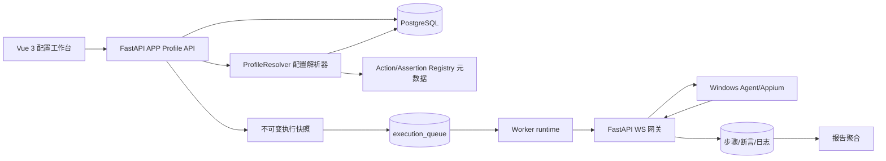
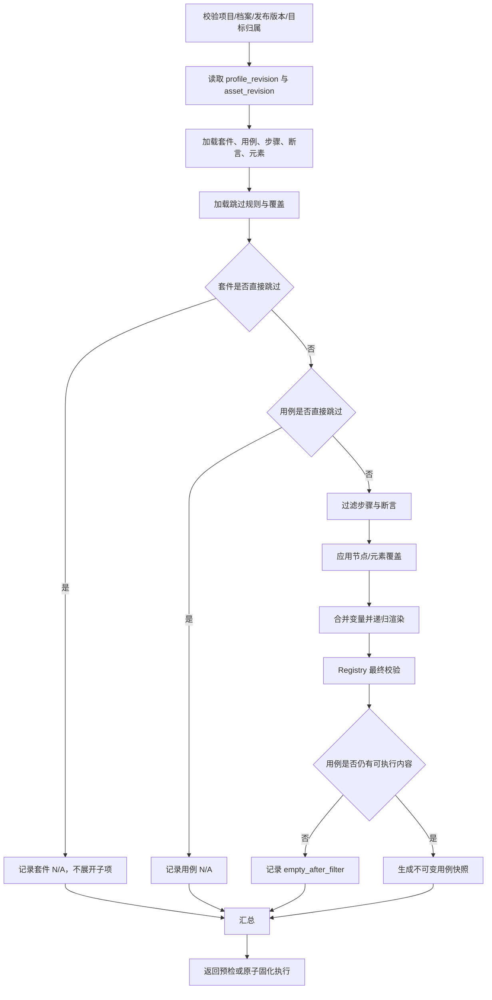
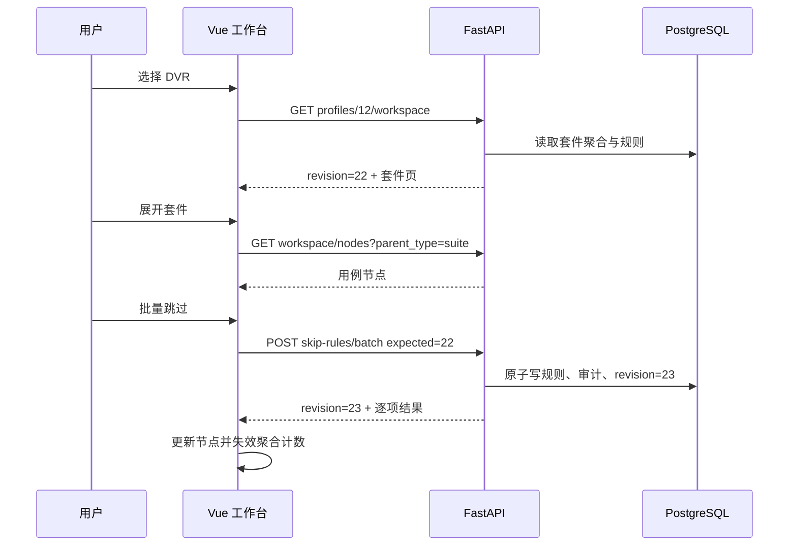
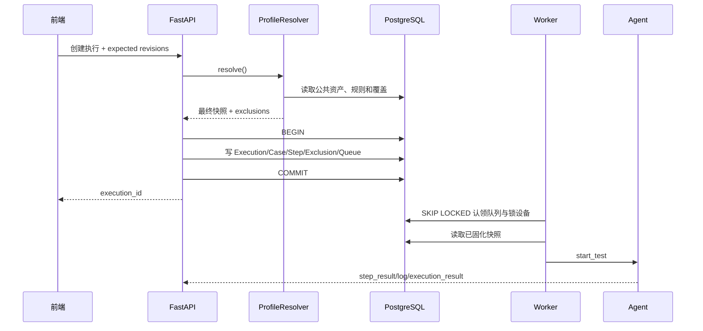
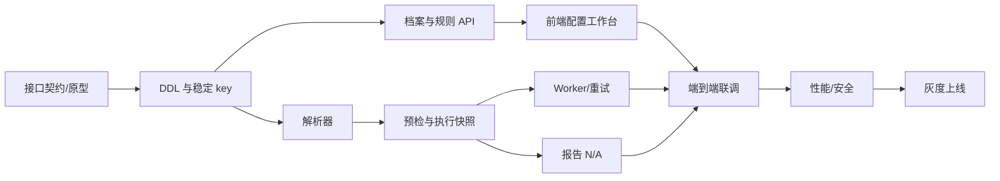
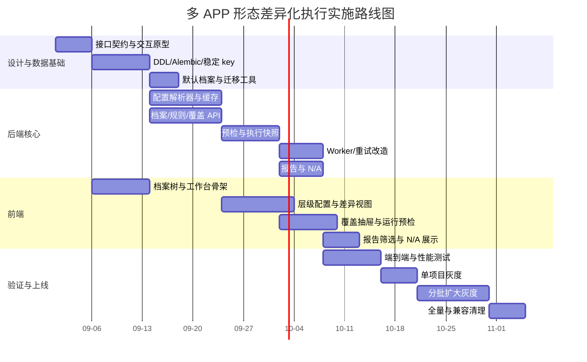

# 多 APP 形态共用测试资产与差异化执行详细实施方案

> 文档版本：V1.0
>
> 编制日期：2026-08-25
>
> 适用项目：APP 自动化测试平台
>
> 上游设计：《套件设计.MD》/《多 APP 形态共用测试资产与差异化执行方案》
>
> 权威架构：`docs/APP自动化测试平台_详细架构实施方案.md` V1.1（冲突时以第 10 章为准）

> **历史/已废弃：本稿不作为现行实现或操作依据。** APP 档案现行口径已收窄为跳过规则与按 `suite_case_id` 隔离的 occurrence 能力变量；元素定位、档案全局变量和节点参数覆盖均已删除。请参阅 [`APP档案跳过与用户变量配置设计方案.md`](APP档案跳过与用户变量配置设计方案.md) 及权威架构文档 §10.20。

## 0. 文档目的与现状校准

本文把上游方案细化为可以直接拆分研发任务、编写迁移、实现接口和组织验收的实施蓝图。目标是在一个项目内只维护一份公共测试资产，通过 APP 配置档案表达 DVR、部标机、网约车等产品形态的“不适用项”和少量差异，避免复制项目、复制套件或复制用例。

### 0.1 与输入假设的差异

输入材料给出了 FastAPI/Django、React、Redis、Celery 等通用假设，但当前仓库的实际技术栈已经确定，实施必须采用下表口径：

| 领域 | 当前项目实际口径 | 本方案决策 |
|---|---|---|
| 后端 | Python 3.11、FastAPI、Pydantic 2、SQLAlchemy 2.0 Async、asyncpg | 不引入 Django |
| 前端 | Vue 3、TypeScript、Vite 5、Element Plus、Pinia | 不使用 React、Redux 或 Zustand |
| 队列 | PostgreSQL `execution_queue`，`FOR UPDATE SKIP LOCKED` | 本期不引入 Celery/Redis |
| Worker | 默认嵌入 FastAPI，也可切换独立 Python Worker | 解析逻辑放共享 service，两个模式复用 |
| 实时通信 | FastAPI WebSocket 网关；Agent 与 Worker 不直接连接 | 配置通知复用 FastAPI WS 能力 |
| Agent | 接收服务端解析后的执行快照 | Agent 协议和执行逻辑保持不变 |

Redis 只作为未来横向扩容后的共享缓存和 Pub/Sub 选项；Celery 只在 PostgreSQL 队列达到第 9 章给出的迁移阈值后评估。本期增加二者会扩大部署面、破坏现有 Worker 单一实现，不产生足够收益。

### 0.2 核心实施原则

1. “全部”是公共测试资产库，不是某台物理设备的资产集合。
2. APP 配置档案按产品形态划分，不与物理设备绑定。
3. APP 档案持续继承公共资产，只保存跳过规则和局部覆盖，不复制套件、用例或步骤。
4. 所有差异在服务端生成执行快照前解析，Agent 不感知档案与规则。
5. 历史执行只读取不可变快照，不重新读取当前配置。
6. 配置写入使用乐观锁与原子事务；批量操作全成全败，不返回难以恢复的部分成功状态。
7. `not_applicable`（产品不适用）与 `skipped`（执行中断、停止导致未执行）严格分离。

## 1. 总体架构与技术选型



### 1.1 服务边界

- FastAPI：档案 CRUD、规则与覆盖写入、预检、执行创建、快照落库、配置变更通知、Agent 消息落库。
- `ProfileResolver`：纯服务层模块，负责读取公共资产、解析规则、应用覆盖、合并变量、校验 Registry、输出快照与排除项。
- Worker runtime：只消费已经固化快照的执行，原子锁设备、发送快照、推进状态、汇总报告和释放资源；不再根据实时用例重新解释档案规则。
- Agent：继续执行 `start_test` 中的步骤、断言和元素快照，不增加档案协议字段。
- 前端：公共库维护、APP 档案树、层级配置工作台、差异视图、覆盖抽屉和统一运行弹窗。

### 1.2 新增后端模块建议

```text
backend/app/
├── models/app_profile.py
├── schemas/app_profile.py
├── api/app_profiles.py
├── services/profile_resolver.py
├── services/profile_revision.py
├── services/profile_audit.py
└── services/execution_snapshot.py
```

不得在路由中重复实现解析逻辑。预检、单用例执行、套件执行、批量执行和重试必须调用同一个 `ProfileResolver`。

## 2. 数据库详细设计

### 2.1 DDL 设计说明

- 主键沿用现有项目 `INTEGER` 风格。
- 时间字段统一使用 `TIMESTAMPTZ`。
- 配置主数据采用软删除；执行排除项和审计日志采用不可变硬记录。
- JSON 使用 `JSONB`，并用 `jsonb_typeof` 约束对象结构。
- 步骤和断言稳定标识使用 PostgreSQL `UUID`；在 JSON 中以标准小写 UUID 字符串表示。
- 外键指向软删除资产时不使用级联删除，删除服务主动清理当前配置；历史执行通过名称快照保持可读。
- 下列 DDL 是目标结构示例，正式实施使用 SQLAlchemy Model 与 Alembic migration 生成并人工审阅。

### 2.2 APP 配置档案与发布版本

```sql
CREATE TABLE app_profiles (
    id              INTEGER GENERATED BY DEFAULT AS IDENTITY PRIMARY KEY,
    project_id      INTEGER NOT NULL REFERENCES projects(id) ON DELETE RESTRICT,
    name            VARCHAR(100) NOT NULL,
    code            VARCHAR(64) NOT NULL,
    description     TEXT,
    status          VARCHAR(16) NOT NULL DEFAULT 'active',
    inherit_all     BOOLEAN NOT NULL DEFAULT TRUE,
    revision        BIGINT NOT NULL DEFAULT 1,
    created_by      INTEGER REFERENCES users(id) ON DELETE SET NULL,
    updated_by      INTEGER REFERENCES users(id) ON DELETE SET NULL,
    created_at      TIMESTAMPTZ NOT NULL DEFAULT now(),
    updated_at      TIMESTAMPTZ NOT NULL DEFAULT now(),
    deleted_at      TIMESTAMPTZ,
    CONSTRAINT ck_app_profiles_status
        CHECK (status IN ('active', 'disabled')),
    CONSTRAINT ck_app_profiles_revision
        CHECK (revision >= 1),
    CONSTRAINT ck_app_profiles_code
        CHECK (code ~ '^[a-z][a-z0-9_-]{1,63}$')
);

CREATE UNIQUE INDEX uq_app_profiles_project_code_active
    ON app_profiles(project_id, code)
    WHERE deleted_at IS NULL;
CREATE UNIQUE INDEX uq_app_profiles_project_name_active
    ON app_profiles(project_id, lower(name))
    WHERE deleted_at IS NULL;
CREATE INDEX idx_app_profiles_project_status
    ON app_profiles(project_id, status)
    WHERE deleted_at IS NULL;

COMMENT ON TABLE app_profiles IS '项目内 APP 产品形态配置档案，不绑定物理设备';
COMMENT ON COLUMN app_profiles.revision IS '档案规则或覆盖每次原子变更后递增一次';

CREATE TABLE app_profile_releases (
    id              INTEGER GENERATED BY DEFAULT AS IDENTITY PRIMARY KEY,
    profile_id      INTEGER NOT NULL REFERENCES app_profiles(id) ON DELETE RESTRICT,
    version         VARCHAR(64) NOT NULL,
    build_number    VARCHAR(64),
    description     TEXT,
    status          VARCHAR(16) NOT NULL DEFAULT 'active',
    created_by      INTEGER REFERENCES users(id) ON DELETE SET NULL,
    updated_by      INTEGER REFERENCES users(id) ON DELETE SET NULL,
    created_at      TIMESTAMPTZ NOT NULL DEFAULT now(),
    updated_at      TIMESTAMPTZ NOT NULL DEFAULT now(),
    deleted_at      TIMESTAMPTZ,
    CONSTRAINT ck_app_profile_releases_status
        CHECK (status IN ('active', 'disabled'))
);

CREATE UNIQUE INDEX uq_app_profile_releases_version_active
    ON app_profile_releases(profile_id, version, COALESCE(build_number, ''))
    WHERE deleted_at IS NULL;
CREATE INDEX idx_app_profile_releases_profile_status
    ON app_profile_releases(profile_id, status)
    WHERE deleted_at IS NULL;

COMMENT ON TABLE app_profile_releases IS 'APP 档案下的发布版本；V1 只用于执行选择和留痕，不参与规则匹配';
```

### 2.3 跳过规则

```sql
CREATE TABLE app_profile_skip_rules (
    id              INTEGER GENERATED BY DEFAULT AS IDENTITY PRIMARY KEY,
    profile_id      INTEGER NOT NULL REFERENCES app_profiles(id) ON DELETE RESTRICT,
    target_type     VARCHAR(16) NOT NULL,
    suite_id        INTEGER REFERENCES test_suites(id) ON DELETE RESTRICT,
    case_id         INTEGER REFERENCES test_cases(id) ON DELETE RESTRICT,
    node_key        UUID,
    reason_code     VARCHAR(32) NOT NULL,
    reason_note     VARCHAR(500),
    created_by      INTEGER REFERENCES users(id) ON DELETE SET NULL,
    updated_by      INTEGER REFERENCES users(id) ON DELETE SET NULL,
    created_at      TIMESTAMPTZ NOT NULL DEFAULT now(),
    updated_at      TIMESTAMPTZ NOT NULL DEFAULT now(),
    deleted_at      TIMESTAMPTZ,
    CONSTRAINT ck_profile_skip_target_type
        CHECK (target_type IN ('suite', 'case', 'step', 'assertion')),
    CONSTRAINT ck_profile_skip_reason
        CHECK (reason_code IN (
            'unsupported', 'not_adapted', 'deprecated',
            'environment_limit', 'other'
        )),
    CONSTRAINT ck_profile_skip_reason_note
        CHECK (reason_code <> 'other' OR length(btrim(COALESCE(reason_note, ''))) > 0),
    CONSTRAINT ck_profile_skip_target_shape CHECK (
        (target_type = 'suite' AND suite_id IS NOT NULL AND case_id IS NULL AND node_key IS NULL)
        OR
        (target_type = 'case' AND suite_id IS NULL AND case_id IS NOT NULL AND node_key IS NULL)
        OR
        (target_type IN ('step', 'assertion') AND suite_id IS NULL
            AND case_id IS NOT NULL AND node_key IS NOT NULL)
    )
);

CREATE UNIQUE INDEX uq_profile_skip_suite_active
    ON app_profile_skip_rules(profile_id, suite_id)
    WHERE target_type = 'suite' AND deleted_at IS NULL;
CREATE UNIQUE INDEX uq_profile_skip_case_active
    ON app_profile_skip_rules(profile_id, case_id)
    WHERE target_type = 'case' AND deleted_at IS NULL;
CREATE UNIQUE INDEX uq_profile_skip_node_active
    ON app_profile_skip_rules(profile_id, target_type, case_id, node_key)
    WHERE target_type IN ('step', 'assertion') AND deleted_at IS NULL;
CREATE INDEX idx_profile_skip_profile_type
    ON app_profile_skip_rules(profile_id, target_type)
    WHERE deleted_at IS NULL;
CREATE INDEX idx_profile_skip_case
    ON app_profile_skip_rules(case_id)
    WHERE deleted_at IS NULL;

COMMENT ON TABLE app_profile_skip_rules IS 'APP 档案对公共套件、用例、步骤、断言的稀疏排除规则';
```

跳过规则按档案全局作用于用例。即同一用例加入多个套件时，用例级规则在所有套件中生效；若只希望某套件不运行该用例，应拆分公共套件成员关系或使用套件级规则，V1 不引入“套件成员级跳过”，避免规则层级膨胀。

### 2.4 元素、变量与节点覆盖

```sql
CREATE TABLE app_profile_element_overrides (
    id              INTEGER GENERATED BY DEFAULT AS IDENTITY PRIMARY KEY,
    profile_id      INTEGER NOT NULL REFERENCES app_profiles(id) ON DELETE RESTRICT,
    element_id      INTEGER NOT NULL REFERENCES test_elements(id) ON DELETE RESTRICT,
    locator_type    VARCHAR(50) NOT NULL,
    locator_value   TEXT NOT NULL,
    created_by      INTEGER REFERENCES users(id) ON DELETE SET NULL,
    updated_by      INTEGER REFERENCES users(id) ON DELETE SET NULL,
    created_at      TIMESTAMPTZ NOT NULL DEFAULT now(),
    updated_at      TIMESTAMPTZ NOT NULL DEFAULT now(),
    deleted_at      TIMESTAMPTZ,
    CONSTRAINT ck_profile_element_locator_value
        CHECK (length(btrim(locator_value)) > 0)
);

CREATE UNIQUE INDEX uq_profile_element_override_active
    ON app_profile_element_overrides(profile_id, element_id)
    WHERE deleted_at IS NULL;
CREATE INDEX idx_profile_element_override_element
    ON app_profile_element_overrides(element_id)
    WHERE deleted_at IS NULL;

CREATE TABLE app_profile_variable_overrides (
    id              INTEGER GENERATED BY DEFAULT AS IDENTITY PRIMARY KEY,
    profile_id      INTEGER NOT NULL REFERENCES app_profiles(id) ON DELETE RESTRICT,
    name            VARCHAR(100) NOT NULL,
    value           TEXT NOT NULL DEFAULT '',
    description     VARCHAR(500),
    created_by      INTEGER REFERENCES users(id) ON DELETE SET NULL,
    updated_by      INTEGER REFERENCES users(id) ON DELETE SET NULL,
    created_at      TIMESTAMPTZ NOT NULL DEFAULT now(),
    updated_at      TIMESTAMPTZ NOT NULL DEFAULT now(),
    deleted_at      TIMESTAMPTZ,
    CONSTRAINT ck_profile_variable_name
        CHECK (name ~ '^[A-Za-z_][A-Za-z0-9_]{0,99}$')
);

CREATE UNIQUE INDEX uq_profile_variable_override_active
    ON app_profile_variable_overrides(profile_id, name)
    WHERE deleted_at IS NULL;

CREATE TABLE app_profile_node_overrides (
    id              INTEGER GENERATED BY DEFAULT AS IDENTITY PRIMARY KEY,
    profile_id      INTEGER NOT NULL REFERENCES app_profiles(id) ON DELETE RESTRICT,
    target_type     VARCHAR(16) NOT NULL,
    case_id         INTEGER NOT NULL REFERENCES test_cases(id) ON DELETE RESTRICT,
    node_key        UUID NOT NULL,
    patch           JSONB NOT NULL,
    created_by      INTEGER REFERENCES users(id) ON DELETE SET NULL,
    updated_by      INTEGER REFERENCES users(id) ON DELETE SET NULL,
    created_at      TIMESTAMPTZ NOT NULL DEFAULT now(),
    updated_at      TIMESTAMPTZ NOT NULL DEFAULT now(),
    deleted_at      TIMESTAMPTZ,
    CONSTRAINT ck_profile_node_override_type
        CHECK (target_type IN ('step', 'assertion')),
    CONSTRAINT ck_profile_node_override_patch
        CHECK (jsonb_typeof(patch) = 'object' AND patch <> '{}'::jsonb)
);

CREATE UNIQUE INDEX uq_profile_node_override_active
    ON app_profile_node_overrides(profile_id, target_type, case_id, node_key)
    WHERE deleted_at IS NULL;
CREATE INDEX idx_profile_node_override_case
    ON app_profile_node_overrides(case_id)
    WHERE deleted_at IS NULL;

COMMENT ON TABLE app_profile_element_overrides IS 'APP 档案元素定位覆盖，执行快照中替换公共定位';
COMMENT ON TABLE app_profile_variable_overrides IS 'APP 档案级变量，优先级高于套件变量';
COMMENT ON TABLE app_profile_node_overrides IS '步骤/断言可变字段的白名单补丁，不允许修改节点身份与顺序';
```

`patch` 不是任意 JSON Patch。后端按 Registry 元数据为每个动作/断言建立可写字段白名单，仅允许覆盖 `element_id`、`params`/`parameters`、期望值、超时等业务字段，禁止覆盖 `key`、`order`、`phase`、`action`、`assertion_type`。

### 2.5 审计日志与幂等请求

```sql
CREATE TABLE app_profile_audit_logs (
    id              BIGINT GENERATED BY DEFAULT AS IDENTITY PRIMARY KEY,
    profile_id      INTEGER NOT NULL REFERENCES app_profiles(id) ON DELETE RESTRICT,
    project_id      INTEGER NOT NULL REFERENCES projects(id) ON DELETE RESTRICT,
    request_id      UUID NOT NULL,
    batch_id        UUID,
    action          VARCHAR(32) NOT NULL,
    actor_id        INTEGER REFERENCES users(id) ON DELETE SET NULL,
    actor_role      VARCHAR(16),
    revision_before BIGINT NOT NULL,
    revision_after  BIGINT NOT NULL,
    changes         JSONB NOT NULL DEFAULT '[]'::jsonb,
    response_data   JSONB NOT NULL DEFAULT '{}'::jsonb,
    client_ip       INET,
    user_agent      VARCHAR(1000),
    created_at      TIMESTAMPTZ NOT NULL DEFAULT now(),
    CONSTRAINT ck_profile_audit_action CHECK (action IN (
        'profile_create', 'profile_update', 'profile_disable',
        'release_create', 'release_update', 'release_disable',
        'skip_batch', 'restore_batch', 'element_override_upsert',
        'element_override_restore', 'variable_override_upsert',
        'variable_override_restore', 'node_override_upsert',
        'node_override_restore'
    )),
    CONSTRAINT ck_profile_audit_changes
        CHECK (jsonb_typeof(changes) = 'array'),
    CONSTRAINT ck_profile_audit_revisions
        CHECK (revision_after >= revision_before)
);

CREATE UNIQUE INDEX uq_profile_audit_request
    ON app_profile_audit_logs(profile_id, request_id);
CREATE INDEX idx_profile_audit_profile_time
    ON app_profile_audit_logs(profile_id, created_at DESC);
CREATE INDEX idx_profile_audit_project_time
    ON app_profile_audit_logs(project_id, created_at DESC);
CREATE INDEX idx_profile_audit_actor_time
    ON app_profile_audit_logs(actor_id, created_at DESC);

COMMENT ON TABLE app_profile_audit_logs IS '每个配置命令一条不可变审计记录；changes 数组记录批量命令的逐项前后值';
```

批量请求使用客户端生成的 `request_id`。同一档案重复提交相同 `request_id` 时，后端不重复写规则，直接返回 `response_data`。批量操作在单事务中全成全败；校验失败返回每个目标的错误列表，不提供部分成功模式。

### 2.6 执行排除项

```sql
CREATE TABLE execution_exclusions (
    id                  BIGINT GENERATED BY DEFAULT AS IDENTITY PRIMARY KEY,
    execution_id        INTEGER NOT NULL REFERENCES executions(id) ON DELETE CASCADE,
    app_profile_id      INTEGER REFERENCES app_profiles(id) ON DELETE SET NULL,
    target_type         VARCHAR(16) NOT NULL,
    suite_id_snapshot   INTEGER,
    suite_name_snapshot VARCHAR(255),
    case_id_snapshot    INTEGER,
    case_name_snapshot  VARCHAR(255),
    node_key            UUID,
    node_name_snapshot  VARCHAR(255),
    source_type         VARCHAR(16) NOT NULL,
    source_rule_id      INTEGER,
    reason_code         VARCHAR(32) NOT NULL,
    reason_note         VARCHAR(500),
    details             JSONB NOT NULL DEFAULT '{}'::jsonb,
    created_at          TIMESTAMPTZ NOT NULL DEFAULT now(),
    CONSTRAINT ck_execution_exclusion_target
        CHECK (target_type IN ('suite', 'case', 'step', 'assertion')),
    CONSTRAINT ck_execution_exclusion_source
        CHECK (source_type IN ('direct', 'inherited', 'empty_after_filter')),
    CONSTRAINT ck_execution_exclusion_details
        CHECK (jsonb_typeof(details) = 'object')
);

CREATE INDEX idx_execution_exclusions_execution
    ON execution_exclusions(execution_id, target_type);
CREATE INDEX idx_execution_exclusions_profile_time
    ON execution_exclusions(app_profile_id, created_at DESC);
CREATE INDEX idx_execution_exclusions_case
    ON execution_exclusions(case_id_snapshot)
    WHERE case_id_snapshot IS NOT NULL;
CREATE INDEX idx_execution_exclusions_created_brin
    ON execution_exclusions USING BRIN(created_at);

COMMENT ON TABLE execution_exclusions IS '执行创建时固化的不适用内容；不依赖后续规则和资产状态';
```

此表故意保存名称快照，不对套件、用例和节点建立外键，保证公共资产软删除后历史报告仍可读取。`source_rule_id` 只用于排障，不设外键。

### 2.7 现有表扩展

```sql
ALTER TABLE projects
    ADD COLUMN test_asset_revision BIGINT NOT NULL DEFAULT 1,
    ADD CONSTRAINT ck_projects_test_asset_revision
        CHECK (test_asset_revision >= 1);

ALTER TABLE executions
    ADD COLUMN app_profile_id INTEGER REFERENCES app_profiles(id) ON DELETE SET NULL,
    ADD COLUMN app_profile_name_snapshot VARCHAR(100),
    ADD COLUMN app_release_id INTEGER REFERENCES app_profile_releases(id) ON DELETE SET NULL,
    ADD COLUMN app_release_version_snapshot VARCHAR(64),
    ADD COLUMN profile_revision BIGINT,
    ADD COLUMN test_asset_revision BIGINT,
    ADD COLUMN profile_resolution_summary JSONB NOT NULL DEFAULT '{}'::jsonb;

ALTER TABLE executions
    ADD CONSTRAINT ck_executions_profile_revision
        CHECK (profile_revision IS NULL OR profile_revision >= 1),
    ADD CONSTRAINT ck_executions_asset_revision
        CHECK (test_asset_revision IS NULL OR test_asset_revision >= 1),
    ADD CONSTRAINT ck_executions_resolution_summary
        CHECK (jsonb_typeof(profile_resolution_summary) = 'object');

CREATE INDEX idx_executions_profile_created
    ON executions(app_profile_id, created_at DESC);
CREATE INDEX idx_executions_release_created
    ON executions(app_release_id, created_at DESC);

ALTER TABLE reports
    ADD COLUMN not_applicable INTEGER NOT NULL DEFAULT 0,
    ADD COLUMN exclusion_summary JSONB NOT NULL DEFAULT '{}'::jsonb,
    ADD CONSTRAINT ck_reports_not_applicable
        CHECK (not_applicable >= 0),
    ADD CONSTRAINT ck_reports_exclusion_summary
        CHECK (jsonb_typeof(exclusion_summary) = 'object');
```

`reports.total` 继续表示实际进入执行的用例数，保持现有接口兼容；`not_applicable` 表示被排除的用例数。套件、步骤、断言的 N/A 数量放在 `exclusion_summary`，不挤入现有用例级统计列。

### 2.8 步骤与断言稳定标识格式

用例 JSON 中统一使用字段 `key`：

```json
{
  "steps": [
    {
      "key": "a58047bb-4ed8-4c22-94d2-bef66fe8468a",
      "phase": "main",
      "order": 1,
      "action": "click",
      "element_id": 101,
      "parameters": {}
    }
  ],
  "assertions": [
    {
      "key": "ae36e74c-d370-48e1-a981-4236ac4dc22f",
      "order": 1,
      "assertion_type": "element_exists",
      "element_id": 102,
      "parameters": {}
    }
  ]
}
```

后端 Pydantic Schema 将 `key` 声明为 UUID；API 输出字符串。普通编辑和排序保留 key，新建节点由前端 `crypto.randomUUID()` 生成，后端对缺失 key 兜底生成并在响应中返回。克隆用例为所有节点重新生成 key，避免未来跨用例复制规则时产生歧义。

### 2.9 修订号生成机制

- `app_profiles.revision`：规则、覆盖、档案执行属性发生有效变化时递增；发布版本增删改不影响解析规则，因此不递增。
- `projects.test_asset_revision`：套件/用例的创建、删除、启停，套件成员关系，用例步骤/断言，元素、变量及其他会改变执行快照的公共资产发生有效变化时递增；只改纯展示描述等非执行字段不递增。
- 所有配置命令携带 `expected_revision`，事务内先锁定档案行，再检查修订号、写业务数据、写审计、最后递增一次。
- 公共资产写操作同理锁定项目行并递增 `test_asset_revision`。
- 禁止通过数据库 trigger 对每条批量记录分别递增，否则一个批量请求会得到不可预测的修订号跨度。

核心 SQL：

```sql
UPDATE app_profiles
SET revision = revision + 1,
    updated_by = :actor_id,
    updated_at = now()
WHERE id = :profile_id
  AND revision = :expected_revision
  AND deleted_at IS NULL
RETURNING revision;
```

未返回行时区分档案不存在和修订冲突，冲突返回 HTTP 409。

### 2.10 数据量与分区策略

建议首期容量基线：每项目不超过 20 个 APP 档案、500 个套件、10,000 个用例、每用例 100 个执行节点；单次执行不超过 5,000 个用例。

- 配置表是稀疏数据，预计远小于公共资产量，不分区。
- 审计日志使用 `(profile_id, created_at)` 索引，按运维要求保留至少 365 天。
- `execution_exclusions` 先使用普通表、执行级 B-tree 和时间 BRIN 索引。达到 1,000 万行或 5 GB 后迁移为按 `created_at` 月分区。
- 分区迁移采用新建分区表、按月份回填、短暂停写切换表名的方式，不在首期提前增加分区维护复杂度。
- 排除记录随执行删除级联；现有清理任务应按报告/执行保留策略同步清理。

风险：单个“全量回归”可能产生大量步骤级排除记录。缓解措施是父级排除只存一条套件或用例排除，不展开写入所有继承子节点；报告按父级规则计算展开视图。

## 3. 配置解析引擎设计

### 3.1 模块职责与类设计

```python
@dataclass(frozen=True)
class ResolutionRequest:
    project_id: int
    profile_id: int
    release_id: int
    target_type: Literal["case", "suite", "batch"]
    target_ids: list[int]
    expected_profile_revision: int
    run_options: dict[str, bool]
    execution_variables: dict[str, Any]

@dataclass(frozen=True)
class ResolvedCase:
    case_id: int
    case_name: str
    module_name: str | None
    steps_snapshot: list[dict[str, Any]]
    assertions_snapshot: list[dict[str, Any]]
    elements_snapshot: dict[str, dict[str, Any]]

@dataclass(frozen=True)
class ExclusionItem:
    target_type: Literal["suite", "case", "step", "assertion"]
    suite_id: int | None
    case_id: int | None
    node_key: UUID | None
    source_type: Literal["direct", "inherited", "empty_after_filter"]
    reason_code: str
    reason_note: str | None
    display_snapshot: dict[str, Any]

@dataclass(frozen=True)
class ResolutionResult:
    profile_revision: int
    test_asset_revision: int
    profile_name: str
    release_version: str
    cases: list[ResolvedCase]
    exclusions: list[ExclusionItem]
    summary: dict[str, int]
    warnings: list[dict[str, Any]]

class ProfileResolver:
    async def preview(self, request: ResolutionRequest) -> ResolutionResult: ...
    async def materialize(
        self, db: AsyncSession, execution: Execution, result: ResolutionResult
    ) -> None: ...
```

`preview` 不写执行相关数据；`materialize` 必须和 Execution、ExecutionCase、ExecutionStep、ExecutionExclusion、ExecutionQueue 的创建处于同一数据库事务。

### 3.2 解析流程



解析顺序固定为：

1. 校验用户对项目的读取/执行权限。
2. 校验档案、发布版本、套件、用例属于同一项目且未软删除。
3. 使用套件成员顺序解析目标；批量套件按请求顺序处理，同一用例按 `case_id` 首次出现去重。
4. 套件直接跳过时只产生一条套件排除项，不展开所有子节点。
5. 用例直接跳过时只产生一条用例排除项。
6. 按稳定 key 过滤步骤和断言；父级规则只影响有效状态，不删除子级规则。
7. 应用节点覆盖和元素覆盖；已跳过节点的覆盖保留在配置中，但本次不应用。
8. 变量按“全局 → 项目 → 用例 → 套件 → APP 档案 → 执行参数”顺序覆盖。
9. 递归渲染 `${NAME}`，未定义变量返回可定位到节点和字段的错误。
10. 使用后端同步生成的 Agent Registry 元数据校验最终动作/断言参数。
11. 应用前置/后置步骤运行选项，重新生成执行级连续 `order`，保留 `source_order` 和 `source_key`。
12. 收集最终节点引用的元素并生成定位器快照。
13. 没有任何可执行节点的用例记为 `empty_after_filter`，不伪造 passed。

### 3.3 核心伪代码

```python
async def resolve(request: ResolutionRequest, db: AsyncSession) -> ResolutionResult:
    ctx = await load_and_validate_context(request, db)
    if ctx.profile.revision != request.expected_profile_revision:
        raise ProfileRevisionConflict(ctx.profile.revision)

    graph = await asset_loader.load_targets(ctx)
    config = await config_loader.load_profile(ctx.profile.id)
    cases: list[ResolvedCase] = []
    exclusions: list[ExclusionItem] = []

    for suite in graph.suites:
        suite_rule = config.skip_suite.get(suite.id)
        if suite_rule:
            exclusions.append(exclude_suite(suite, suite_rule))
            continue

        for case in deduplicate_cases(suite.cases):
            case_rule = config.skip_case.get(case.id)
            if case_rule:
                exclusions.append(exclude_case(suite, case, case_rule))
                continue

            steps, step_exclusions = filter_nodes(
                case.steps, config.step_rules.get(case.id, {})
            )
            assertions, assertion_exclusions = filter_nodes(
                case.assertions, config.assertion_rules.get(case.id, {})
            )
            exclusions.extend(with_parent(suite, case, step_exclusions))
            exclusions.extend(with_parent(suite, case, assertion_exclusions))

            steps = apply_whitelisted_patches(
                steps, config.step_overrides.get(case.id, {})
            )
            assertions = apply_whitelisted_patches(
                assertions, config.assertion_overrides.get(case.id, {})
            )
            variables = merge_variables(
                ctx.global_vars,
                ctx.project_vars,
                case.variables,
                ctx.suite_vars.get(suite.id, {}),
                config.variable_overrides,
                request.execution_variables,
            )
            steps = render_and_validate(steps, variables, registry.actions)
            assertions = render_and_validate(
                assertions, variables, registry.assertions
            )
            steps = select_phases_and_reorder(steps, request.run_options)

            if not steps and not assertions:
                exclusions.append(exclude_empty_case(suite, case))
                continue

            elements = await resolve_element_snapshots(
                steps,
                assertions,
                config.element_overrides,
                variables,
                db,
            )
            cases.append(snapshot_case(case, steps, assertions, elements))

    if not cases:
        raise ProfileEmpty(exclusions)
    return build_result(ctx, cases, compact_exclusions(exclusions))
```

### 3.4 缓存策略

仅按 `(profile_id, revision)` 缓存是不安全的，因为公共用例或元素变化不会改变档案 revision。正确缓存键为：

```text
(project_id, test_asset_revision, profile_id, profile_revision)
```

V1 使用每进程有界 LRU + TTL：

- 缓存内容：公共资产结构、档案规则索引、覆盖索引；不缓存执行变量渲染后的最终快照。
- 建议上限：128 个缓存键、TTL 300 秒。
- revision 进入 key 后无需广播式强制删除；旧条目自然淘汰。
- Worker 外置时同样读取数据库 revision，使用自身进程缓存。
- 缓存命中仍要校验档案状态、发布版本状态和请求目标权限。
- 当多进程实例数超过 2 或缓存内存超过 512 MB，再引入 Redis 作为共享结构缓存；不能把 Redis 设为正确性依赖。

### 3.5 预检与提交冲突

预检响应返回 `profile_revision` 和 `test_asset_revision`。执行提交同时携带二者：

```json
{
  "app_profile_id": 12,
  "app_release_id": 33,
  "expected_profile_revision": 18,
  "expected_test_asset_revision": 205,
  "device_id": 8,
  "parameters": {}
}
```

提交事务中再次读取两个 revision。任一变化均返回 409，且不创建 Execution、不入队、不锁设备。前端重新预检并显示差异摘要，禁止静默接受变化。

### 3.6 错误处理

- 规则引用不存在或已删除节点：配置读取时标记为 stale，预检返回警告；后台清理任务可软删除该规则。
- 节点覆盖不通过 Registry：保存覆盖时立即拒绝；执行预检再次校验，防止 Registry 升级造成旧覆盖失效。
- 变量缺失：返回变量名、用例、节点 key 和字段路径，不向 Agent 下发半成品。
- 元素跨项目：返回 422，不允许通过猜测 ID 引用其他项目元素。
- 快照超过限制：返回 413 `SNAPSHOT_TOO_LARGE`，提示缩小批次。
- 数据库暂时失败：事务整体回滚，客户端可使用相同 `request_id` 重试。

## 4. API 接口详细设计

### 4.1 通用约定

- 所有路径使用现有 `/api` 前缀和 Bearer Access Token。
- 时间使用 ISO 8601 UTC；ID 为整数；UUID 为小写字符串。
- 列表响应统一 `{total, page, page_size, items}`。
- `page_size` 默认 20，最大 200；工作台套件页默认 30。
- 排序参数采用 `sort_by` 和 `sort_order=asc|desc`，只允许白名单字段。
- 错误响应统一：

```json
{
  "detail": {
    "code": "PROFILE_REVISION_CONFLICT",
    "message": "APP 档案配置已更新，请刷新后重试",
    "data": {
      "expected_revision": 17,
      "current_revision": 18
    },
    "field_errors": []
  }
}
```

### 4.2 APP 档案接口

#### 查询档案

`GET /api/projects/{project_id}/app-profiles`

查询参数：`status`、`keyword`、`include_disabled=false`、`sort_by=updated_at`、`sort_order=desc`。

响应项：

```json
{
  "id": 12,
  "project_id": 1,
  "name": "DVR",
  "code": "dvr",
  "description": "DVR 产品形态",
  "status": "active",
  "inherit_all": true,
  "revision": 18,
  "release_count": 3,
  "skip_counts": {"suite": 2, "case": 9, "step": 21, "assertion": 4},
  "override_counts": {"element": 8, "variable": 5, "node": 6},
  "updated_at": "2026-08-25T02:00:00Z"
}
```

Owner/Admin/Member/Viewer 均可读取。

#### 创建档案

`POST /api/projects/{project_id}/app-profiles`

```json
{
  "request_id": "2f3390c6-f939-47f2-8642-6f202beedcd0",
  "name": "DVR",
  "code": "dvr",
  "description": "DVR 产品形态",
  "inherit_all": true
}
```

仅 Owner/Admin。成功返回 201 和完整档案；相同 `request_id` 重放返回原结果。

#### 详情、修改和删除

- `GET /api/app-profiles/{profile_id}`：所有项目成员可读。
- `PATCH /api/app-profiles/{profile_id}`：Owner/Admin；请求包含 `request_id`、`expected_revision` 和待修改字段。
- `DELETE /api/app-profiles/{profile_id}`：Owner/Admin；请求体包含 `request_id`、`expected_revision`。执行软删除；存在 queued/running/stopping 执行时返回 409。

### 4.3 发布版本接口

- `GET /api/app-profiles/{profile_id}/releases?status=active&page=1&page_size=50`
- `POST /api/app-profiles/{profile_id}/releases`
- `PATCH /api/app-profile-releases/{release_id}`
- `DELETE /api/app-profile-releases/{release_id}`

创建请求：

```json
{
  "request_id": "0db77886-b41e-4530-a5f2-41eac76588f4",
  "version": "2026.08.1",
  "build_number": "2026082501",
  "description": "内测版本"
}
```

版本 CRUD 仅 Owner/Admin；Member 可读取并用于运行。被历史执行引用时 DELETE 只设置 `deleted_at/status=disabled`，名称快照不受影响。

### 4.4 配置工作台接口

#### 套件根节点分页

`GET /api/app-profiles/{profile_id}/workspace`

参数：

- `page=1&page_size=30`
- `keyword`
- `effective_status=all|enabled|skipped|overridden`
- `reason_code`
- `updated_by`
- `sort_by=name|updated_at|case_count`
- `sort_order=asc|desc`

只返回套件节点和聚合计数：

```json
{
  "profile_revision": 18,
  "test_asset_revision": 205,
  "total": 62,
  "page": 1,
  "page_size": 30,
  "items": [
    {
      "node_type": "suite",
      "id": 10,
      "name": "登录与权限回归",
      "effective_status": "enabled",
      "status_source": "none",
      "direct_rule_id": null,
      "reason": null,
      "override_count": 2,
      "child_count": 18,
      "difference_count": 3,
      "has_children": true
    }
  ]
}
```

#### 子节点懒加载

`GET /api/app-profiles/{profile_id}/workspace/nodes`

参数：

- 套件下用例：`parent_type=suite&parent_id=10&page=1&page_size=100`
- 用例下节点：`parent_type=case&parent_id=42&include=steps,assertions`

节点统一返回 `node_type`、`id/node_key`、`name`、`phase`、`order`、`effective_status`、`status_source`、`reason`、`override_count`、`updated_by_name`、`updated_at`。`status_source` 为 `none|direct|suite|case`。

#### 差异列表

`GET /api/app-profiles/{profile_id}/differences`

参数：`type=all|skipped|overridden`、`target_type`、`reason_code`、`keyword`、`page`、`page_size`。响应为扁平化面包屑行，适合虚拟滚动和导出。

### 4.5 批量跳过与恢复

`POST /api/app-profiles/{profile_id}/skip-rules/batch`

```json
{
  "request_id": "e6817d91-a742-4cb0-b933-b797eed0f726",
  "expected_revision": 18,
  "operation": "skip",
  "reason": {
    "code": "unsupported",
    "note": "DVR 版本无网约车订单入口"
  },
  "targets": [
    {"type": "suite", "suite_id": 10},
    {"type": "case", "case_id": 42},
    {
      "type": "step",
      "case_id": 43,
      "node_key": "a58047bb-4ed8-4c22-94d2-bef66fe8468a"
    }
  ]
}
```

恢复时 `operation=restore`，不传 reason。响应：

```json
{
  "request_id": "e6817d91-a742-4cb0-b933-b797eed0f726",
  "revision_before": 18,
  "revision_after": 19,
  "changed": 3,
  "unchanged": 0,
  "results": [
    {"index": 0, "status": "changed", "rule_id": 301}
  ]
}
```

幂等规则：目标已是相同跳过配置时计入 `unchanged`；恢复不存在的直接规则同样是 `unchanged`。任何目标跨项目、节点不存在或原因非法时返回 422，整个事务回滚，并在 `field_errors` 中列出 `targets[n]`。

### 4.6 覆盖接口

#### 元素覆盖

`PUT /api/app-profiles/{profile_id}/element-overrides/{element_id}`

```json
{
  "request_id": "b7fa72d8-7546-4c18-8958-5488ea31ec47",
  "expected_revision": 19,
  "locator_type": "resource_id",
  "locator_value": "com.example.dvr:id/login"
}
```

`DELETE` 使用 JSON 请求体携带 `request_id` 和 `expected_revision`，恢复公共定位器。

#### 变量覆盖

`PUT /api/app-profiles/{profile_id}/variable-overrides/{name}`

```json
{
  "request_id": "b6a25067-6d51-4bd8-b8da-8dce51006118",
  "expected_revision": 20,
  "value": "com.example.dvr",
  "description": "DVR 包名"
}
```

#### 节点参数覆盖

`PUT /api/app-profiles/{profile_id}/node-overrides/{case_id}/{node_type}/{node_key}`

```json
{
  "request_id": "9c87a879-52cb-49f2-9329-c728f0272ce5",
  "expected_revision": 21,
  "patch": {
    "element_id": 108,
    "parameters": {"timeout": 15}
  }
}
```

`node_type` 只允许 `step|assertion`。保存前把 patch 合并到公共节点副本并进行完整 Registry 校验。

### 4.7 执行预检接口

`POST /api/executions/preview`

```json
{
  "project_id": 1,
  "target": {
    "type": "suite",
    "ids": [10]
  },
  "app_profile_id": 12,
  "app_release_id": 33,
  "device_id": 8,
  "parameters": {
    "use_pre_steps": true,
    "use_post_steps": true,
    "variables": {"TEST_ACCOUNT": "demo01"}
  },
  "timeout_seconds": 1800
}
```

响应：

```json
{
  "profile_revision": 22,
  "test_asset_revision": 205,
  "profile": {"id": 12, "name": "DVR"},
  "release": {"id": 33, "version": "2026.08.1"},
  "counts": {
    "source_suites": 1,
    "source_cases": 18,
    "executable_cases": 14,
    "executable_steps": 97,
    "executable_assertions": 31,
    "na_suites": 0,
    "na_cases": 4,
    "na_steps": 12,
    "na_assertions": 3,
    "overrides": 6
  },
  "exclusion_preview": [
    {
      "target_type": "case",
      "path": "登录与权限回归 / 网约车司机登录",
      "reason_code": "unsupported",
      "reason_note": "DVR 无司机角色"
    }
  ],
  "warnings": []
}
```

预检只读、不创建执行、不抢设备。设备可以不传；传入时同时校验用户授权、Agent 在线和设备当前可用性。

### 4.8 执行创建接口调整

现有用例、套件、批量执行请求新增必填字段：

```json
{
  "app_profile_id": 12,
  "app_release_id": 33,
  "expected_profile_revision": 22,
  "expected_test_asset_revision": 205,
  "device_id": 8,
  "parameters": {},
  "timeout_seconds": 1800
}
```

兼容规则：API 兼容期内允许旧客户端不传档案，服务端注入项目的“通用配置（待调整）”；新前端必须显式传递。兼容开关关闭后，新执行缺档案返回 `APP_PROFILE_REQUIRED`。

### 4.9 WebSocket 配置变更通知

新增 `GET /ws/projects/{project_id}/config`。连接使用现有认证模式，事件格式：

```json
{
  "type": "profile_revision_changed",
  "project_id": 1,
  "profile_id": 12,
  "profile_revision": 23,
  "test_asset_revision": 205,
  "changed_by": 7,
  "changed_at": "2026-08-25T03:00:00Z"
}
```

事件只用于提示刷新，不携带配置正文，也不是一致性来源。断线后前端重新读取 revision；无 WS 时每 30 秒轻量轮询档案详情。当前单进程 WS 网关可直接广播，未来多进程部署再接 Redis Pub/Sub。

### 4.10 业务错误码

| HTTP | 错误码 | 场景 |
|---:|---|---|
| 400 | `PROFILE_EMPTY` | 解析后没有可执行用例 |
| 400 | `PROFILE_TARGET_NOT_APPLICABLE` | 直接运行被整体跳过的目标 |
| 400 | `DEFAULT_PROFILE_UNAVAILABLE` | 兼容模式找不到默认档案 |
| 401 | `UNAUTHENTICATED` | Token 无效或过期 |
| 403 | `PROJECT_PERMISSION_DENIED` | 项目角色不足 |
| 404 | `APP_PROFILE_NOT_FOUND` | 档案不存在或已软删除 |
| 404 | `APP_RELEASE_NOT_FOUND` | 发布版本不存在或已停用 |
| 404 | `PROFILE_TARGET_NOT_FOUND` | 规则或覆盖目标不存在 |
| 409 | `PROFILE_REVISION_CONFLICT` | 档案 revision 已变化 |
| 409 | `TEST_ASSET_REVISION_CONFLICT` | 公共资产 revision 已变化 |
| 409 | `PROFILE_IN_USE` | 档案仍有非终态执行 |
| 409 | `DEVICE_JUST_OCCUPIED` | 设备在提交时被并发抢占 |
| 413 | `SNAPSHOT_TOO_LARGE` | 快照超过单次限制 |
| 422 | `PROFILE_RULE_INVALID` | 跳过目标、原因或层级非法 |
| 422 | `PROFILE_OVERRIDE_INVALID` | 覆盖字段或 Registry 校验失败 |
| 422 | `PROFILE_VARIABLE_UNRESOLVED` | 最终快照仍存在未定义变量 |
| 422 | `NODE_KEY_DUPLICATED` | 用例内步骤/断言 key 重复 |
| 429 | `PROFILE_PREVIEW_RATE_LIMITED` | 预检接口触发限流 |
| 503 | `PROFILE_RESOLVER_UNAVAILABLE` | 数据库或 Registry 暂不可用 |

安全要求：所有按 `profile_id` 访问的接口必须反查 `project_id` 并调用项目权限依赖；不得只相信请求中的 `project_id`。审计请求中的 IP 从可信代理链解析，生产环境必须配置可信代理范围，防止伪造 `X-Forwarded-For`。

## 5. 前端架构与页面组件设计

### 5.1 页面布局

套件页面改为固定左侧档案树与自适应右侧工作台：

```text
┌──────────────────┬──────────────────────────────────────────────────────────┐
│ 公共套件库（全部）│ DVR   revision 22       [只看跳过] [只看覆盖] [批量操作] │
│                  ├──────────────────────────────────────────────────────────┤
│ APP 配置档案      │ 搜索 / 状态 / 原因 / 更新人                   汇总卡片    │
│ ├ DVR            ├──────────────────────────────────────────────────────────┤
│ ├ 部标机          │ 名称           类型  生效状态  原因  覆盖  更新人  操作  │
│ └ 网约车          │ ▸ 登录回归     套件  正常      —     2    张三    ...   │
│                  │   ▾ 司机登录    用例  跳过      不支持 0    李四    ...   │
│ + 新建 APP 档案   │      点击登录   步骤  继承跳过  用例   1    —       ...   │
└──────────────────┴──────────────────────────────────────────────────────────┘
```

左侧宽度建议 240px，可折叠到 64px；右侧最小宽度 960px。移动端不作为管理工作台目标，低于 1280px 时左侧改为抽屉。

### 5.2 Vue 组件拆分

| 组件 | 职责 |
|---|---|
| `AppProfileTree.vue` | “全部”与档案列表、状态与差异数量、新建入口 |
| `ProfileSummaryBar.vue` | 当前档案、revision、发布版本和差异统计 |
| `ProfileWorkspaceToolbar.vue` | 搜索、过滤、批量操作和视图切换 |
| `ProfileHierarchyTable.vue` | 套件分页、树节点懒加载、选择与状态展示 |
| `ProfileStatusTag.vue` | 正常、直接跳过、继承跳过、覆盖等统一标签 |
| `SkipReasonDialog.vue` | 原因校验、批量跳过确认 |
| `ProfileOverrideDrawer.vue` | 公共值/档案值对比与恢复公共值 |
| `ProfileDifferenceView.vue` | 跳过和覆盖扁平列表、筛选、面包屑 |
| `ProfileReleaseManager.vue` | 发布版本增删改停用 |
| `ExecutionProfileSection.vue` | 运行弹窗的档案、版本与预检摘要 |
| `ProfileConflictDialog.vue` | revision 冲突后的新旧摘要与重新预检 |

公共套件库继续提供套件和用例 CRUD，但复用新的右侧视觉规范。档案视图只编辑差异，不能在该视图直接修改公共用例正文，避免用户误以为修改只作用于当前 APP。

### 5.3 Pinia 状态设计

新增 `useAppProfileStore`：

```ts
interface ProfileWorkspaceState {
  projectId: number | null
  profiles: AppProfileSummary[]
  selectedProfileId: number | 'all' | null
  profileRevision: number | null
  testAssetRevision: number | null
  suitePage: PageState<ProfileNode>
  childrenByParent: Record<string, ProfileNode[]>
  expandedKeys: Set<string>
  selectedKeys: Set<string>
  filters: WorkspaceFilters
  differenceMode: 'all' | 'skipped' | 'overridden'
  loadingKeys: Set<string>
  stale: boolean
}
```

设计规则：

- 展开和勾选状态只保存在前端，不进入后端配置。
- `childrenByParent` 的 key 使用 `suite:10`、`case:42`，切换档案时隔离缓存。
- 档案 revision 变化时设置 `stale=true`，停止继续批量编辑；用户刷新后恢复。
- 过滤条件同步到 URL query，页面刷新和分享链接可复现。
- 保存成功后采用响应中的新 revision 更新 store，并只失效受影响父节点；不盲目重载整页。
- 切换项目时清空所有节点缓存，防止跨项目残留。

### 5.4 数据加载与保存流程



请求层使用现有 Axios 封装。搜索输入 300ms 防抖；切换过滤或档案时取消上一请求，响应返回后再次检查请求对应的 profile ID，防止慢请求覆盖新页面。

### 5.5 层级表格交互

- 套件根节点服务端分页，每页 30 条。
- 第一次展开套件才请求用例；第一次展开用例才请求步骤与断言。
- 展开状态在分页切换后保留；资产 revision 变化时清理受影响节点。
- 直接跳过：红色“已跳过”标签，显示原因和设置人。
- 继承跳过：灰红色“继承跳过”标签，并显示“来自套件/用例”。
- 已覆盖：蓝色“已覆盖”标签和覆盖数量。
- 跳过且有覆盖：同时显示“已跳过”和“存在未生效覆盖”，恢复父级后覆盖自动重新生效。
- 对继承跳过节点禁用“再次跳过”，允许进入只读详情或设置未来生效的子级规则，但默认不鼓励后者。
- 恢复父级的确认文案必须说明“子级直接跳过规则将保留”。

### 5.6 只看跳过项与只看覆盖项

- “全部”使用层级树表格。
- “只看跳过项”调用 `differences?type=skipped`，展示扁平面包屑列表，包含直接与继承状态；默认只展示直接规则，用户可开启“展开受影响子项”。
- “只看覆盖项”调用 `differences?type=overridden`，按元素、变量、步骤、断言分组。
- 两个模式互斥，URL 使用 `difference=skipped|overridden|all`。
- 差异列表超过 500 行时使用 Element Plus `el-table-v2` 虚拟滚动；层级工作台本身采用分页和懒加载，不强行同时使用虚拟树与动态行高。

### 5.7 运行入口改造

扩展现有 `RunButton`、`DevicePicker` 和 `useDeviceSelect`：

1. 从 APP 档案视图点击运行时传递 `profile_id`，档案只读显示。
2. 从公共库点击运行时必须选择档案。
3. 发布版本必选；默认选中当前用户在该档案上最近一次使用的版本，仅保存用户偏好，不绑定设备。
4. 选择档案和版本后调用预检，展示“源用例 18、执行 14、N/A 4、覆盖 6”。
5. 预检为空、目标整体跳过或存在阻断错误时禁用运行。
6. 确认运行提交预检 revision；409 时打开冲突弹窗并重新预检。

### 5.8 前端性能与可访问性

- 档案摘要、套件页和子节点分别缓存；不要将全项目所有步骤装入 Pinia。
- 搜索、防抖、请求取消、骨架屏和局部错误重试独立处理。
- 批量选择上限默认 500 个目标，超过时要求按套件执行服务端批量命令。
- 状态不能只依赖颜色，标签同时显示文字和图标。
- 所有危险操作支持键盘确认，但删除档案不允许仅按 Enter 直接提交。
- 原因、覆盖字段错误定位到具体表单项，不只弹全局消息。

风险：树表格在大量动态节点下可能卡顿。缓解方式是根节点分页、子节点懒加载、差异视图扁平虚拟滚动，以及避免深度响应式存储完整后端对象。

## 6. 执行引擎改造

### 6.1 创建流程调整

当前 Worker 在认领任务后读取实时用例并生成快照。新方案为确保 revision 与历史可重现，需要把“数据库内快照固化”前移到执行创建事务：



解析读取与写事务之间仍需 revision 二次检查。具体做法是在写事务开头锁定 `app_profiles` 与 `projects` 行；revision 不匹配立即回滚。对大批量执行，可先在事务外构建候选结果，事务内二次检查 revision 后快速批量写入。

### 6.2 原子固化内容

同一事务写入：

- `executions`
- `execution_cases`
- `execution_steps` 的 pending 行
- `execution_exclusions`
- `execution_queue`

`ExecutionCase.steps_snapshot/assertions_snapshot/elements_snapshot` 保存完整最终快照；`ExecutionStep.parameters` 保存变量渲染后的最终参数。事务失败时不得留下无队列执行或空快照执行。

Worker 的 `create_execution_cases_from_execution` 改造为：

- 新执行：验证快照已存在，直接发送。
- 兼容期旧执行：仅当 `app_profile_id IS NULL` 且没有 ExecutionCase 时，使用项目默认通用档案解析一次并落快照。
- 兼容期开关关闭后，缺少快照视为数据错误并终止为 `error`。

### 6.3 N/A 处理

- 套件或用例整体不适用：不创建对应 ExecutionCase，不发送 Agent。
- 步骤或断言不适用：从最终快照移除，并写排除记录。
- 用例过滤后没有可执行内容：整个用例作为 N/A，不创建空用例快照。
- N/A 不是顶层 Execution 状态，不改变现有执行状态机。
- 单目标执行若目标整体 N/A，创建前返回错误；批量套件只要仍有可执行用例即可创建。

### 6.4 设备锁与档案并发

档案不需要悲观全局锁。多个执行可以基于同一 revision 同时生成快照，各执行快照互相独立。并发控制分两层：

- 配置层：`expected_profile_revision` 和 `expected_test_asset_revision` 乐观锁。
- 设备层：继续使用现有 `UPDATE devices ... WHERE status='idle' AND locked_by_execution IS NULL` 原子抢占。

不得为执行读取配置而长期 `FOR UPDATE` 锁定整个档案；只有最终创建事务短暂锁 revision 行。

### 6.5 重试语义

“重试”默认复用原执行的目标、APP 档案、发布版本、设备选择偏好和运行选项，但重新读取当前档案：

1. 打开重试弹窗时调用预检。
2. 若当前 revision 与原执行不同，展示“原 revision 18，当前 revision 22”及 N/A/覆盖数量变化。
3. 用户确认后按当前 revision 创建新执行，`retry_of` 指向原执行。
4. 历史执行仍展示旧快照。

若需要完全复现旧快照，提供独立的管理员操作“按原快照重新执行”；它复制旧 ExecutionCase 快照和排除项，但仍重新选择并锁定设备。第一期可不开放该入口，但数据结构应允许后续实现。

### 6.6 Agent 协议兼容

- `start_test` 消息结构保持不变。
- `source_key` 等服务端审计字段不要求 Agent 回传；执行步骤仍按最终连续 order 对应。
- Agent 不接收 profile ID、规则或变量合并信息。
- 截图、停止、后置操作和断言终态逻辑沿用现有实现。

风险：服务端过滤后步骤 order 改变，可能影响实时消息映射。缓解措施是在创建 ExecutionStep 时使用最终 order，并在快照保留 `source_key/source_order`，WS 落库仍按最终 order 查找。

## 7. 报告与统计改造

### 7.1 报告口径

报告头部新增：

- APP 档案名称快照
- 发布版本快照
- 档案 revision
- 公共资产 revision
- 公共源内容数量
- 实际执行数量
- N/A 数量及原因分布
- 覆盖数量

成功率公式：

```text
success_rate = passed / (passed + failed + error_count) × 100%
```

- N/A 不进入分母。
- 因停止或中断产生的 skipped 也不进入成功率分母，但单独展示。
- 分母为 0 时成功率为 0，不显示 100%。
- `reports.total` 是实际执行用例数，`reports.not_applicable` 是用例级 N/A 数量。

### 7.2 报告详情

新增“不适用内容”页签：

- 按套件、用例、步骤、断言分组。
- 显示执行时名称快照、直接/继承来源、原因和备注。
- 默认折叠父级排除，用户可展开查看受影响数量。
- 明确区分“不适用”与“执行中跳过”。

报告详情继续从 ExecutionCase 完整快照渲染，不读取当前用例、元素或档案配置。HTML 下载同样使用快照和 execution_exclusions。

### 7.3 列表筛选与统计接口

报告列表增加：

- `app_profile_id`
- `app_release_id`
- `release_version_keyword`
- `profile_revision`

列表项增加档案名、版本和 N/A 数量。常用查询使用 `executions(app_profile_id, created_at DESC)` 与 `executions(app_release_id, created_at DESC)` 索引；不要按名称快照做主筛选。

### 7.4 快照存储策略

存储完整最终快照，不只存差异。PostgreSQL TOAST 会自动压缩较大的 JSONB/JSON 值，本期不在应用层 gzip，避免报告查询必须全量解压。

限制建议：

- 单用例快照序列化后不超过 1 MB。
- 单执行全部快照不超过 20 MB，可配置。
- 排除项预览最多返回前 200 条，完整数据在报告详情分页读取。
- 元素快照只保存最终节点实际引用的元素。

## 8. 数据迁移与兼容性

### 8.1 迁移拆分

采用 expand/migrate/contract 三阶段，避免一个超大迁移同时做 DDL 和 JSON 全表重写。

#### Migration A：结构扩展

- 创建八张新表和索引。
- 给 projects、executions、reports 增加可兼容字段。
- 新字段先允许旧服务忽略。
- 不在该迁移中修改大批量用例 JSON。

#### Migration B：稳定 key 回填和默认档案

编写可重复运行的 Python 数据迁移脚本：

```python
async def backfill_case_keys(batch_size: int = 200) -> None:
    last_id = 0
    while True:
        rows = await fetch_cases_after(last_id, batch_size, for_update=True)
        if not rows:
            break
        for case in rows:
            changed = False
            for collection in (case.steps, case.assertions):
                seen: set[str] = set()
                for node in collection or []:
                    raw = node.get("key")
                    if not is_valid_uuid(raw) or raw in seen:
                        node["key"] = str(uuid.uuid4())
                        changed = True
                    seen.add(node["key"])
            if changed:
                await update_case_json(case)
        await commit_batch()
        last_id = rows[-1].id
```

要求：

- 按主键游标分批，不使用大 OFFSET。
- 每批独立事务并记录 last_id，失败后可继续。
- 更新前把原始 `id/steps/assertions` 导出为带校验和的 JSONL 备份。
- 脚本提供 `--dry-run`、`--project-id`、`--batch-size` 和结果统计。
- 回填后执行 SQL/应用校验，确认每个用例内 key 非空且不重复。

每个未软删除项目创建一个“通用配置（待调整）”：

- code 使用 `default`；冲突时使用 `default_migrated`。
- `inherit_all=true`、无跳过、无覆盖。
- 创建一个“未标注历史版本”发布版本供兼容期使用。
- 项目 owner 作为 created_by；owner 不存在时为空。

#### Migration C：约束收紧

- 新前端和后端稳定后，API 关闭默认档案自动注入。
- 视业务决定是否要求每个 active 项目至少一个 active 档案；不使用数据库跨表 CHECK 强制。
- 历史 executions 继续允许 profile 字段为 NULL，永不回填虚假档案。

### 8.2 在线迁移与锁控制

- 新建表和 nullable 列可在线执行。
- PostgreSQL 给大表增加带默认值字段在现代版本通常为元数据操作，但仍在低峰执行并设置合理 `lock_timeout`。
- 大索引使用 `CREATE INDEX CONCURRENTLY`；Alembic 中通过 autocommit block 执行。
- JSON 回填由独立脚本完成，不放在 Alembic upgrade 的单事务中。
- 回填期间旧服务仍可运行；新服务对缺 key 的节点读时生成但不自动写，避免请求路径隐式大规模更新。

### 8.3 回滚方案

- Migration A 回滚只允许在尚未产生新配置数据时执行；产生数据后优先前滚修复。
- JSON 回填回滚使用 JSONL 备份按 case ID 恢复，并校验备份的项目和数据库标识。
- 关闭功能时设置 feature flag，执行创建退回默认通用档案解析；不删除新表。
- 新列均为兼容性新增，旧版本后端不会读取，可先回滚应用再处置数据。
- 禁止直接 drop 新表作为应急操作，避免丢失审计与历史排除项。

### 8.4 新旧流程并行

增加配置：

```text
APP_PROFILE_FEATURE_MODE=off|compat|required
APP_PROFILE_ENABLED_PROJECT_IDS=1,8,15
```

- `off`：旧入口运行，内部使用通用档案，不展示新页面。
- `compat`：灰度项目使用新页面；旧请求自动注入通用档案并记录告警。
- `required`：所有新执行必须显式提供档案与版本。

灰度项目列表只控制 UI 与请求要求，不改变历史报告读取。

## 9. 权限与审计

### 9.1 权限矩阵

| 操作 | Owner | Admin | Member | Viewer |
|---|:---:|:---:|:---:|:---:|
| 查看档案、规则、覆盖 | ✓ | ✓ | ✓ | ✓ |
| 查看审计日志 | ✓ | ✓ | ✓ | ✓（只读） |
| 创建/编辑/停用档案 | ✓ | ✓ | — | — |
| 管理发布版本 | ✓ | ✓ | — | — |
| 设置/恢复跳过规则 | ✓ | ✓ | — | — |
| 设置/恢复覆盖 | ✓ | ✓ | — | — |
| 公共套件/用例编辑 | ✓ | ✓ | ✓ | — |
| 执行用例/套件 | ✓ | ✓ | ✓ | — |
| 按原快照重放 | ✓ | ✓ | — | — |
| 删除档案 | ✓ | ✓ | — | — |

平台管理员不应仅凭平台身份绕过项目内容权限；除非现有系统明确授予项目访问，仍需进入项目角色校验。设备使用权限继续按 Agent 绑定单独校验。

### 9.2 审计内容

每个配置命令记录：

- request_id、batch_id
- 项目、档案
- 操作类型
- 操作者 ID、当时角色
- revision 前后值
- 每个目标稳定标识和面包屑快照
- 变更前、变更后值
- 原因代码与备注
- 客户端 IP、User-Agent
- 服务端时间
- 幂等响应摘要

批量操作在一条审计记录的 `changes` 数组中逐项保存，数组元素包含 `index/target/before/after/result`。若单次 changes 序列化超过 1 MB，拒绝请求并要求拆批，避免审计行无限膨胀。

审计接口不得返回变量值中可能存在的敏感内容；`changes` 中的变量 value 按统一脱敏策略显示前后哈希和掩码。日志、异常和 WebSocket 事件同样不能输出完整变量值或执行参数。

## 10. 性能、容错与监控

### 10.1 性能目标

在“20 个档案、500 个套件、10,000 个用例、单次目标 1,000 个用例、平均 40 个节点”的基准下：

| 指标 | 目标 |
|---|---:|
| 工作台套件首屏 P95 | < 500 ms |
| 子节点懒加载 P95 | < 300 ms |
| 100 用例预检 P95 | < 800 ms |
| 1,000 用例预检 P95 | < 3 s |
| 100 用例执行快照事务 P95 | < 1.5 s |
| revision 冲突检测 | < 100 ms |
| 配置缓存命中率 | > 80% |

这些是验收基线而非凭空承诺，需用生产规模匿名数据或等量合成数据校准。

### 10.2 SQL 与内存优化

- 规则和覆盖按 profile 一次批量加载并构建字典，禁止逐节点查询。
- 套件成员、用例和元素使用 `IN` 分批读取，单批建议不超过 2,000 个 ID。
- 元素只读取最终有效节点引用集合。
- 工作台根节点使用聚合 SQL，子节点按需加载。
- SQLAlchemy 使用 `selectinload` 或显式批量查询，避免 ORM N+1。
- 快照批量插入使用 SQLAlchemy Core insert；单事务内定期 flush，不逐行 commit。
- 解析器使用不可变轻量 dataclass，避免深拷贝整个项目资产；只复制本次目标节点。

### 10.3 限流与资源保护

- 预检按 `user_id + project_id` 限制默认 30 次/分钟；执行创建沿用现有 60 次/分钟上限。
- 相同用户、相同目标、相同 revisions 和参数哈希的预检结果可缓存 30 秒。
- 批量目标上限：套件 100、用例解析后 5,000、配置 targets 500。
- 序列化快照超过 20 MB 返回 413。
- 请求超时：普通工作台 10 秒、预检 15 秒、执行创建 30 秒。
- 配置 WS 断线不影响写入；前端轮询是兜底。

### 10.4 数据库连接与事务

- 沿用 asyncpg/SQLAlchemy 连接池；单实例建议 `pool_size=10`、`max_overflow=20`，按实际 FastAPI 并发和 PostgreSQL `max_connections` 调整。
- 默认隔离级别使用 PostgreSQL `READ COMMITTED`。
- 配置写入通过档案行锁和 expected revision 保证一致性，不需要全局 SERIALIZABLE。
- 执行创建锁定档案/项目 revision 行的时间必须控制在快照批量写入阶段；大对象序列化在事务外完成。
- 所有锁按 `project_id -> profile_id -> device_id` 固定顺序获取，避免死锁。

### 10.5 监控指标

建议引入轻量 `prometheus-client`，以受网络策略保护的 `/metrics` 暴露：

- `profile_resolve_duration_seconds{mode=preview|materialize}`
- `profile_resolve_total{result=success|empty|invalid|error}`
- `profile_cache_requests_total{result=hit|miss}`
- `profile_revision_conflicts_total{type=profile|asset}`
- `profile_rules_total{target_type}`
- `profile_overrides_total{target_type}`
- `execution_na_ratio`
- `execution_snapshot_bytes`
- `execution_snapshot_create_duration_seconds`
- `profile_ws_connections`
- `profile_audit_write_failures_total`

结构化日志包含 `request_id/project_id/profile_id/profile_revision/execution_id/duration_ms`，不记录规则密文、变量值或完整快照。

告警建议：

- 5 分钟解析错误率 > 2%。
- P95 预检耗时连续 10 分钟 > 3 秒。
- revision 冲突率 > 10%，提示多人高频编辑或前端未刷新。
- 单执行快照 > 15 MB。
- N/A 比率相较灰度前基线突增 30%。
- 新功能项目执行失败率较旧流程提升 5 个百分点。

### 10.6 容错

- 数据库不可用：预检和执行创建快速失败，不生成本地临时任务。
- 缓存异常：降级为数据库解析，缓存永远不是正确性依赖。
- Registry 文件不可用：服务启动自检失败；运行期不得跳过校验继续执行。
- 审计写入失败：配置事务整体回滚，不能出现“配置已改但无审计”。
- 配置 WS 广播失败：配置仍提交成功，记录 warning，前端轮询恢复。
- Worker 收到缺损快照：终止为 error，保留设备释放和唯一终态汇总逻辑。

## 11. 测试策略

### 11.1 后端单元测试

解析器采用表驱动测试，至少覆盖：

- 无规则时公共快照保持语义一致。
- 套件 > 用例 > 步骤/断言优先级。
- 恢复父级后子级直接规则继续生效。
- 同一用例出现在多个套件时去重且用例规则全局生效。
- 跳过节点覆盖不应用但仍保留配置。
- 元素、变量和节点覆盖正确合并。
- 变量优先级：执行 > APP > 套件 > 用例 > 项目 > 全局。
- 未定义变量、非法 patch、跨项目元素被拒绝。
- setup/main/teardown 过滤后 order 连续且 source_key 不变。
- 所有节点被过滤时用例为 N/A，不是 passed。
- 缓存键包含两类 revision，公共用例修改后不会命中旧缓存。
- 快照大小限制和排除项压缩。

### 11.2 API 集成测试

- Owner/Admin/Member/Viewer 权限矩阵。
- 档案、发布版本、规则和覆盖 CRUD。
- 相同 request_id 重放不重复写入或递增 revision。
- 批量目标一个非法时整体回滚。
- 两个并发请求使用同一 expected revision，仅一个成功。
- 预检与提交间档案变化返回 409。
- 预检与提交间公共资产变化返回 409。
- 全部视图执行缺档案/版本被拒绝。
- 被整体跳过目标不创建 Execution 和 Queue。
- 快照、pending 步骤、排除项和 Queue 同事务生成。
- 设备抢占竞争仍只有一个执行成功。
- 历史无档案执行详情保持兼容。

测试必须使用独立 `test_platform_test` 数据库并在启动时拒绝连接非测试库；测试创建的项目、档案、规则、执行和排除记录完整清理。

### 11.3 前端测试

使用 Vitest 覆盖：

- 档案切换、URL 过滤同步和缓存隔离。
- 套件/用例节点懒加载和请求竞态取消。
- 直接/继承跳过状态标签。
- 原因必填和“其他”备注校验。
- 批量跳过成功、整体失败和 revision 冲突。
- 恢复父级提示并保留子级状态。
- 覆盖抽屉公共值与档案值对比。
- 只看跳过/只看覆盖互斥切换。
- 全部视图运行强制选择档案和版本。
- 预检摘要、空档案阻断和冲突重新预检。

同时执行 `npm run build`，确保 Vue TypeScript 类型和 Bundle 构建通过。

### 11.4 Agent 回归

Agent 不新增档案逻辑，但必须回归：

- 收到过滤后的步骤快照能够正常执行。
- 步骤 order 与结果回传映射正确。
- 断言失败仍正确使用例失败。
- 后置步骤在断言完成后执行。
- 停止、截图上传、Appium Session 清理不受影响。

### 11.5 性能测试

构造三档数据：

- 小：10 套件、100 用例、4,000 节点。
- 中：100 套件、2,000 用例、80,000 节点。
- 大：500 套件、10,000 用例、400,000 节点。

测试冷缓存/热缓存预检、并发 10/30/60 用户、批量规则写入、快照固化和报告详情。采集 API P50/P95/P99、SQL 次数、数据库 CPU、连接池等待、进程 RSS 和快照字节数。

### 11.6 业务验收场景

1. 新建 DVR 档案后立即看到全部公共套件。
2. 公共库新增套件后所有档案自动可见。
3. DVR 跳过套件不影响部标机和网约车。
4. 恢复套件后原有子级跳过继续有效。
5. 步骤重新排序后规则仍指向原稳定 key。
6. APP 元素覆盖后 Agent 收到覆盖定位器。
7. 全部视图未选择档案或版本不能运行。
8. 整体不适用目标不锁设备、不入队。
9. N/A 不下发 Agent，并在报告显示原因。
10. 预检后 revision 变化产生明确冲突。
11. 两个档案同时执行同一公共用例，分别使用自己的覆盖。
12. 配置修改、资产删除后历史报告仍保持原快照。

### 11.7 Step 门禁

每个实施 Step 的全部子任务完成后执行一次完整门禁：

```text
Backend: uv run ruff check app/ tests/ worker.py scripts/
         uv run pytest tests/ -q
         uv run alembic check
Agent:   uv run ruff check .
         uv run pytest tests/ -q
Frontend:npm run test
         npm run build
```

禁止在同一 Step 的半成品阶段将局部测试结果作为验收结论。

## 12. 部署、灰度与上线计划

### 12.1 发布顺序

1. 备份数据库并验证恢复演练。
2. 部署 Migration A，仅增加兼容结构。
3. 部署兼容版后端，feature mode 为 `off`，验证旧流程。
4. 运行稳定 key 回填和默认档案脚本，核对统计。
5. 部署解析器、档案 API、执行兼容逻辑，mode 切为 `compat`，但灰度列表为空。
6. 部署新前端，未灰度项目仍显示旧入口。
7. 选择一个非关键项目灰度，观察至少 3 个工作日。
8. 扩展至 10%、30%、60%、100% 项目。
9. 所有活跃项目完成档案配置后，将 mode 切为 `required`。
10. 稳定两个发布周期后删除旧前端路径和 Worker 实时解析兼容分支。

### 12.2 停机评估

- Migration A 可在线执行，建议低峰短维护窗口。
- 稳定 key 回填在线分批执行，不要求停机。
- 若 `test_cases` 数据量很大且更新产生明显 WAL/锁等待，可按项目分批并暂停写入对应项目，而非全站停机。
- 切换到 required 只改配置，不需要数据库停机。

### 12.3 灰度准入和退出

灰度项目前置条件：

- 已创建至少一个业务 APP 档案和发布版本。
- Owner/Admin 完成主要套件跳过配置。
- 预检结果由测试负责人确认。
- 真实设备完成至少一次冒烟执行。

退出灰度条件：

- 解析错误率超过 2%。
- 新旧流程相同目标的有效步骤差异无法解释。
- 执行失败率上升超过 5 个百分点。
- 产生错误 N/A 导致关键用例漏跑。

退出时将项目从灰度列表移除，旧请求使用通用档案；已生成的新执行和报告继续正常读取。

### 12.4 应急预案

- UI 故障：feature flag 关闭新入口，后端兼容逻辑继续运行。
- 解析错误：项目退回通用档案、无跳过无覆盖模式；不得删除配置。
- 快照创建性能异常：限制批量目标并降级关闭预检缓存以外的新功能，Worker 继续处理已入队快照。
- revision 冲突异常增多：临时关闭 WS 编辑入口并延长前端刷新提示，不绕过 revision 校验。
- 数据错误：停止新执行创建，保留 Worker 处理已有队列；使用审计和 JSONL 备份前滚修复。

## 13. 文档与培训

### 13.1 文档更新

- 在权威架构文档第 10 章增加 APP 档案职责、解析顺序、revision、执行快照和 N/A 口径。
- OpenAPI Schema 补齐所有请求、响应和错误码示例。
- 更新数据库字典和 Alembic 迁移说明。
- 更新用户手册的公共库、档案配置、发布版本、跳过、覆盖、运行和报告章节。
- 更新运维手册的 feature flag、监控指标、灰度与回滚步骤。

### 13.2 培训材料

管理员培训（60 分钟）：

- 公共资产与 APP 档案的边界。
- 创建档案和版本。
- 跳过层级、原因、父子恢复规则。
- 元素/变量/步骤覆盖的适用范围。
- revision 冲突和审计查询。

测试人员培训（45 分钟）：

- 从正确 APP 档案运行套件。
- 选择发布版本和设备。
- 阅读预检摘要。
- 区分 N/A、skipped、failed 和 error。
- 在报告中定位跳过原因与覆盖来源。

提供一份 DVR 示例配置作为演练：一个整套跳过、一个用例跳过、一个步骤跳过、一个断言跳过、一个定位器覆盖和一个包名变量覆盖。

## 14. 人天估算与实施路线图

### 14.1 估算假设

- 团队配置：2 名后端、2 名前端、1 名测试、0.5 名运维/DBA、产品/测试负责人兼职验收。
- 人天为有效工作日，不包含需求等待、真实设备采购和外部 APP 修复时间。
- 当前代码测试基线稳定，相关历史阻断项已修复。

### 14.2 模块人天

| 模块 | 后端 | 前端 | 测试 | 运维/DBA | 合计 |
|---|---:|---:|---:|---:|---:|
| 架构确认、接口契约、原型 | 2 | 2 | 1 | 0 | 5 |
| 数据模型、DDL、迁移和回填 | 5 | 0 | 2 | 2 | 9 |
| 配置解析器、缓存、Registry 校验 | 8 | 0 | 4 | 0 | 12 |
| 档案/规则/覆盖/API/WS | 7 | 1 | 4 | 0 | 12 |
| 前端档案树与层级工作台 | 1 | 10 | 5 | 0 | 16 |
| 执行创建、Worker、重试 | 7 | 2 | 5 | 1 | 15 |
| 报告、筛选和 N/A 展示 | 4 | 4 | 3 | 0 | 11 |
| 性能、监控、安全加固 | 3 | 1 | 3 | 2 | 9 |
| 灰度、上线、文档和培训 | 2 | 2 | 2 | 3 | 9 |
| **合计** | **39** | **22** | **29** | **8** | **98 人天** |

并行投入后预计 8～10 周完成生产全量；MVP（档案、四级跳过、预检、执行与基本报告，不含局部覆盖完整 UI）约 5～6 周。不能为了缩期取消稳定 key、revision 或不可变快照，这三项属于正确性基础。

### 14.3 依赖顺序



### 14.4 甘特图风格路线图

以下以 2026-09-01 为示例启动日，实际日期整体平移：



## 15. 风险清单与最终决策

| 风险 | 影响 | 缓解措施 |
|---|---|---|
| 步骤无稳定 ID | 跳过规则错位 | 上线前强制回填 UUID，编辑保留 key |
| 只按档案 revision 缓存 | 公共资产修改后执行旧内容 | cache key 同时包含项目资产 revision |
| 批量操作部分成功 | 配置难以恢复和审计 | V1 全成全败，request_id 幂等 |
| 父级恢复误清子规则 | 不支持功能被意外执行 | 父级恢复只删除父级直接规则 |
| 覆盖可修改任意 JSON | 绕过 Registry 或破坏步骤身份 | 白名单 patch，合并后完整校验 |
| 快照在 Worker 认领后才生成 | 排队期间配置变化 | 执行创建事务固化完整快照 |
| N/A 与 skipped 混用 | 报告成功率和覆盖率失真 | 独立 execution_exclusions 与统计口径 |
| 将档案绑定物理设备 | 换机后配置失效 | 档案与设备独立，运行时分别选择 |
| 引入 Redis/Celery 过早 | 增加运维与双队列风险 | 保持 PostgreSQL 队列，达到阈值后演进 |
| 多人同时编辑 | 覆盖他人修改 | expected revision + 409 + WS 提示 |

最终确定：

1. APP 配置档案按产品形态划分，发布版本只选择和留痕。
2. 公共套件库是唯一资产源，档案持续继承全部资产。
3. 套件、用例、步骤、断言均可长期跳过，原因必填。
4. 元素、变量和节点参数支持局部覆盖，不支持通过覆盖改变节点身份和顺序。
5. 从公共库运行必须选择档案与版本；从档案视图运行自动带入档案。
6. FastAPI 在执行创建事务固化最终快照；Worker 和 Agent 不解释档案规则。
7. 历史执行允许档案字段为空，新执行经兼容期后必须显式指定。
8. V1 使用 PostgreSQL 队列、进程内 revision 缓存和 FastAPI WS；不引入 Redis/Celery。
